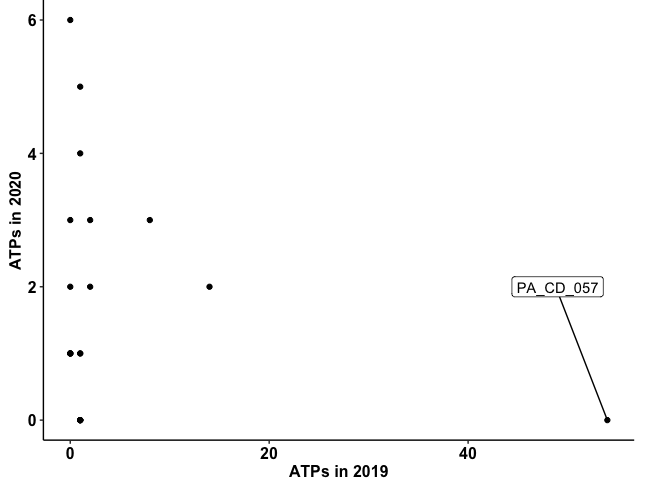

# Reproducible Scripts for the Publication: 

Huttelmaier MT, Gabel A, Seewald MS, Frantz S, Störk S, Fischer TH. __Impact of coronavirus disease (COVID-19) pandemic on physical activity of patients with cardiac implantable electronic devices__.

================

-   [Setup libraries and Functions](#setup-libraries-and-functions)
-   [Data set](#data-set)
    -   [General information (Table 1)](#general-information-table-1)
-   [Physical activity](#physical-activity)
    -   [Figure 1](#figure-1)
    -   [Mean weekday physical activity of
        patients](#mean-weekday-physical-activity-of-patients)
    -   [Summarizing physical activity for each time
        interval](#summarizing-physical-activity-for-each-time-interval)
    -   [Distribution of physical activity
        values](#distribution-of-physical-activity-values)
    -   [Figure 2](#figure-2)
    -   [Figure 3](#figure-3)
    -   [Figure 2 without consideration of gender
        effects](#figure-2-without-consideration-of-gender-effects)
    -   [Figure 3 without consideration of gender
        effects](#figure-3-without-consideration-of-gender-effects)
    -   [Figure 4.1](#figure-4.1)
    -   [Figure 4.2](#figure-4.2)
-   [Average Heart Rate (HR)](#average-heart-rate-hr)
    -   [HR within 2019 and 2020](#hr-within-2019-and-2020)
    -   [Figure 5:](#figure-5)
-   [Average resting Heart Rate (rHR)](#average-resting-heart-rate-rhr)
    -   [rHR within 2019 and 2020](#rhr-within-2019-and-2020)
    -   [Figure 6:](#figure-6)
-   [Atrial Arrhythmia Burden (AAB)](#atrial-arrhythmia-burden-aab)
    -   [AAB within 2019 and 2020](#aab-within-2019-and-2020)
    -   [Figure 7](#figure-7)
-   [Thoracic Impedance](#thoracic-impedance)
    -   [Thoracic Impedance within 2019 and
        2020](#thoracic-impedance-within-2019-and-2020)
    -   [Figure 8](#figure-8)
-   [ICD - Therapies](#icd---therapies)
    -   [ATP events](#atp-events)
    -   [ICD-shocks](#icd-shocks)

# Setup libraries and Functions

``` r
library(readr)
library(dplyr)
library(ggplot2)
library(knitr)
library(tibble)
library(tidyr)
library(kableExtra)
library(RColorBrewer)
library(tidyverse)
library(nparLD)
library(ggsignif)
```

### Define ggplot plot themes

``` r
ggStyle <- ggplot2::theme_classic() + 
  ggplot2::theme(axis.title = ggplot2::element_text(size = 12, face = "bold"),
                 axis.line = ggplot2::element_line(colour = "black"),
                 axis.text.x = ggplot2::element_text(colour = "black", face = "bold", size = 12), 
                 axis.text.y = ggplot2::element_text(colour = "black", face = "bold", size = 12),
                 legend.position = c(0, 0.95),
                 legend.justification = c("left", "top"),
                 legend.box.just = "left",
                 legend.margin = margin(6, 6, 6, 6),
                 legend.text = ggplot2::element_text(size = 12), 
                 legend.title = ggplot2::element_text(face = "bold", size = 12), 
                 legend.background = ggplot2::element_rect(fill = NA),
                 plot.title = ggplot2::element_text(face = "bold"),
                 plot.caption = ggplot2::element_text(face = "bold"),
                 strip.text = ggplot2::element_text(face="bold", size=12),
                 strip.background = ggplot2::element_rect(fill = "white"),
                 plot.margin = ggplot2::unit(c(0,1,0,0.25), "cm"))

ggStyle_ts <- ggplot2::theme_classic() + 
  ggplot2::theme(axis.title = ggplot2::element_text(size = 12, face = "bold"),
                 axis.line = ggplot2::element_line(colour = "black"),
                 axis.text.x = ggplot2::element_text(colour = "black", face = "bold", size = 12, angle = 45, hjust = 1, vjust = 1), #hjust = 0, vjust = 0.5), 
                 axis.text.y = ggplot2::element_text(colour = "black", face = "bold",size = 12),
                 legend.margin = margin(6, 6, 6, 6),
                 legend.text = ggplot2::element_text(size = 12), 
                 legend.title = ggplot2::element_text(face = "bold", size = 12), 
                 legend.background = ggplot2::element_rect(fill = NA),
                 plot.title = ggplot2::element_text(face = "bold"),
                 plot.caption = ggplot2::element_text(face = "bold"),
                 strip.text = ggplot2::element_text(face="bold", size=12),
                 strip.background = ggplot2::element_rect(fill = "white"),
                 plot.margin = ggplot2::unit(c(0.25,1,0,0), "cm"))
```

### Functions

``` r
get_icd_data <- function(ds, variable){
  
  ds_filter <- filter_complete_dataset(ds = data_set, variable = variable)
  ds_interval <- summarise_intervals(ds = ds_filter, variable = variable, add = T)

}

filter_complete_dataset <- function(ds, variable, correct_weekday = F){
  
  ds_all <- ds %>% filter(!is.na(!!sym(variable)))
  ids_in_intervals <- ds_all %>% group_by(ID) %>% summarise(n_intervals = length(unique(Interval))) %>% filter(n_intervals == 12) %>% pull(ID)
  ds_all <- ds_all %>% filter(ID %in% ids_in_intervals)
  
  if(correct_weekday){
    ds_all <- ds_all %>% mutate(!!variable := lm(!!sym(variable) ~ Weekday, data = cur_data())$res)
  }
  
  return(ds_all)
}

summarise_intervals <- function(ds, variable, add = F){
  
  ds_interval <- c()
  
  if(add){
    
    ds_interval <- ds %>% group_by(ID, year, IntGroup, Interval, Gender, Age) %>% 
      summarise(!!variable := sum(!!sym(variable)), .groups = 'drop')
    
  }else{
    
    ds_interval <- ds %>% group_by(ID, year, IntGroup, Interval, Gender, Age) %>% 
      summarise(!!variable := mean(!!sym(variable)), .groups = 'drop')
    
  }
  
  ds_interval$ID <- factor(ds_interval$ID, unique(ds_interval$ID))
  ds_interval$Gender <- factor(ds_interval$Gender, unique(ds_interval$Gender))
  ds_interval$IntGroup <- factor(ds_interval$IntGroup, unique(ds_interval$IntGroup))
  ds_interval$Interval <- factor(ds_interval$Interval, levels = unique(ds_interval$Interval))
    
  ds_interval <- ds_interval %>% mutate(AgeCat = if_else((Age <= 70), "young", "old"))
    
  ds_interval$AgeCat <- factor(ds_interval$AgeCat, levels = unique(ds_interval$AgeCat))

  return(ds_interval)
}

plot_longitude <- function(ds, x, variable, ylim, lockDownDates, first_cases, lockdownLabs, n_subs){
  
  mean_overall <- mean(ds %>% pull(!!sym(variable)))
  
  segment_means_df <- data.frame(ds %>% group_by(Interval) %>% summarise(mean = mean(!!sym(variable))), 
                                 xstart = lockDownDates[-length(lockDownDates)], xend = lockDownDates[-1]-1)
  
  ggplot2::ggplot(data = ds, ggplot2::aes_string(x = x, y = variable)) + ggplot2::geom_line() + 
    ggplot2::theme(legend.position = "none") +
    ggStyle_ts +
    ggplot2::geom_hline(yintercept = mean_overall, col = "green4", lwd = 1, linetype = "dashed") + 
    ggplot2::geom_vline(xintercept = lockDownDates) + 
    ggplot2::geom_vline(xintercept = first_cases, col ="red", linetype = "dashed") + 
    ggplot2::annotate(geom="label", x = lockdownLabs, 
                      y = max(ylim), 
                      label = LETTERS[1:6]) + ggplot2::ylim(ylim) + 
    geom_segment(data = segment_means_df, aes(x = xstart, xend = xend, y = mean, yend = mean), lwd = 1, col = "blue2") + 
    ggplot2::scale_x_date(breaks = lockDownDates) 
    # ggplot2::annotate(geom="text", x = lockDownDates[3] + 40, 
    #                   y = min(ylim), 
    #                   label = paste0("#Subjects: ", n_subs))
}

number_to_star <- function(signif_df){
  
    signif_df <- signif_df %>% mutate(significant = case_when((significant == "<0.05") ~ "*",
                                                              (significant == "<0.01") ~ "**",
                                                              (significant == "<0.001") ~ "***",
                                                              (significant == "<0.0001") ~ "****",
                                                              (significant == "ns") ~ "ns"))
    return(signif_df)
}

add_signif_bar_year <- function(ds, variable, star_df){
  
  ylim_new <- ds %>% group_by(IntGroup) %>% summarise(ymin = boxplot.stats(!!sym(variable))$stats[1],
                                                      ymax = boxplot.stats(!!sym(variable))$stats[5]) %>% 
    summarise(min(ymin), max(ymax)) %>% as.numeric()
  ylim_new <- ylim_new * 1.2
  
  ymax_data <- ds %>% group_by(IntGroup) %>% summarise(ymax = boxplot.stats(!!sym(variable))$stats[5])
  
  anno_dat <- data.frame(x1 = ymax_data$IntGroup[-length(ymax_data$IntGroup)], 
                         x2 = ymax_data$IntGroup[-1]) %>% droplevels()
  
  anno_dat <- data.frame(anno_dat, 
                         y = apply(anno_dat, 1, function(i) max(ymax_data %>% filter(IntGroup %in% i) %>% pull(ymax))) * 1.05
  )
  
  star_df <- number_to_star(signif_df = star_df)
  
  anno_dat <- anno_dat %>% inner_join(star_df, by = c("x1" = "group1", "x2" = "group2")) %>% filter(significant != "ns")
  
  if(dim(anno_dat)[1] == 0){
    return(NULL)
    
  }else{
    offset <- (max(ylim_new) - max(anno_dat$y))/length(anno_dat$y)
    
    ggsignif::geom_signif(annotations = anno_dat$significant, tip_length = 0.005,
                          y_position = anno_dat$y + cumsum(c(0, rep(offset, length(anno_dat$y)-1))), 
                          xmin=as.character(anno_dat$x1), xmax=as.character(anno_dat$x2))
  }
}

add_signif_bar_1920 <- function(ds, variable, star_df){

  anno_dat <- ds %>% group_by(IntGroup) %>% summarise(ymax = boxplot.stats(!!sym(variable))$stats[5]) %>% 
    group_by(IntGroup) %>% summarise(ymax = max(ymax) * 1.05)
  
  anno_dat <- cbind(anno_dat,  xmin = seq(0.8, 0.8+nrow(anno_dat)-1, by = 1), xmax = seq(1.2, 0.2 + nrow(anno_dat), by = 1))
  
  star_df <- number_to_star(signif_df = star_df)
  anno_dat <- anno_dat %>% inner_join(star_df, by = c("IntGroup" = "group1")) %>% filter(significant != "ns")
  
  if(dim(anno_dat)[1] == 0){
    return(NULL)
  }

  geom_signif(
      y_position = anno_dat$ymax, xmin = anno_dat$xmin, xmax = anno_dat$xmax,
      annotation = anno_dat$significant,  tip_length = 0.005)
}

boxplot_each_year <- function(ds, variable, fill_color, xlabel, ylabel, main_title, ylim_new, pattern = NULL, show.legend = T, legend.labels = NULL){
       
  ggDesign <- ggStyle + 
               ggplot2::theme(axis.text.x = ggplot2::element_text(angle = 0),
                              legend.position = "none")
  
  if(is.null(pattern)){
    
    bxplt <- ggplot2::ggplot(data = ds, ggplot2::aes_string(x = "IntGroup", y = variable)) + 
               ggplot2::geom_point(size = -1) + 
               ggplot2::stat_boxplot(geom = "errorbar", width = 0.5, position = position_dodge(width = 0.75)) + 
               ggplot2::geom_boxplot(notch=F, outlier.colour="black", outlier.fill="black", outlier.size = -1, size = 0.8, 
                                     show.legend = FALSE, position = position_dodge(width = 0.75), fill = fill_color) + 
               ggDesign +
               ggplot2::xlab(xlabel) + 
               ggplot2::ylab(ylabel) +      
               ggplot2::scale_fill_manual(labels = legend.labels, values = fill_color) +
               ggplot2::coord_cartesian(ylim = ylim_new) 
  }else{
    
    bxplt <- ggplot2::ggplot(data = ds, ggplot2::aes_string(x = "IntGroup", y = variable)) + 
              ggplot2::geom_point(size = -1) + 
              ggplot2::stat_boxplot(geom = "errorbar", width = 0.5, position = position_dodge(width = 0.75)) + 
              ggpattern::geom_boxplot_pattern(notch=F, outlier.colour="black", outlier.fill="black", outlier.size = -1, size = 0.8, 
                                             show.legend = FALSE, position = position_dodge(width = 0.75), fill = fill_color, 
                                             pattern_size = 0.5, pattern = pattern, pattern_alpha = 0.75, pattern_angle = 45) + 
             ggDesign +
             ggplot2::xlab(xlabel) + 
             ggplot2::ylab(ylabel) + 
             ggplot2::scale_fill_manual(labels = legend.labels, values = fill_color) +
             ggplot2::coord_cartesian(ylim = ylim_new) 
  }
  
   if(is.null(main_title)){
    
    bxplt <- bxplt +  ggplot2::theme(title = element_blank())
    
  }else{
    
    bxplt <- bxplt +  ggplot2::ggtitle(main_title)
  }
  
  if(show.legend){
    
    bxplt <- bxplt +  ggplot2::guides(fill = guide_legend(title.position = "top",
                                          keywidth = unit(0.5, "cm"),
                                          keyheight = unit(0.5, "cm"),
                                          override.aes = list(shape = 22, size = 8, stroke = 1), ncol = 2)) +  
                      ggplot2::theme(legend.position= "top",
                                     legend.box.just = "left",
                                     legend.margin = margin(1,1,1,1))
  
  }else{
    
     bxplt <- bxplt +  ggplot2::theme(legend.position = "none")
     
  }
  
  return(bxplt)
 
}

boxplot_btw_years <- function(ds, variable, fill_colors, pattern = NULL, main_title, xlabel, ylabel, ylim_new, show.legend = T, legend.labels = NULL){
  
  ggDesign <- ggStyle + 
    ggplot2::theme(legend.position = c(0.01, 0.97),
                   legend.justification = c("left", "top"),
                   legend.box.just = "left",
                   legend.margin = margin(6, 6, 6, 6),
                   legend.text = ggplot2::element_text(size = 12, face = "bold"), 
                   legend.title = ggplot2::element_blank(),
                   axis.text.x = ggplot2::element_text(angle = 0)) 
   
  
  if(is.null(pattern)){
    
    bxplt <- ggplot2::ggplot(data = ds, ggplot2::aes_string(x = "IntGroup", y = variable, fill = "year")) + 
      ggplot2::geom_point(size = -1) + 
      ggplot2::stat_boxplot(geom = "errorbar", width = 0.5, position = position_dodge(width = 0.75)) + 
      ggplot2::geom_boxplot(notch=F, outlier.colour="black", outlier.fill="black", outlier.size = -1, size = 0.8, 
                            show.legend = FALSE, position = position_dodge(width = 0.75)) + 
      ggDesign + 
      ggplot2::scale_fill_manual(labels = legend.labels, values = fill_colors) +
      ggplot2::scale_color_manual(values = rep("black", 4)) +
      ggplot2::xlab(xlabel) + 
      ggplot2::ylab(ylabel) + 
      ggplot2::coord_cartesian(ylim = ylim_new)
    
  }else{
    
    bxplt <- ggplot2::ggplot(data = ds, ggplot2::aes_string(x = "IntGroup", y = variable, fill = "year")) + 
      ggplot2::geom_point(size = -1) + 
      ggplot2::stat_boxplot(geom = "errorbar", width = 0.5, position = position_dodge(width = 0.75)) +
      ggpattern::geom_boxplot_pattern(notch=F, outlier.colour="black", outlier.fill="black", outlier.size = -1, size = 0.8, 
                                      show.legend = FALSE, position = position_dodge(width = 0.75), 
                                      pattern_size = 0.5, pattern = pattern, pattern_alpha = 0.75, pattern_angle = 45) + 
      ggDesign + 
      ggplot2::scale_fill_manual(labels = legend.labels, values = fill_colors) +
      ggplot2::scale_color_manual(values = rep("black", 4)) +
      ggplot2::xlab(xlabel) + 
      ggplot2::ylab(ylabel) + 
      ggplot2::coord_cartesian(ylim = ylim_new) 
  }
  
  if(is.null(main_title)){
    
    bxplt <- bxplt +  ggplot2::theme(title = element_blank())
    
  }else{
    
    bxplt <- bxplt +  ggplot2::ggtitle(main_title)
  }
  
  if(show.legend){
    
    bxplt <- bxplt +  ggplot2::guides(fill = guide_legend(title.position = "top",
                                          keywidth = unit(0.5, "cm"),
                                          keyheight = unit(0.5, "cm"),
                                          override.aes = list(shape = 22, size = 8, stroke = 1), ncol = 2)) +  
                      ggplot2::theme(legend.position= "top",
                                     legend.box.just = "left",
                                     legend.margin = margin(1,1,1,1))
  
  }else{
    
     bxplt <- bxplt +  ggplot2::theme(legend.position = "none")
     
  }
  
  return(bxplt)
}

boxplot_year <- function(ds, variable, main_title, ymax = NULL, stats, show.legend = F, legend.labels = NULL,
                         pairs = paste0(LETTERS[1:5],"19",LETTERS[2:6],"19"), sel_year = 2019, sep_age = F, 
                         xlabel = "Time interval", ylabel = "Physical Activity"){
  
  order_letter <- c("AB","BC", "CD", "DE", "EF", "AC", "BD", "CE", "DF", "AD", "BE", "CF", "AE", "BF", "AF")
 
  # year_col <- data.frame(color = c("#A0A0A0FF","#DF8F44FF" ), year = c(2019, 2020), stringsAsFactors = F) 
  year_col <- data.frame(color = c("#A0A0A0FF","#4e60c7FF" ), year = c(2019, 2020), stringsAsFactors = F) 
  
  ylim_new <- ds %>% group_by(IntGroup) %>% summarise(ymin = boxplot.stats(!!sym(variable))$stats[1],
                                                      ymax = boxplot.stats(!!sym(variable))$stats[5]) %>% 
                                            summarise(min(ymin) * 0.8, max(ymax)*1.2) %>% as.numeric()
  
  ymax_data <- ds %>% group_by(IntGroup) %>% summarise(ymax = boxplot.stats(!!sym(variable))$stats[5])
  
  anno_dat <- data.frame(x1 = ymax_data$IntGroup[-length(ymax_data$IntGroup)], 
                         x2 = ymax_data$IntGroup[-1])
  
  anno_dat <- data.frame(anno_dat, 
                         y = apply(anno_dat, 1, function(i) max(ymax_data %>% filter(IntGroup %in% i) %>% pull(ymax))) * 1.05
                         )
  
  offset <- (max(ylim_new) - max(anno_dat$y))/length(anno_dat$y)
  
  bx_plt <- c()
  
  if(sep_age){
    
    age_cats <- levels(ds$AgeCat)
    bx_plt <- list()
    
    age_patterns <- c("stripe", "crosshatch")
    
    for(i in seq_along(age_cats)){
      
      if(i == 1){
        
        year_col <- data.frame(color = c("#908c8cff","#4455b3ff" ), year = c(2019, 2020), stringsAsFactors = F) 
        
      }
      if(i == 2){
        year_col <- data.frame(color = c("#b8b3b3ff","#949ed6ff" ), year = c(2019, 2020), stringsAsFactors = F) 
      }
      
      
      bx_plt[[i]] <- boxplot_each_year(ds = ds  %>% filter(year == sel_year, AgeCat == age_cats[i]), variable = variable, 
                                  fill_color = year_col[year_col$year == sel_year,]$color, 
                                  xlabel = xlabel, ylabel = ylabel, ylim_new = ylim_new, main_title = paste0(main_title, " ", age_cats[i]), pattern = NULL, show.legend = FALSE, legend.labels = paste0(year_col$year," ",rep(age_cats[i], 2)))
      
      star_df <- stats %>% filter(Age == age_cats[i])
      star_df <- star_df %>% dplyr::filter(star_df %>% dplyr::select(group1, group2) %>% mutate(gr = paste0(group1,group2) %in% pairs) %>% pull(gr)) %>% 
                             dplyr::select(group1, group2, significant) %>% 
                             dplyr::mutate(group1 = gsub(group1, pattern = "([0-9]*)", repl = ""),
                                           group2 = gsub(group2, pattern = "([0-9]*)", repl = ""))
      
      bx_plt[[i]] <- bx_plt[[i]] + add_signif_bar_year(ds = ds  %>% filter(year == sel_year, AgeCat == age_cats[i]), variable = variable, star_df = star_df)
    }
    
    names(bx_plt) <- age_cats
    
    bx_plt <- cowplot::plot_grid(bx_plt[[1]] + ggplot2::theme(plot.margin = ggplot2::margin(b = 3)), 
                                 bx_plt[[2]] + ggplot2::theme(plot.margin = ggplot2::margin(b = 3)), 
                                 # + ggplot2::theme(axis.text.y = ggplot2::element_blank(), 
                                 #                              axis.ticks.y = ggplot2::element_blank(),
                                 #                              axis.title.y = ggplot2::element_blank(),
                                 #                              axis.line.y = ggplot2::element_blank(),
                                 #                              plot.margin = ggplot2::margin(l = 0)),
                                 rel_heights = c(0.45,0.45))
    
  }else{
    
    bx_plt <- boxplot_each_year(ds = ds  %>% filter(year == sel_year), variable = variable, fill_color = year_col[year_col$year == sel_year,]$color, 
                                 xlabel = xlabel, ylabel = ylabel, ylim_new = ylim_new, main_title = main_title, show.legend = show.legend, legend.labels = legend.labels)
  
    star_df <- stats %>% rownames_to_column() %>% filter(Factor == "Time-Interval") 
    star_df <- star_df %>% dplyr::filter(star_df %>% dplyr::select(group1, group2) %>% mutate(gr = paste0(group1,group2) %in% pairs) %>% pull(gr)) %>% 
                           dplyr::select(group1, group2, significant) %>% 
                           dplyr::mutate(group1 = gsub(group1, pattern = "([0-9]*)", repl = ""),
                                         group2 = gsub(group2, pattern = "([0-9]*)", repl = ""))
  
    bx_plt <- bx_plt + add_signif_bar_year(ds = ds, variable = variable, star_df = star_df)
  }
 
  
  return(bx_plt)
  
}

boxplot_1920 <- function(ds, variable, main_title = NULL, ymax = NULL, stats, 
                         ylabel = variable, xlabel = "Time interval", sep_age = F, legend.labels = NULL, show.legend = F){
  
  ds$year <- factor(ds$year, levels = c(2019, 2020))
  # year_col <- data.frame(color = c("#A0A0A0FF","#DF8F44FF" ), year = c(2019, 2020), stringsAsFactors = F) 
  year_col <- data.frame(color = c("#A0A0A0FF","#4e60c7FF" ), year = c(2019, 2020), stringsAsFactors = F) 
  
  ylim_new <- ds %>% group_by(IntGroup, Interval) %>% summarise(ymin = boxplot.stats(!!sym(variable))$stats[1],
                                                                ymax = boxplot.stats(!!sym(variable))$stats[5], .groups = 'drop') %>% 
              summarise(ymin = min(ymin) * 0.8, ymax = max(ymax)*1.2) %>% as.numeric()
  
  pairs <- paste0(LETTERS[1:6],"19",LETTERS[1:6],"20")
  
  bx_plt <- c()
  
  if(sep_age){
    
    age_cats <- levels(ds$AgeCat)
    bx_plt <- list()
    
    age_patterns <- c("stripe", "crosshatch")
     
    for(i in seq_along(age_cats)){
      
      if(i == 1){
        
        year_col <- data.frame(color = c("#908c8cff","#4455b3ff" ), year = c(2019, 2020), stringsAsFactors = F) 
        
      }
      if(i == 2){
        year_col <- data.frame(color = c("#b8b3b3ff","#949ed6ff" ), year = c(2019, 2020), stringsAsFactors = F) 
      }
      
      bx_plt[[i]] <- boxplot_btw_years(ds = ds %>% filter(AgeCat == age_cats[i]), variable = variable, 
                                  fill_colors = year_col$color, 
                                  xlabel = xlabel, ylabel = ylabel, ylim_new = ylim_new, main_title = main_title, pattern = NULL, legend.labels = paste0(year_col$year," ",rep(age_cats[i], 2)))
      
      star_df <- stats %>% filter(Age == age_cats[i])
      star_df <- star_df %>% dplyr::filter(star_df %>% dplyr::select(group1, group2) %>% mutate(gr = paste0(group1,group2) %in% pairs) %>% pull(gr)) %>% 
                             dplyr::select(group1, group2, significant) %>% 
                             dplyr::mutate(group1 = gsub(group1, pattern = "([0-9]*)", repl = ""),
                                           group2 = gsub(group2, pattern = "([0-9]*)", repl = ""))
      
      bx_plt[[i]] <- bx_plt[[i]] + add_signif_bar_1920(ds = ds  %>% filter(AgeCat == age_cats[i]), variable = variable, star_df = star_df)
    }
    
    names(bx_plt) <- age_cats
    
    
    bx_plt <- cowplot::plot_grid(bx_plt[[1]],
                                 bx_plt[[2]])
      
    # bx_plt <- cowplot::plot_grid(bx_plt[[1]] + ggplot2::theme(plot.margin = ggplot2::margin(r = 0)), 
    #                              bx_plt[[2]] + ggplot2::theme(axis.text.y = ggplot2::element_blank(), 
    #                                                           axis.ticks.y = ggplot2::element_blank(),
    #                                                           axis.title.y = ggplot2::element_blank(),
    #                                                           axis.line.y = ggplot2::element_blank(),
    #                                                           plot.margin = ggplot2::margin(l = 0)),
    #                              rel_widths = c(0.525,0.475))
  }else{
    
     bx_plt <- boxplot_btw_years(ds = ds, variable = variable,  fill_colors = year_col$color, pattern = NULL, main_title = main_title, xlabel = xlabel, ylabel = ylabel,  ylim_new = ylim_new, show.legend = show.legend, legend.labels = legend.labels)
      
     star_df <- stats %>% tibble::rownames_to_column() %>% filter(Factor == "Time-Interval")
     star_df <- star_df %>% filter(star_df %>% dplyr::select(group1, group2) %>% mutate(gr = paste0(group1, group2) %in% pairs) %>% 
                pull(gr)) %>% dplyr::select(group1, group2, significant) %>% 
                mutate(group1 = gsub(group1, pattern = "([0-9]*)", repl = ""),
                       group2 = gsub(group2, pattern = "([0-9]*)", repl = ""))
    
      bx_plt <- bx_plt + add_signif_bar_1920(ds = ds, variable = variable, star_df = star_df)
  }
  
  return(bx_plt)
}

event_barplot <- function(ds, variable, xlabel, ylabel){
    
  #year_col <- data.frame(color = c("#A0A0A0FF","#DF8F44FF" ), year = c(2019, 2020), stringsAsFactors = F) 
  year_col <- data.frame(color = c("#A0A0A0FF","#4e60c7FF" ), year = c(2019, 2020), stringsAsFactors = F) 
  
  ds$IntGroup <- factor(ds$IntGroup)
  ds$year <- factor(ds$year)
  
  bar_plt <- ggplot2::ggplot(ds, ggplot2::aes_string(x = "IntGroup", y = variable, fill = "year")) +
    ggplot2::geom_bar(stat = "identity", col = "black") +
    ggplot2::facet_wrap(~year) + 
    ggStyle + ggplot2::scale_fill_manual(values = year_col$color) +
    ggplot2::xlab(xlabel) +
    ggplot2::ylab(ylabel) +
    ggplot2::theme(axis.text.x = ggplot2::element_text(angle = 0),
                   legend.position = "none") 
  
  bar_plt
}

rankTest_pairwise <- function(ds, variable, consider_gender = T){

  int_groups <- levels(ds$Interval)
  int_combs <- combn(x = int_groups, m = 2)
  
  res_nparLD <- c()
  stats_ats <- c()
  
  if(consider_gender){
    
    res_nparLD <- apply(int_combs, 2, function(intGrp){
    
      ds_sub_interval <- as.data.frame(ds %>% filter(Interval %in% intGrp) %>% droplevels())
      res <- f2.ld.f1(y = ds_sub_interval %>% pull(!!sym(variable)), 
                      time = as.character(ds_sub_interval$Interval), 
                      group1 = as.character(ds_sub_interval$AgeCat), 
                      group2 = as.character(ds_sub_interval$Gender), 
                      subject = as.character(ds_sub_interval$ID), 
                      time.order = levels(ds_sub_interval$Interval), 
                      group1.name = "Age", group2.name = "Gender", plot.RTE = FALSE, description = FALSE)
    res
  })
     stats_ats <- data.frame(Factor = c("Age", "Gender", "Time-Interval", "Age:Gender", "Age:Time-Interval", "Gender:Time-Interval", "Age:Gender:Time-Interval"), 
                          group1 = rep(int_combs[1,], each = 7), group2 = rep(int_combs[2,], each = 7), 
                          do.call("rbind", lapply(res_nparLD, function(elem)elem$ANOVA.test))) %>% dplyr::select(!df)
  }else{
    
    text_formula <- paste0(variable," ~  Interval * AgeCat")
    
    res_nparLD <- apply(int_combs, 2, function(intGrp){
      
      res <- nparLD(eval(parse(text = text_formula)), data = as.data.frame(ds %>% filter(Interval %in% intGrp)), 
                    subject = "ID", description = FALSE, plot.CI = FALSE)
      res
    })
    
     stats_ats <- data.frame(Factor = c("Age", "Time-Interval", "Age:Time-Interval"), 
                          group1 = rep(int_combs[1,], each = 3), group2 = rep(int_combs[2,], each = 3), 
                          do.call("rbind", lapply(res_nparLD, function(elem)elem$ANOVA.test))) %>% dplyr::select(!df)
  }
  
  
  stats_ats <- data.frame(stats_ats, "p.adj(BY)" = p.adjust(stats_ats$p.value, method = "BY"), check.names = F) %>% 
    mutate(significant = case_when((`p.adj(BY)` >= 0.05) ~ "ns",
                                   (`p.adj(BY)` < 0.05 & `p.adj(BY)` >= 0.01) ~ "<0.05",
                                   (`p.adj(BY)` < 0.01 & `p.adj(BY)` >= 0.001) ~ "<0.01",
                                   (`p.adj(BY)` < 0.001 & `p.adj(BY)` >= 0.0001) ~ "<0.001",
                                   (`p.adj(BY)` < 0.0001 & `p.adj(BY)` >= 0) ~ "<0.0001"))
  
  stats_groups <- ds %>% group_by(Interval, AgeCat) %>% 
    summarise("Mean ± SD" = paste0(round(mean(!!sym(variable)), 2), " ± ", round(sd(!!sym(variable)), 2)), Mean = mean(!!sym(variable)))
  
  FC_stats <- apply(int_combs, 2, function(intGrp){
    
    fc_stats <- ds %>% filter(Interval %in% intGrp) %>% dplyr::select(ID, Interval, !!sym(variable), AgeCat) %>% 
      tidyr::pivot_wider(names_from = Interval, values_from = !!sym(variable)) %>% mutate(FC = !!sym(intGrp[1])/!!sym(intGrp[2]))  
    
    fc_desc <- fc_stats %>% group_by(AgeCat) %>% summarise(FC = paste0(round(mean(FC),3), " ± ", round(sd(FC),3))) %>% 
      tidyr::pivot_wider(names_from = AgeCat, values_from = FC) %>% mutate(Comparison = paste0(intGrp, collapse = ""))
    
    colnames(fc_desc)[1:2] <- c("FC(old)", "FC(young)")
    fc_wilcox <- fc_stats %>% rstatix::wilcox_test(FC ~AgeCat)
    
    cbind(fc_desc, fc_wilcox)
  })
  
  fc_stats_pairs <- do.call("rbind", FC_stats)[,-4]
  fc_stats_pairs <- fc_stats_pairs %>% dplyr::mutate("p.adj(BY)" = p.adjust(p,"BY"))

  if(!consider_gender){
    
  stats_ats_time <- data.frame(group1 = rep(int_combs[1,], each = 2), group2 = rep(int_combs[2,], each = 2), 
                               Age = c("old", "young"),
                               do.call("rbind", lapply(res_nparLD, function(elem)elem$ANOVA.test.time))) %>% dplyr::select(!df)  
    
  stats_ats_time <- stats_ats_time %>% inner_join(stats_groups, by = c("Age" = "AgeCat", "group1" = "Interval"), suffix = c(" (group1)"," (group2)")) %>% 
                                       inner_join(stats_groups, by = c("Age" = "AgeCat", "group2" = "Interval"), suffix = c(" (group1)"," (group2)")) %>% 
                                       dplyr::mutate("Fold change (group2/group1)" = round(`Mean (group2)`/`Mean (group1)`, 3)) %>% 
                                       dplyr::select(!dplyr::matches("Mean \\(group"))
  
  stats_ats_time <- stats_ats_time[,c(1:3, 6:8, 4:5)]

  stats_ats_time <- data.frame(stats_ats_time, "p.adj(BY)" = p.adjust(stats_ats_time$p.value, method = "BY"), check.names = F) %>% 
    mutate(significant = case_when((`p.adj(BY)` >= 0.05) ~ "ns",
                                   (`p.adj(BY)` < 0.05 & `p.adj(BY)` >= 0.01) ~ "<0.05",
                                   (`p.adj(BY)` < 0.01 & `p.adj(BY)` >= 0.001) ~ "<0.01",
                                   (`p.adj(BY)` < 0.001 & `p.adj(BY)` >= 0.0001) ~ "<0.001",
                                   (`p.adj(BY)` < 0.0001 & `p.adj(BY)` >= 0) ~ "<0.0001"))
  
  
  btw_years <- apply(matrix(nc = 2, paste0(rep(LETTERS[1:6], each=2), 19:20), byrow = T),1,function(i)paste0(i, collapse=""))
  btw_ints <- apply(matrix(nc = 2, paste0(rep(LETTERS[1:6], each=2)[-c(1,12)], rep(19:20, each = 10)), byrow = T),1,function(i)paste0(i, collapse=""))
  
  stats_df_full <- stats_ats_time
  
  split_df <- function(stats_df_full, groups){
    
    stats_df_split <- stats_df_full %>% mutate(g1g2 = paste0(group1,group2)) %>% filter(g1g2 %in% groups) %>% dplyr::select(-g1g2)
    
    lapply(split(stats_df_split, stats_df_split$Age), function(sub_df){
      sub_df <- sub_df %>% dplyr::select(-Age) %>% 
                tidyr::pivot_longer(cols = starts_with("group"), names_to = "group", values_to = "Interval") %>% 
                as.data.frame(check.names = F, stringsAsFactors = F) 
      
      new_sub_df <- as.data.frame(t(apply(sub_df, 1, function(col_vals){
        
        col_vals[c(9,grep(colnames(sub_df), pattern = col_vals[8], ignore.case = T)[1], 5:7, 3)]
      })), stringsAsFactors = F)
      
      colnames(new_sub_df)[-2] <- colnames(sub_df)[c(9,5:7,3)] 
      colnames(new_sub_df)[2] <- "Mean ± SD"
      new_sub_df
    })
  }
 
  ats_sub_list_years <- split_df(stats_ats_time, groups = btw_years)
  ats_sub_list_ints <-split_df(stats_ats_time, groups = btw_ints)
  
  pairs_result_list <- list(stats = stats_groups, stats_ats = stats_ats, 
                            stats_ats_time = stats_ats_time,
                            ats_sub_list_years = ats_sub_list_years, ats_sub_list_ints = ats_sub_list_ints,
                            fc_stats_pairs = fc_stats_pairs)
  }else{
    
    stats_groups_gender <- ds %>% group_by(Interval, Gender) %>% 
    summarise("Mean ± SD" = paste0(round(mean(!!sym(variable)), 2), " ± ",round(sd(!!sym(variable)), 2)), Mean = mean(!!sym(variable)))
  
    FC_stats <- apply(int_combs, 2, function(intGrp){
    
      fc_stats <- ds %>% filter(Interval %in% intGrp) %>% dplyr::select(ID, Interval, !!sym(variable), Gender) %>% 
        tidyr::pivot_wider(names_from = Interval, values_from = !!sym(variable)) %>% mutate(FC = !!sym(intGrp[1])/!!sym(intGrp[2]))  
    
    fc_desc <- fc_stats %>% group_by(Gender) %>% summarise(FC = paste0(round(mean(FC),3), " ± ", round(sd(FC),3))) %>% 
      tidyr::pivot_wider(names_from = Gender, values_from = FC) %>% mutate(Comparison = paste0(intGrp, collapse = ""))
    
    colnames(fc_desc)[1:2] <- c("FC(male)", "FC(female)")
    fc_wilcox <- fc_stats %>% rstatix::wilcox_test(FC ~ Gender)
    
    cbind(fc_desc, fc_wilcox)
  })
  
  fc_stats_pairs_gender <- do.call("rbind", FC_stats)[,-4]
  fc_stats_pairs_gender <- fc_stats_pairs_gender %>% dplyr::mutate("p.adj(BY)" = p.adjust(p,"BY"))
    
     pairs_result_list <- list(stats = stats_groups, 
                               stats_groups_gender = stats_groups_gender,
                               fc_stats_pairs_gender, 
                               stats_ats = stats_ats,
                               fc_stats_pairs = fc_stats_pairs)
     
  }
  
  return(pairs_result_list)
  
}

rankTest_year <- function(ds, variable, consider_gender = T){
  
  year_groups <- unique(ds$year)
  
  res_nparLD <- c()
  stats_ats <- c()
  
  if(consider_gender){
    
    res_nparLD <- sapply(year_groups, function(yearGrp){
    
      ds_sub_interval <- as.data.frame(ds %>% filter(year %in% yearGrp) %>% droplevels())
      res <- f2.ld.f1(y = ds_sub_interval %>% pull(!!sym(variable)), 
                      time = as.character(ds_sub_interval$IntGroup), 
                      group1 = as.character(ds_sub_interval$AgeCat), 
                      group2 = as.character(ds_sub_interval$Gender), 
                      subject = as.character(ds_sub_interval$ID), 
                      time.order = levels(ds_sub_interval$IntGroup), 
                      group1.name = "Age", group2.name = "Gender", plot.RTE = F, description = FALSE)
    res
  }, simplify = T)
    
    stats_ats <- data.frame(Factor = c("Age", "Gender", "Time-Interval", "Age:Gender", "Age:Time-Interval", "Gender:Time-Interval", "Age:Gender:Time-Interval"), 
                          group1 = 2019, group2 = 2020, 
                          do.call("rbind", apply(res_nparLD, 2, function(elem)elem$ANOVA.test))) %>% dplyr::select(!df)
    
  }else{
    
    text_formula <- paste0(variable," ~  IntGroup * AgeCat")
  
    res_nparLD <- sapply(year_groups, function(yearGrp){
      res <- nparLD(eval(parse(text = text_formula)), data = as.data.frame(ds %>% filter(year %in% yearGrp)), 
                    subject = "ID", description = FALSE, plot.CI = FALSE)
      res
  }, simplify = F)
    
    stats_ats <- data.frame(Year = rep(year_groups, each = 3),
                          Factor = c("Age", "Time-Interval", "Age:Time-Interval"), 
                          do.call("rbind", lapply(res_nparLD, function(elem)elem$ANOVA.test))) %>% dplyr::select(!df)
  }

  stats_ats <- data.frame(stats_ats, "p.adj(BY)" = p.adjust(stats_ats$p.value, method = "BY"), check.names = F) %>% 
    mutate(Statistic = format(Statistic, digits = 2), 
           p.value = format(p.value, digits = 2, scientific = T), 
           `p.adj(BY)` = as.numeric(format(`p.adj(BY)`, digits = 2, scientific = T)),
           significant = case_when((`p.adj(BY)` >= 0.05) ~ "ns",
                                   (`p.adj(BY)` < 0.05 & `p.adj(BY)` >= 0.01) ~ "<0.05",
                                   (`p.adj(BY)` < 0.01 & `p.adj(BY)` >= 0.001) ~ "<0.01",
                                   (`p.adj(BY)` < 0.001 & `p.adj(BY)` >= 0.0001) ~ "<0.001",
                                   (`p.adj(BY)` < 0.0001 & `p.adj(BY)` >= 0) ~ "<0.0001"))
 
stats_groups <- ds %>% group_by(year, AgeCat) %>% 
    summarise("Mean ± SD" = paste0(round(mean(!!sym(variable)), 2), " ± ",round(sd(!!sym(variable)), 2)))
  
 fc_stats <- ds %>% dplyr::select(ID, year, !!sym(variable), AgeCat) %>% group_by(ID, year, AgeCat) %>% 
             summarise(meanYear = mean(!!sym(variable))) %>%
             tidyr::pivot_wider(names_from = year, values_from = meanYear) %>% mutate(FC = `2019`/`2020`)  
    
  fc_desc <- fc_stats %>% group_by(AgeCat) %>% summarise(FC = paste0(round(mean(FC),3), " ± ", round(sd(FC),3))) %>% 
      tidyr::pivot_wider(names_from = AgeCat, values_from = FC) %>% mutate(Comparison = "2019/2020")
    
  colnames(fc_desc)[1:2] <- c("FC(old)", "FC(young)")
    
  w_test <- wilcox.test(fc_stats %>% filter(AgeCat == "young") %>% pull(FC), fc_stats %>% filter(AgeCat == "old") %>% pull(FC))
  
  fc_stats <- data.frame(fc_desc, statistic = w_test$statistic, p = w_test$p.value, check.names = F, stringsAsFactors = F)
  
  if(!consider_gender){
    
    stats_ats_time <- data.frame(Year = rep(year_groups, each = 2), 
                               Age = c("old", "young"),
                               do.call("rbind", lapply(res_nparLD, function(elem)elem$ANOVA.test.time))) %>% dplyr::select(!df)
    
    stats_ats_time <- stats_ats_time %>% inner_join(stats_groups, by = c("Age" = "AgeCat", "Year" = "year")) 
  
    stats_ats_time <- stats_ats_time[,c(1:2, 5, 3:4)]
  
    stats_ats_time <- data.frame(stats_ats_time, "p.adj(BY)" = p.adjust(stats_ats_time$p.value, method = "BY"), check.names = F) %>% 
      mutate(significant = case_when((`p.adj(BY)` >= 0.05) ~ "ns",
                                     (`p.adj(BY)` < 0.05 & `p.adj(BY)` >= 0.01) ~ "<0.05",
                                     (`p.adj(BY)` < 0.01 & `p.adj(BY)` >= 0.001) ~ "<0.01",
                                     (`p.adj(BY)` < 0.001 & `p.adj(BY)` >= 0.0001) ~ "<0.001",
                                     (`p.adj(BY)` < 0.0001 & `p.adj(BY)` >= 0) ~ "<0.0001"))
    
    res_list <- list(stats = stats_groups, fc_stats = fc_stats, stats_ats = stats_ats, stats_ats_time = stats_ats_time)
    
  }else{
    
    stats_groups_gender <- ds %>% group_by(year, Gender) %>% 
    summarise("Mean ± SD" = paste0(round(mean(!!sym(variable)), 2), " ± ",round(sd(!!sym(variable)), 2)))
  
 fc_stats_gender <- ds %>% dplyr::select(ID, year, !!sym(variable), Gender) %>% group_by(ID, year, Gender) %>% 
                    summarise(meanYear = mean(!!sym(variable))) %>%
                    tidyr::pivot_wider(names_from = year, values_from = meanYear) %>% mutate(FC = `2019`/`2020`)  
    
  fc_desc_gender <- fc_stats_gender %>% group_by(Gender) %>% summarise(FC = paste0(round(mean(FC),3), " ± ", round(sd(FC),3))) %>% 
      tidyr::pivot_wider(names_from = Gender, values_from = FC) %>% mutate(Comparison = "2019/2020")
    
  colnames(fc_desc_gender)[1:2] <- c("FC(male)", "FC(female)")
    
  w_test <- wilcox.test(fc_stats_gender %>% filter(Gender == "male") %>% pull(FC), fc_stats_gender %>% filter(Gender == "female") %>% pull(FC))
  
  fc_stats_gender <- data.frame(fc_desc_gender, statistic = w_test$statistic, p = w_test$p.value)
  
  res_list <- list(stats = stats_groups, fc_stats = fc_stats, fc_stats_gender = fc_stats_gender, stats_groups_gender = stats_groups_gender, stats_ats = stats_ats)
    
  }
  
  return(res_list)
}
```

### Define Intervals and occurences of first cases

``` r
lockDownDates <-  as.Date(c("2020-01-01", "2020-03-21", "2020-05-06", "2020-08-04", "2020-11-03","2020-12-16", "2020-12-31"))
lockdownLabs <- as.Date(c("2020-01-01", "2020-03-21", "2020-05-06", "2020-08-04", "2020-11-03","2020-12-16"))
  
for(i in seq_along(lockDownDates[-1])){
  lockdownLabs[i] <- as.Date(lockDownDates[i] + diff.Date(lockDownDates[i:(i+1)])/2)
}
first_cases <- as.Date(c("2020-01-27", "2020-03-03"))
```

### Ploting directory

``` r
super_plot.dir <- "plots/"

if(!file.exists(super_plot.dir)){
  dir.create(super_plot.dir)
}
```

# Data set

``` r
data_set <- readr::read_delim(file = "data/physical_activity_cied_patients.csv.gz", delim=";")
w_days <- c("Mon", "Tue", "Wed", "Thu", "Fri", "Sat", "Sun")
data_set$Weekday <- factor(data_set$Weekday, levels = w_days)
```

## General information (Table 1)

``` r
vars <- c("Age", "Gender", "Device", "Indication")

general_information <- sapply(vars, function(variable){
  df <- c()
  if(variable == "Age"){
    
    df <- data_set %>% dplyr::select(ID,!!sym(variable)) %>% unique() %>% summarise( Feature = "Age",
                                                                                     'relative' =  paste0(round(median(!!sym(variable)),1), " ± ", round(mad(!!sym(variable)),1)),
                                                                                     'absolute' = "(Median(Age) ± MAD(Age))")
    
  }else{
    
    df <- data_set %>% dplyr::select(ID,!!sym(variable)) %>% unique() %>% group_by(!!sym(variable)) %>% 
          summarise(relative = round(length(!!sym(variable))/  data_set %>% dplyr::select(ID) %>% unique() %>% nrow() * 100, 2),
                    absolute = length(!!sym(variable)))
    
  }
  colnames(df) <- c("Feature","relative (%)", "absolute")
  df$`relative (%)` <- format(df$`relative (%)`, scientific = F, digits=3)
  df
}, simplify = F)

general_information <- as.data.frame(do.call("rbind", general_information))
rownames(general_information) <- general_information$Feature

kable(general_information[,-1], row.names = T) %>% 
  kableExtra::pack_rows("Age", 1, 1) %>%
  kableExtra::pack_rows("Gender", 2, 3) %>%
  kableExtra::pack_rows("Device", 4, 9) %>%
  kableExtra::pack_rows("Indication", 10, 12) %>% kable_styling(bootstrap_options = c("striped", "hover", "condensed"), full_width = F, position = "left")
```

<table class="table table-striped table-hover table-condensed" style="width: auto !important; ">
<thead>
<tr>
<th style="text-align:left;">
</th>
<th style="text-align:left;">
relative (%)
</th>
<th style="text-align:left;">
absolute
</th>
</tr>
</thead>
<tbody>
<tr grouplength="1">
<td colspan="3" style="border-bottom: 1px solid;">
<strong>Age</strong>
</td>
</tr>
<tr>
<td style="text-align:left; padding-left: 2em;" indentlevel="1">
Age
</td>
<td style="text-align:left;">
69 ± 11.9
</td>
<td style="text-align:left;">
(Median(Age) ± MAD(Age))
</td>
</tr>
<tr grouplength="2">
<td colspan="3" style="border-bottom: 1px solid;">
<strong>Gender</strong>
</td>
</tr>
<tr>
<td style="text-align:left; padding-left: 2em;" indentlevel="1">
female
</td>
<td style="text-align:left;">
23.8
</td>
<td style="text-align:left;">
35
</td>
</tr>
<tr>
<td style="text-align:left; padding-left: 2em;" indentlevel="1">
male
</td>
<td style="text-align:left;">
76.2
</td>
<td style="text-align:left;">
112
</td>
</tr>
<tr grouplength="6">
<td colspan="3" style="border-bottom: 1px solid;">
<strong>Device</strong>
</td>
</tr>
<tr>
<td style="text-align:left; padding-left: 2em;" indentlevel="1">
1CH-ICD
</td>
<td style="text-align:left;">
46.94
</td>
<td style="text-align:left;">
69
</td>
</tr>
<tr>
<td style="text-align:left; padding-left: 2em;" indentlevel="1">
2CH-ICD
</td>
<td style="text-align:left;">
9.52
</td>
<td style="text-align:left;">
14
</td>
</tr>
<tr>
<td style="text-align:left; padding-left: 2em;" indentlevel="1">
2CH-PM
</td>
<td style="text-align:left;">
2.04
</td>
<td style="text-align:left;">
3
</td>
</tr>
<tr>
<td style="text-align:left; padding-left: 2em;" indentlevel="1">
CRT-D
</td>
<td style="text-align:left;">
36.05
</td>
<td style="text-align:left;">
53
</td>
</tr>
<tr>
<td style="text-align:left; padding-left: 2em;" indentlevel="1">
CRT-P
</td>
<td style="text-align:left;">
3.40
</td>
<td style="text-align:left;">
5
</td>
</tr>
<tr>
<td style="text-align:left; padding-left: 2em;" indentlevel="1">
eventrecorder
</td>
<td style="text-align:left;">
2.04
</td>
<td style="text-align:left;">
3
</td>
</tr>
<tr grouplength="3">
<td colspan="3" style="border-bottom: 1px solid;">
<strong>Indication</strong>
</td>
</tr>
<tr>
<td style="text-align:left; padding-left: 2em;" indentlevel="1">
primary
</td>
<td style="text-align:left;">
54.4
</td>
<td style="text-align:left;">
80
</td>
</tr>
<tr>
<td style="text-align:left; padding-left: 2em;" indentlevel="1">
secondary
</td>
<td style="text-align:left;">
38.8
</td>
<td style="text-align:left;">
57
</td>
</tr>
<tr>
<td style="text-align:left; padding-left: 2em;" indentlevel="1">
unknown
</td>
<td style="text-align:left;">
6.8
</td>
<td style="text-align:left;">
10
</td>
</tr>
</tbody>
</table>

# Physical activity

``` r
variable <- "Activity"
x <- "Date"
  
plot.dir <- file.path(super_plot.dir, variable)
  
if(!file.exists(plot.dir)){
  dir.create(plot.dir, recursive = T)
}

file_name <- file.path(plot.dir, paste0(variable,""))
```

Filter data set according to available activity data. Each subject in
the study should have activity values within all 12 predefined time
intervals.

``` r
ds_activity <- filter_complete_dataset(ds = data_set, variable = variable)
ds_activity_corrected <- filter_complete_dataset(ds = data_set, variable = variable, correct_weekday = T)
```

Averaging activity of each day over all patients.

``` r
ds_act_date <- ds_activity %>% group_by(Date, year, IntGroup, Interval) %>% 
        summarise(!!variable := mean(!!sym(variable)), .groups = 'drop')

n_subjects <- length(unique(ds_activity$ID))
```

## Figure 1

### Mean activity and seasonal variations in 2019 and 2020

``` r
ylim_y <- ds_act_date %>% summarise(min = floor(min(!!sym(variable))), max = ceiling(max(!!sym(variable)))) %>% as.numeric()
        
long_plt_19 <- plot_longitude(ds = ds_act_date %>% filter(year == 2019), x = x, variable = variable, ylim = ylim_y, 
                                lockDownDates = lockDownDates - 365, first_cases = first_cases - 365, lockdownLabs = lockdownLabs - 365, n_subs = n_subjects)
long_plt_20 <- plot_longitude(ds = ds_act_date %>% filter(year == 2020), x = x, variable = variable, ylim = ylim_y, 
                                lockDownDates = lockDownDates, first_cases = first_cases, lockdownLabs = lockdownLabs, n_subs = n_subjects)
  
long_plot <- cowplot::plot_grid(
    long_plt_19 + 
      ggplot2::xlab("Time intervals") +
      ggplot2::ylab("Mean physical activity (% of day)") +
      ggplot2::ggtitle(label = "2019") + 
      ggplot2::theme(axis.text.x = ggplot2::element_blank(), 
                     plot.margin = ggplot2::margin(t = 0, b=0)),
    
    long_plt_20 + 
      ggplot2::xlab("Time intervals") + 
      ggplot2::ylab("Mean physical activity (% of day)") +
      ggplot2::ggtitle(label = "2019") + 
      ggplot2::theme(axis.text.x = ggplot2::element_blank(),
                     plot.margin = ggplot2::margin(t = 0, b=0)),
    nrow = 2,ncol = 1)

long_plot
```

<!-- -->

``` r
ggsave(plot = long_plot, filename = paste0(file_name, "_longitude_plot.pdf"), device = "pdf", height = 7.5, width = 15)
ggsave(plot = long_plot, filename = paste0(file_name, "_longitude_plot.svg"), device = "svg", height = 7.5, width = 15)
```

## Mean weekday physical activity of patients

Here we want to analyse the recurring reduction of physical acitvity of
patients during the end of the week, especially on Sundays. We calculate
the average weekday activity of each patient during each time interval.
The average weekday activity for each patient at each time interval is
defined as the arithmetic mean of each patient over the same weekday
(Monday, Tuesday, …) during one particular time interval. To determine
significant differences, we perform a paired non-parametric test for
each time interval and each pariwise combination of weekdays.

``` r
ds_week <- data_set %>% dplyr::select(ID, IntGroup, Interval, year, Weekday, Activity) %>% group_by(ID, IntGroup, Interval, year, Weekday) %>% summarise(meanActivity = mean(Activity, na.rm = T))
ds_week$Interval <- factor(ds_week$Interval, levels = paste0(rep(unique(ds_week$IntGroup), 2), rep(c(19,20), each = length(unique(ds_week$IntGroup)))))

ids_in_IntDays<- ds_week %>% mutate(IntDay = paste0(Interval, Weekday)) %>% group_by(ID) %>% summarise(nIntDays = length(unique(IntDay))) %>% filter(nIntDays == 84) %>% pull(ID)

ds_week <- ds_week %>% filter(ID %in% ids_in_IntDays)

day_groups <- levels(ds_week$Weekday)
day_combs <- combn(x = day_groups, m = 2)

int_list <- list()

for(i in seq_along(levels(ds_week$Interval))){
  
  sel_interval <- levels(ds_week$Interval)[i]
  
  res_nparLD <- c()
  
  res_nparLD <- apply(day_combs, 2, function(dayGrp){
    
      sub_ds <- as.data.frame(ds_week %>% filter(Weekday %in% dayGrp & Interval == sel_interval) %>% droplevels())
      
      res <- ld.f1(y = sub_ds %>% pull(meanActivity), 
                      time = as.character(sub_ds$Weekday),
                      time.order = levels(sub_ds$Weekday),
                      subject = as.character(sub_ds$ID),
                      plot.RTE = FALSE, description = FALSE)
    res
  })
  int_list[[i]] <- data.frame(Interval = sel_interval, group1 = day_combs[1,], group2 = day_combs[2,], do.call("rbind", lapply(res_nparLD, function(elem)elem$ANOVA.test)))
}

weekday_analysis <- do.call("rbind", int_list) %>% mutate(`p.adj(BY)` = p.adjust(p.value, method = "BY")) %>% filter(`p.adj(BY)` < 0.05)
```

We see that all pairwise comparisons with Sundays show significant
differences in mean physical activity. In contrast, we could only find a
few pairwise comparisons between other weekdays showing significant
differences.

``` r
kable(weekday_analysis %>% dplyr::arrange(Interval, group1, group2), row.names = F) %>% 
  kable_styling(bootstrap_options = c("striped", "hover", "condensed"), full_width = F, position = "left") %>% 
 scroll_box(width = "450px", height = "550px")
```

<div
style="border: 1px solid #ddd; padding: 0px; overflow-y: scroll; height:550px; overflow-x: scroll; width:450px; ">

<table class="table table-striped table-hover table-condensed" style="width: auto !important; ">
<thead>
<tr>
<th style="text-align:left;position: sticky; top:0; background-color: #FFFFFF;">
Interval
</th>
<th style="text-align:left;position: sticky; top:0; background-color: #FFFFFF;">
group1
</th>
<th style="text-align:left;position: sticky; top:0; background-color: #FFFFFF;">
group2
</th>
<th style="text-align:right;position: sticky; top:0; background-color: #FFFFFF;">
Statistic
</th>
<th style="text-align:right;position: sticky; top:0; background-color: #FFFFFF;">
df
</th>
<th style="text-align:right;position: sticky; top:0; background-color: #FFFFFF;">
p.value
</th>
<th style="text-align:right;position: sticky; top:0; background-color: #FFFFFF;">
p.adj(BY)
</th>
</tr>
</thead>
<tbody>
<tr>
<td style="text-align:left;">
A19
</td>
<td style="text-align:left;">
Fri
</td>
<td style="text-align:left;">
Sun
</td>
<td style="text-align:right;">
56.560597
</td>
<td style="text-align:right;">
1
</td>
<td style="text-align:right;">
0.0000000
</td>
<td style="text-align:right;">
0.0000000
</td>
</tr>
<tr>
<td style="text-align:left;">
A19
</td>
<td style="text-align:left;">
Mon
</td>
<td style="text-align:left;">
Sun
</td>
<td style="text-align:right;">
47.735291
</td>
<td style="text-align:right;">
1
</td>
<td style="text-align:right;">
0.0000000
</td>
<td style="text-align:right;">
0.0000000
</td>
</tr>
<tr>
<td style="text-align:left;">
A19
</td>
<td style="text-align:left;">
Sat
</td>
<td style="text-align:left;">
Sun
</td>
<td style="text-align:right;">
29.994634
</td>
<td style="text-align:right;">
1
</td>
<td style="text-align:right;">
0.0000000
</td>
<td style="text-align:right;">
0.0000010
</td>
</tr>
<tr>
<td style="text-align:left;">
A19
</td>
<td style="text-align:left;">
Thu
</td>
<td style="text-align:left;">
Sat
</td>
<td style="text-align:right;">
18.572277
</td>
<td style="text-align:right;">
1
</td>
<td style="text-align:right;">
0.0000164
</td>
<td style="text-align:right;">
0.0003109
</td>
</tr>
<tr>
<td style="text-align:left;">
A19
</td>
<td style="text-align:left;">
Thu
</td>
<td style="text-align:left;">
Sun
</td>
<td style="text-align:right;">
67.652069
</td>
<td style="text-align:right;">
1
</td>
<td style="text-align:right;">
0.0000000
</td>
<td style="text-align:right;">
0.0000000
</td>
</tr>
<tr>
<td style="text-align:left;">
A19
</td>
<td style="text-align:left;">
Tue
</td>
<td style="text-align:left;">
Sun
</td>
<td style="text-align:right;">
47.959365
</td>
<td style="text-align:right;">
1
</td>
<td style="text-align:right;">
0.0000000
</td>
<td style="text-align:right;">
0.0000000
</td>
</tr>
<tr>
<td style="text-align:left;">
A19
</td>
<td style="text-align:left;">
Wed
</td>
<td style="text-align:left;">
Sat
</td>
<td style="text-align:right;">
10.568539
</td>
<td style="text-align:right;">
1
</td>
<td style="text-align:right;">
0.0011503
</td>
<td style="text-align:right;">
0.0184450
</td>
</tr>
<tr>
<td style="text-align:left;">
A19
</td>
<td style="text-align:left;">
Wed
</td>
<td style="text-align:left;">
Sun
</td>
<td style="text-align:right;">
52.069206
</td>
<td style="text-align:right;">
1
</td>
<td style="text-align:right;">
0.0000000
</td>
<td style="text-align:right;">
0.0000000
</td>
</tr>
<tr>
<td style="text-align:left;">
B19
</td>
<td style="text-align:left;">
Fri
</td>
<td style="text-align:left;">
Sun
</td>
<td style="text-align:right;">
46.064711
</td>
<td style="text-align:right;">
1
</td>
<td style="text-align:right;">
0.0000000
</td>
<td style="text-align:right;">
0.0000000
</td>
</tr>
<tr>
<td style="text-align:left;">
B19
</td>
<td style="text-align:left;">
Mon
</td>
<td style="text-align:left;">
Sun
</td>
<td style="text-align:right;">
37.973550
</td>
<td style="text-align:right;">
1
</td>
<td style="text-align:right;">
0.0000000
</td>
<td style="text-align:right;">
0.0000000
</td>
</tr>
<tr>
<td style="text-align:left;">
B19
</td>
<td style="text-align:left;">
Mon
</td>
<td style="text-align:left;">
Thu
</td>
<td style="text-align:right;">
14.623029
</td>
<td style="text-align:right;">
1
</td>
<td style="text-align:right;">
0.0001313
</td>
<td style="text-align:right;">
0.0023232
</td>
</tr>
<tr>
<td style="text-align:left;">
B19
</td>
<td style="text-align:left;">
Sat
</td>
<td style="text-align:left;">
Sun
</td>
<td style="text-align:right;">
37.831401
</td>
<td style="text-align:right;">
1
</td>
<td style="text-align:right;">
0.0000000
</td>
<td style="text-align:right;">
0.0000000
</td>
</tr>
<tr>
<td style="text-align:left;">
B19
</td>
<td style="text-align:left;">
Thu
</td>
<td style="text-align:left;">
Fri
</td>
<td style="text-align:right;">
23.870721
</td>
<td style="text-align:right;">
1
</td>
<td style="text-align:right;">
0.0000010
</td>
<td style="text-align:right;">
0.0000211
</td>
</tr>
<tr>
<td style="text-align:left;">
B19
</td>
<td style="text-align:left;">
Thu
</td>
<td style="text-align:left;">
Sat
</td>
<td style="text-align:right;">
18.072216
</td>
<td style="text-align:right;">
1
</td>
<td style="text-align:right;">
0.0000213
</td>
<td style="text-align:right;">
0.0003945
</td>
</tr>
<tr>
<td style="text-align:left;">
B19
</td>
<td style="text-align:left;">
Thu
</td>
<td style="text-align:left;">
Sun
</td>
<td style="text-align:right;">
67.402094
</td>
<td style="text-align:right;">
1
</td>
<td style="text-align:right;">
0.0000000
</td>
<td style="text-align:right;">
0.0000000
</td>
</tr>
<tr>
<td style="text-align:left;">
B19
</td>
<td style="text-align:left;">
Tue
</td>
<td style="text-align:left;">
Sun
</td>
<td style="text-align:right;">
50.975152
</td>
<td style="text-align:right;">
1
</td>
<td style="text-align:right;">
0.0000000
</td>
<td style="text-align:right;">
0.0000000
</td>
</tr>
<tr>
<td style="text-align:left;">
B19
</td>
<td style="text-align:left;">
Wed
</td>
<td style="text-align:left;">
Sun
</td>
<td style="text-align:right;">
50.068550
</td>
<td style="text-align:right;">
1
</td>
<td style="text-align:right;">
0.0000000
</td>
<td style="text-align:right;">
0.0000000
</td>
</tr>
<tr>
<td style="text-align:left;">
B19
</td>
<td style="text-align:left;">
Wed
</td>
<td style="text-align:left;">
Thu
</td>
<td style="text-align:right;">
10.143579
</td>
<td style="text-align:right;">
1
</td>
<td style="text-align:right;">
0.0014480
</td>
<td style="text-align:right;">
0.0225160
</td>
</tr>
<tr>
<td style="text-align:left;">
C19
</td>
<td style="text-align:left;">
Fri
</td>
<td style="text-align:left;">
Sun
</td>
<td style="text-align:right;">
81.811761
</td>
<td style="text-align:right;">
1
</td>
<td style="text-align:right;">
0.0000000
</td>
<td style="text-align:right;">
0.0000000
</td>
</tr>
<tr>
<td style="text-align:left;">
C19
</td>
<td style="text-align:left;">
Mon
</td>
<td style="text-align:left;">
Fri
</td>
<td style="text-align:right;">
13.579865
</td>
<td style="text-align:right;">
1
</td>
<td style="text-align:right;">
0.0002286
</td>
<td style="text-align:right;">
0.0039544
</td>
</tr>
<tr>
<td style="text-align:left;">
C19
</td>
<td style="text-align:left;">
Mon
</td>
<td style="text-align:left;">
Sun
</td>
<td style="text-align:right;">
47.853620
</td>
<td style="text-align:right;">
1
</td>
<td style="text-align:right;">
0.0000000
</td>
<td style="text-align:right;">
0.0000000
</td>
</tr>
<tr>
<td style="text-align:left;">
C19
</td>
<td style="text-align:left;">
Sat
</td>
<td style="text-align:left;">
Sun
</td>
<td style="text-align:right;">
58.785595
</td>
<td style="text-align:right;">
1
</td>
<td style="text-align:right;">
0.0000000
</td>
<td style="text-align:right;">
0.0000000
</td>
</tr>
<tr>
<td style="text-align:left;">
C19
</td>
<td style="text-align:left;">
Thu
</td>
<td style="text-align:left;">
Sun
</td>
<td style="text-align:right;">
64.520118
</td>
<td style="text-align:right;">
1
</td>
<td style="text-align:right;">
0.0000000
</td>
<td style="text-align:right;">
0.0000000
</td>
</tr>
<tr>
<td style="text-align:left;">
C19
</td>
<td style="text-align:left;">
Tue
</td>
<td style="text-align:left;">
Sun
</td>
<td style="text-align:right;">
63.128243
</td>
<td style="text-align:right;">
1
</td>
<td style="text-align:right;">
0.0000000
</td>
<td style="text-align:right;">
0.0000000
</td>
</tr>
<tr>
<td style="text-align:left;">
C19
</td>
<td style="text-align:left;">
Wed
</td>
<td style="text-align:left;">
Fri
</td>
<td style="text-align:right;">
17.778062
</td>
<td style="text-align:right;">
1
</td>
<td style="text-align:right;">
0.0000248
</td>
<td style="text-align:right;">
0.0004549
</td>
</tr>
<tr>
<td style="text-align:left;">
C19
</td>
<td style="text-align:left;">
Wed
</td>
<td style="text-align:left;">
Sun
</td>
<td style="text-align:right;">
51.589599
</td>
<td style="text-align:right;">
1
</td>
<td style="text-align:right;">
0.0000000
</td>
<td style="text-align:right;">
0.0000000
</td>
</tr>
<tr>
<td style="text-align:left;">
D19
</td>
<td style="text-align:left;">
Fri
</td>
<td style="text-align:left;">
Sun
</td>
<td style="text-align:right;">
58.640024
</td>
<td style="text-align:right;">
1
</td>
<td style="text-align:right;">
0.0000000
</td>
<td style="text-align:right;">
0.0000000
</td>
</tr>
<tr>
<td style="text-align:left;">
D19
</td>
<td style="text-align:left;">
Mon
</td>
<td style="text-align:left;">
Sun
</td>
<td style="text-align:right;">
39.877308
</td>
<td style="text-align:right;">
1
</td>
<td style="text-align:right;">
0.0000000
</td>
<td style="text-align:right;">
0.0000000
</td>
</tr>
<tr>
<td style="text-align:left;">
D19
</td>
<td style="text-align:left;">
Sat
</td>
<td style="text-align:left;">
Sun
</td>
<td style="text-align:right;">
58.524579
</td>
<td style="text-align:right;">
1
</td>
<td style="text-align:right;">
0.0000000
</td>
<td style="text-align:right;">
0.0000000
</td>
</tr>
<tr>
<td style="text-align:left;">
D19
</td>
<td style="text-align:left;">
Thu
</td>
<td style="text-align:left;">
Sun
</td>
<td style="text-align:right;">
58.261876
</td>
<td style="text-align:right;">
1
</td>
<td style="text-align:right;">
0.0000000
</td>
<td style="text-align:right;">
0.0000000
</td>
</tr>
<tr>
<td style="text-align:left;">
D19
</td>
<td style="text-align:left;">
Tue
</td>
<td style="text-align:left;">
Sun
</td>
<td style="text-align:right;">
48.744509
</td>
<td style="text-align:right;">
1
</td>
<td style="text-align:right;">
0.0000000
</td>
<td style="text-align:right;">
0.0000000
</td>
</tr>
<tr>
<td style="text-align:left;">
D19
</td>
<td style="text-align:left;">
Wed
</td>
<td style="text-align:left;">
Sun
</td>
<td style="text-align:right;">
50.663806
</td>
<td style="text-align:right;">
1
</td>
<td style="text-align:right;">
0.0000000
</td>
<td style="text-align:right;">
0.0000000
</td>
</tr>
<tr>
<td style="text-align:left;">
E19
</td>
<td style="text-align:left;">
Fri
</td>
<td style="text-align:left;">
Sun
</td>
<td style="text-align:right;">
95.413678
</td>
<td style="text-align:right;">
1
</td>
<td style="text-align:right;">
0.0000000
</td>
<td style="text-align:right;">
0.0000000
</td>
</tr>
<tr>
<td style="text-align:left;">
E19
</td>
<td style="text-align:left;">
Mon
</td>
<td style="text-align:left;">
Sun
</td>
<td style="text-align:right;">
80.970107
</td>
<td style="text-align:right;">
1
</td>
<td style="text-align:right;">
0.0000000
</td>
<td style="text-align:right;">
0.0000000
</td>
</tr>
<tr>
<td style="text-align:left;">
E19
</td>
<td style="text-align:left;">
Sat
</td>
<td style="text-align:left;">
Sun
</td>
<td style="text-align:right;">
73.553386
</td>
<td style="text-align:right;">
1
</td>
<td style="text-align:right;">
0.0000000
</td>
<td style="text-align:right;">
0.0000000
</td>
</tr>
<tr>
<td style="text-align:left;">
E19
</td>
<td style="text-align:left;">
Thu
</td>
<td style="text-align:left;">
Sun
</td>
<td style="text-align:right;">
91.528385
</td>
<td style="text-align:right;">
1
</td>
<td style="text-align:right;">
0.0000000
</td>
<td style="text-align:right;">
0.0000000
</td>
</tr>
<tr>
<td style="text-align:left;">
E19
</td>
<td style="text-align:left;">
Tue
</td>
<td style="text-align:left;">
Sun
</td>
<td style="text-align:right;">
91.397987
</td>
<td style="text-align:right;">
1
</td>
<td style="text-align:right;">
0.0000000
</td>
<td style="text-align:right;">
0.0000000
</td>
</tr>
<tr>
<td style="text-align:left;">
E19
</td>
<td style="text-align:left;">
Wed
</td>
<td style="text-align:left;">
Sun
</td>
<td style="text-align:right;">
70.565821
</td>
<td style="text-align:right;">
1
</td>
<td style="text-align:right;">
0.0000000
</td>
<td style="text-align:right;">
0.0000000
</td>
</tr>
<tr>
<td style="text-align:left;">
F19
</td>
<td style="text-align:left;">
Fri
</td>
<td style="text-align:left;">
Sun
</td>
<td style="text-align:right;">
32.657865
</td>
<td style="text-align:right;">
1
</td>
<td style="text-align:right;">
0.0000000
</td>
<td style="text-align:right;">
0.0000003
</td>
</tr>
<tr>
<td style="text-align:left;">
F19
</td>
<td style="text-align:left;">
Mon
</td>
<td style="text-align:left;">
Sat
</td>
<td style="text-align:right;">
14.729288
</td>
<td style="text-align:right;">
1
</td>
<td style="text-align:right;">
0.0001241
</td>
<td style="text-align:right;">
0.0022214
</td>
</tr>
<tr>
<td style="text-align:left;">
F19
</td>
<td style="text-align:left;">
Mon
</td>
<td style="text-align:left;">
Sun
</td>
<td style="text-align:right;">
62.512219
</td>
<td style="text-align:right;">
1
</td>
<td style="text-align:right;">
0.0000000
</td>
<td style="text-align:right;">
0.0000000
</td>
</tr>
<tr>
<td style="text-align:left;">
F19
</td>
<td style="text-align:left;">
Mon
</td>
<td style="text-align:left;">
Thu
</td>
<td style="text-align:right;">
21.645658
</td>
<td style="text-align:right;">
1
</td>
<td style="text-align:right;">
0.0000033
</td>
<td style="text-align:right;">
0.0000656
</td>
</tr>
<tr>
<td style="text-align:left;">
F19
</td>
<td style="text-align:left;">
Mon
</td>
<td style="text-align:left;">
Tue
</td>
<td style="text-align:right;">
13.402739
</td>
<td style="text-align:right;">
1
</td>
<td style="text-align:right;">
0.0002513
</td>
<td style="text-align:right;">
0.0042975
</td>
</tr>
<tr>
<td style="text-align:left;">
F19
</td>
<td style="text-align:left;">
Mon
</td>
<td style="text-align:left;">
Wed
</td>
<td style="text-align:right;">
51.510452
</td>
<td style="text-align:right;">
1
</td>
<td style="text-align:right;">
0.0000000
</td>
<td style="text-align:right;">
0.0000000
</td>
</tr>
<tr>
<td style="text-align:left;">
F19
</td>
<td style="text-align:left;">
Sat
</td>
<td style="text-align:left;">
Sun
</td>
<td style="text-align:right;">
11.358778
</td>
<td style="text-align:right;">
1
</td>
<td style="text-align:right;">
0.0007509
</td>
<td style="text-align:right;">
0.0124296
</td>
</tr>
<tr>
<td style="text-align:left;">
F19
</td>
<td style="text-align:left;">
Thu
</td>
<td style="text-align:left;">
Sun
</td>
<td style="text-align:right;">
11.636486
</td>
<td style="text-align:right;">
1
</td>
<td style="text-align:right;">
0.0006467
</td>
<td style="text-align:right;">
0.0108209
</td>
</tr>
<tr>
<td style="text-align:left;">
F19
</td>
<td style="text-align:left;">
Tue
</td>
<td style="text-align:left;">
Sun
</td>
<td style="text-align:right;">
19.247040
</td>
<td style="text-align:right;">
1
</td>
<td style="text-align:right;">
0.0000115
</td>
<td style="text-align:right;">
0.0002210
</td>
</tr>
<tr>
<td style="text-align:left;">
F19
</td>
<td style="text-align:left;">
Tue
</td>
<td style="text-align:left;">
Wed
</td>
<td style="text-align:right;">
8.929471
</td>
<td style="text-align:right;">
1
</td>
<td style="text-align:right;">
0.0028061
</td>
<td style="text-align:right;">
0.0412951
</td>
</tr>
<tr>
<td style="text-align:left;">
F19
</td>
<td style="text-align:left;">
Wed
</td>
<td style="text-align:left;">
Fri
</td>
<td style="text-align:right;">
27.840725
</td>
<td style="text-align:right;">
1
</td>
<td style="text-align:right;">
0.0000001
</td>
<td style="text-align:right;">
0.0000029
</td>
</tr>
<tr>
<td style="text-align:left;">
A20
</td>
<td style="text-align:left;">
Fri
</td>
<td style="text-align:left;">
Sun
</td>
<td style="text-align:right;">
73.424586
</td>
<td style="text-align:right;">
1
</td>
<td style="text-align:right;">
0.0000000
</td>
<td style="text-align:right;">
0.0000000
</td>
</tr>
<tr>
<td style="text-align:left;">
A20
</td>
<td style="text-align:left;">
Mon
</td>
<td style="text-align:left;">
Sun
</td>
<td style="text-align:right;">
42.241329
</td>
<td style="text-align:right;">
1
</td>
<td style="text-align:right;">
0.0000000
</td>
<td style="text-align:right;">
0.0000000
</td>
</tr>
<tr>
<td style="text-align:left;">
A20
</td>
<td style="text-align:left;">
Mon
</td>
<td style="text-align:left;">
Thu
</td>
<td style="text-align:right;">
11.113518
</td>
<td style="text-align:right;">
1
</td>
<td style="text-align:right;">
0.0008570
</td>
<td style="text-align:right;">
0.0140346
</td>
</tr>
<tr>
<td style="text-align:left;">
A20
</td>
<td style="text-align:left;">
Sat
</td>
<td style="text-align:left;">
Sun
</td>
<td style="text-align:right;">
37.030786
</td>
<td style="text-align:right;">
1
</td>
<td style="text-align:right;">
0.0000000
</td>
<td style="text-align:right;">
0.0000000
</td>
</tr>
<tr>
<td style="text-align:left;">
A20
</td>
<td style="text-align:left;">
Thu
</td>
<td style="text-align:left;">
Sat
</td>
<td style="text-align:right;">
8.922541
</td>
<td style="text-align:right;">
1
</td>
<td style="text-align:right;">
0.0028167
</td>
<td style="text-align:right;">
0.0412951
</td>
</tr>
<tr>
<td style="text-align:left;">
A20
</td>
<td style="text-align:left;">
Thu
</td>
<td style="text-align:left;">
Sun
</td>
<td style="text-align:right;">
70.940419
</td>
<td style="text-align:right;">
1
</td>
<td style="text-align:right;">
0.0000000
</td>
<td style="text-align:right;">
0.0000000
</td>
</tr>
<tr>
<td style="text-align:left;">
A20
</td>
<td style="text-align:left;">
Tue
</td>
<td style="text-align:left;">
Sun
</td>
<td style="text-align:right;">
45.955321
</td>
<td style="text-align:right;">
1
</td>
<td style="text-align:right;">
0.0000000
</td>
<td style="text-align:right;">
0.0000000
</td>
</tr>
<tr>
<td style="text-align:left;">
A20
</td>
<td style="text-align:left;">
Tue
</td>
<td style="text-align:left;">
Thu
</td>
<td style="text-align:right;">
10.331717
</td>
<td style="text-align:right;">
1
</td>
<td style="text-align:right;">
0.0013076
</td>
<td style="text-align:right;">
0.0205402
</td>
</tr>
<tr>
<td style="text-align:left;">
A20
</td>
<td style="text-align:left;">
Wed
</td>
<td style="text-align:left;">
Sun
</td>
<td style="text-align:right;">
47.192764
</td>
<td style="text-align:right;">
1
</td>
<td style="text-align:right;">
0.0000000
</td>
<td style="text-align:right;">
0.0000000
</td>
</tr>
<tr>
<td style="text-align:left;">
B20
</td>
<td style="text-align:left;">
Fri
</td>
<td style="text-align:left;">
Sat
</td>
<td style="text-align:right;">
10.109453
</td>
<td style="text-align:right;">
1
</td>
<td style="text-align:right;">
0.0014751
</td>
<td style="text-align:right;">
0.0227074
</td>
</tr>
<tr>
<td style="text-align:left;">
B20
</td>
<td style="text-align:left;">
Fri
</td>
<td style="text-align:left;">
Sun
</td>
<td style="text-align:right;">
55.844052
</td>
<td style="text-align:right;">
1
</td>
<td style="text-align:right;">
0.0000000
</td>
<td style="text-align:right;">
0.0000000
</td>
</tr>
<tr>
<td style="text-align:left;">
B20
</td>
<td style="text-align:left;">
Mon
</td>
<td style="text-align:left;">
Sun
</td>
<td style="text-align:right;">
46.243658
</td>
<td style="text-align:right;">
1
</td>
<td style="text-align:right;">
0.0000000
</td>
<td style="text-align:right;">
0.0000000
</td>
</tr>
<tr>
<td style="text-align:left;">
B20
</td>
<td style="text-align:left;">
Mon
</td>
<td style="text-align:left;">
Thu
</td>
<td style="text-align:right;">
24.747227
</td>
<td style="text-align:right;">
1
</td>
<td style="text-align:right;">
0.0000007
</td>
<td style="text-align:right;">
0.0000136
</td>
</tr>
<tr>
<td style="text-align:left;">
B20
</td>
<td style="text-align:left;">
Mon
</td>
<td style="text-align:left;">
Wed
</td>
<td style="text-align:right;">
43.205688
</td>
<td style="text-align:right;">
1
</td>
<td style="text-align:right;">
0.0000000
</td>
<td style="text-align:right;">
0.0000000
</td>
</tr>
<tr>
<td style="text-align:left;">
B20
</td>
<td style="text-align:left;">
Sat
</td>
<td style="text-align:left;">
Sun
</td>
<td style="text-align:right;">
89.855642
</td>
<td style="text-align:right;">
1
</td>
<td style="text-align:right;">
0.0000000
</td>
<td style="text-align:right;">
0.0000000
</td>
</tr>
<tr>
<td style="text-align:left;">
B20
</td>
<td style="text-align:left;">
Thu
</td>
<td style="text-align:left;">
Fri
</td>
<td style="text-align:right;">
20.672781
</td>
<td style="text-align:right;">
1
</td>
<td style="text-align:right;">
0.0000054
</td>
<td style="text-align:right;">
0.0001075
</td>
</tr>
<tr>
<td style="text-align:left;">
B20
</td>
<td style="text-align:left;">
Thu
</td>
<td style="text-align:left;">
Sun
</td>
<td style="text-align:right;">
82.814543
</td>
<td style="text-align:right;">
1
</td>
<td style="text-align:right;">
0.0000000
</td>
<td style="text-align:right;">
0.0000000
</td>
</tr>
<tr>
<td style="text-align:left;">
B20
</td>
<td style="text-align:left;">
Tue
</td>
<td style="text-align:left;">
Sun
</td>
<td style="text-align:right;">
53.109763
</td>
<td style="text-align:right;">
1
</td>
<td style="text-align:right;">
0.0000000
</td>
<td style="text-align:right;">
0.0000000
</td>
</tr>
<tr>
<td style="text-align:left;">
B20
</td>
<td style="text-align:left;">
Tue
</td>
<td style="text-align:left;">
Thu
</td>
<td style="text-align:right;">
9.850633
</td>
<td style="text-align:right;">
1
</td>
<td style="text-align:right;">
0.0016977
</td>
<td style="text-align:right;">
0.0258757
</td>
</tr>
<tr>
<td style="text-align:left;">
B20
</td>
<td style="text-align:left;">
Tue
</td>
<td style="text-align:left;">
Wed
</td>
<td style="text-align:right;">
18.148172
</td>
<td style="text-align:right;">
1
</td>
<td style="text-align:right;">
0.0000204
</td>
<td style="text-align:right;">
0.0003837
</td>
</tr>
<tr>
<td style="text-align:left;">
B20
</td>
<td style="text-align:left;">
Wed
</td>
<td style="text-align:left;">
Fri
</td>
<td style="text-align:right;">
27.484401
</td>
<td style="text-align:right;">
1
</td>
<td style="text-align:right;">
0.0000002
</td>
<td style="text-align:right;">
0.0000034
</td>
</tr>
<tr>
<td style="text-align:left;">
B20
</td>
<td style="text-align:left;">
Wed
</td>
<td style="text-align:left;">
Sun
</td>
<td style="text-align:right;">
84.706036
</td>
<td style="text-align:right;">
1
</td>
<td style="text-align:right;">
0.0000000
</td>
<td style="text-align:right;">
0.0000000
</td>
</tr>
<tr>
<td style="text-align:left;">
C20
</td>
<td style="text-align:left;">
Fri
</td>
<td style="text-align:left;">
Sat
</td>
<td style="text-align:right;">
14.970979
</td>
<td style="text-align:right;">
1
</td>
<td style="text-align:right;">
0.0001092
</td>
<td style="text-align:right;">
0.0019772
</td>
</tr>
<tr>
<td style="text-align:left;">
C20
</td>
<td style="text-align:left;">
Fri
</td>
<td style="text-align:left;">
Sun
</td>
<td style="text-align:right;">
109.134278
</td>
<td style="text-align:right;">
1
</td>
<td style="text-align:right;">
0.0000000
</td>
<td style="text-align:right;">
0.0000000
</td>
</tr>
<tr>
<td style="text-align:left;">
C20
</td>
<td style="text-align:left;">
Mon
</td>
<td style="text-align:left;">
Fri
</td>
<td style="text-align:right;">
32.228907
</td>
<td style="text-align:right;">
1
</td>
<td style="text-align:right;">
0.0000000
</td>
<td style="text-align:right;">
0.0000003
</td>
</tr>
<tr>
<td style="text-align:left;">
C20
</td>
<td style="text-align:left;">
Mon
</td>
<td style="text-align:left;">
Sun
</td>
<td style="text-align:right;">
51.156749
</td>
<td style="text-align:right;">
1
</td>
<td style="text-align:right;">
0.0000000
</td>
<td style="text-align:right;">
0.0000000
</td>
</tr>
<tr>
<td style="text-align:left;">
C20
</td>
<td style="text-align:left;">
Mon
</td>
<td style="text-align:left;">
Tue
</td>
<td style="text-align:right;">
8.976304
</td>
<td style="text-align:right;">
1
</td>
<td style="text-align:right;">
0.0027350
</td>
<td style="text-align:right;">
0.0408761
</td>
</tr>
<tr>
<td style="text-align:left;">
C20
</td>
<td style="text-align:left;">
Mon
</td>
<td style="text-align:left;">
Wed
</td>
<td style="text-align:right;">
22.277381
</td>
<td style="text-align:right;">
1
</td>
<td style="text-align:right;">
0.0000024
</td>
<td style="text-align:right;">
0.0000478
</td>
</tr>
<tr>
<td style="text-align:left;">
C20
</td>
<td style="text-align:left;">
Sat
</td>
<td style="text-align:left;">
Sun
</td>
<td style="text-align:right;">
62.572784
</td>
<td style="text-align:right;">
1
</td>
<td style="text-align:right;">
0.0000000
</td>
<td style="text-align:right;">
0.0000000
</td>
</tr>
<tr>
<td style="text-align:left;">
C20
</td>
<td style="text-align:left;">
Thu
</td>
<td style="text-align:left;">
Fri
</td>
<td style="text-align:right;">
29.719807
</td>
<td style="text-align:right;">
1
</td>
<td style="text-align:right;">
0.0000000
</td>
<td style="text-align:right;">
0.0000011
</td>
</tr>
<tr>
<td style="text-align:left;">
C20
</td>
<td style="text-align:left;">
Thu
</td>
<td style="text-align:left;">
Sun
</td>
<td style="text-align:right;">
70.743176
</td>
<td style="text-align:right;">
1
</td>
<td style="text-align:right;">
0.0000000
</td>
<td style="text-align:right;">
0.0000000
</td>
</tr>
<tr>
<td style="text-align:left;">
C20
</td>
<td style="text-align:left;">
Tue
</td>
<td style="text-align:left;">
Fri
</td>
<td style="text-align:right;">
10.948082
</td>
<td style="text-align:right;">
1
</td>
<td style="text-align:right;">
0.0009370
</td>
<td style="text-align:right;">
0.0151832
</td>
</tr>
<tr>
<td style="text-align:left;">
C20
</td>
<td style="text-align:left;">
Tue
</td>
<td style="text-align:left;">
Sun
</td>
<td style="text-align:right;">
78.262293
</td>
<td style="text-align:right;">
1
</td>
<td style="text-align:right;">
0.0000000
</td>
<td style="text-align:right;">
0.0000000
</td>
</tr>
<tr>
<td style="text-align:left;">
C20
</td>
<td style="text-align:left;">
Wed
</td>
<td style="text-align:left;">
Sun
</td>
<td style="text-align:right;">
78.175762
</td>
<td style="text-align:right;">
1
</td>
<td style="text-align:right;">
0.0000000
</td>
<td style="text-align:right;">
0.0000000
</td>
</tr>
<tr>
<td style="text-align:left;">
C20
</td>
<td style="text-align:left;">
Wed
</td>
<td style="text-align:left;">
Thu
</td>
<td style="text-align:right;">
9.613668
</td>
<td style="text-align:right;">
1
</td>
<td style="text-align:right;">
0.0019313
</td>
<td style="text-align:right;">
0.0291477
</td>
</tr>
<tr>
<td style="text-align:left;">
D20
</td>
<td style="text-align:left;">
Fri
</td>
<td style="text-align:left;">
Sun
</td>
<td style="text-align:right;">
71.378305
</td>
<td style="text-align:right;">
1
</td>
<td style="text-align:right;">
0.0000000
</td>
<td style="text-align:right;">
0.0000000
</td>
</tr>
<tr>
<td style="text-align:left;">
D20
</td>
<td style="text-align:left;">
Mon
</td>
<td style="text-align:left;">
Sun
</td>
<td style="text-align:right;">
44.443459
</td>
<td style="text-align:right;">
1
</td>
<td style="text-align:right;">
0.0000000
</td>
<td style="text-align:right;">
0.0000000
</td>
</tr>
<tr>
<td style="text-align:left;">
D20
</td>
<td style="text-align:left;">
Sat
</td>
<td style="text-align:left;">
Sun
</td>
<td style="text-align:right;">
61.160265
</td>
<td style="text-align:right;">
1
</td>
<td style="text-align:right;">
0.0000000
</td>
<td style="text-align:right;">
0.0000000
</td>
</tr>
<tr>
<td style="text-align:left;">
D20
</td>
<td style="text-align:left;">
Thu
</td>
<td style="text-align:left;">
Sat
</td>
<td style="text-align:right;">
12.040541
</td>
<td style="text-align:right;">
1
</td>
<td style="text-align:right;">
0.0005206
</td>
<td style="text-align:right;">
0.0088059
</td>
</tr>
<tr>
<td style="text-align:left;">
D20
</td>
<td style="text-align:left;">
Thu
</td>
<td style="text-align:left;">
Sun
</td>
<td style="text-align:right;">
86.587076
</td>
<td style="text-align:right;">
1
</td>
<td style="text-align:right;">
0.0000000
</td>
<td style="text-align:right;">
0.0000000
</td>
</tr>
<tr>
<td style="text-align:left;">
D20
</td>
<td style="text-align:left;">
Tue
</td>
<td style="text-align:left;">
Sun
</td>
<td style="text-align:right;">
66.100920
</td>
<td style="text-align:right;">
1
</td>
<td style="text-align:right;">
0.0000000
</td>
<td style="text-align:right;">
0.0000000
</td>
</tr>
<tr>
<td style="text-align:left;">
D20
</td>
<td style="text-align:left;">
Wed
</td>
<td style="text-align:left;">
Sun
</td>
<td style="text-align:right;">
72.795372
</td>
<td style="text-align:right;">
1
</td>
<td style="text-align:right;">
0.0000000
</td>
<td style="text-align:right;">
0.0000000
</td>
</tr>
<tr>
<td style="text-align:left;">
E20
</td>
<td style="text-align:left;">
Fri
</td>
<td style="text-align:left;">
Sun
</td>
<td style="text-align:right;">
73.062102
</td>
<td style="text-align:right;">
1
</td>
<td style="text-align:right;">
0.0000000
</td>
<td style="text-align:right;">
0.0000000
</td>
</tr>
<tr>
<td style="text-align:left;">
E20
</td>
<td style="text-align:left;">
Mon
</td>
<td style="text-align:left;">
Sun
</td>
<td style="text-align:right;">
29.422125
</td>
<td style="text-align:right;">
1
</td>
<td style="text-align:right;">
0.0000001
</td>
<td style="text-align:right;">
0.0000013
</td>
</tr>
<tr>
<td style="text-align:left;">
E20
</td>
<td style="text-align:left;">
Sat
</td>
<td style="text-align:left;">
Sun
</td>
<td style="text-align:right;">
34.393024
</td>
<td style="text-align:right;">
1
</td>
<td style="text-align:right;">
0.0000000
</td>
<td style="text-align:right;">
0.0000001
</td>
</tr>
<tr>
<td style="text-align:left;">
E20
</td>
<td style="text-align:left;">
Thu
</td>
<td style="text-align:left;">
Sun
</td>
<td style="text-align:right;">
46.132516
</td>
<td style="text-align:right;">
1
</td>
<td style="text-align:right;">
0.0000000
</td>
<td style="text-align:right;">
0.0000000
</td>
</tr>
<tr>
<td style="text-align:left;">
E20
</td>
<td style="text-align:left;">
Tue
</td>
<td style="text-align:left;">
Sun
</td>
<td style="text-align:right;">
31.779992
</td>
<td style="text-align:right;">
1
</td>
<td style="text-align:right;">
0.0000000
</td>
<td style="text-align:right;">
0.0000004
</td>
</tr>
<tr>
<td style="text-align:left;">
E20
</td>
<td style="text-align:left;">
Wed
</td>
<td style="text-align:left;">
Sun
</td>
<td style="text-align:right;">
42.433902
</td>
<td style="text-align:right;">
1
</td>
<td style="text-align:right;">
0.0000000
</td>
<td style="text-align:right;">
0.0000000
</td>
</tr>
<tr>
<td style="text-align:left;">
F20
</td>
<td style="text-align:left;">
Fri
</td>
<td style="text-align:left;">
Sun
</td>
<td style="text-align:right;">
27.134173
</td>
<td style="text-align:right;">
1
</td>
<td style="text-align:right;">
0.0000002
</td>
<td style="text-align:right;">
0.0000040
</td>
</tr>
<tr>
<td style="text-align:left;">
F20
</td>
<td style="text-align:left;">
Mon
</td>
<td style="text-align:left;">
Sun
</td>
<td style="text-align:right;">
34.272384
</td>
<td style="text-align:right;">
1
</td>
<td style="text-align:right;">
0.0000000
</td>
<td style="text-align:right;">
0.0000001
</td>
</tr>
<tr>
<td style="text-align:left;">
F20
</td>
<td style="text-align:left;">
Sat
</td>
<td style="text-align:left;">
Sun
</td>
<td style="text-align:right;">
19.354796
</td>
<td style="text-align:right;">
1
</td>
<td style="text-align:right;">
0.0000109
</td>
<td style="text-align:right;">
0.0002115
</td>
</tr>
<tr>
<td style="text-align:left;">
F20
</td>
<td style="text-align:left;">
Thu
</td>
<td style="text-align:left;">
Sun
</td>
<td style="text-align:right;">
51.907735
</td>
<td style="text-align:right;">
1
</td>
<td style="text-align:right;">
0.0000000
</td>
<td style="text-align:right;">
0.0000000
</td>
</tr>
<tr>
<td style="text-align:left;">
F20
</td>
<td style="text-align:left;">
Tue
</td>
<td style="text-align:left;">
Sun
</td>
<td style="text-align:right;">
57.670934
</td>
<td style="text-align:right;">
1
</td>
<td style="text-align:right;">
0.0000000
</td>
<td style="text-align:right;">
0.0000000
</td>
</tr>
<tr>
<td style="text-align:left;">
F20
</td>
<td style="text-align:left;">
Wed
</td>
<td style="text-align:left;">
Fri
</td>
<td style="text-align:right;">
10.465099
</td>
<td style="text-align:right;">
1
</td>
<td style="text-align:right;">
0.0012165
</td>
<td style="text-align:right;">
0.0193058
</td>
</tr>
<tr>
<td style="text-align:left;">
F20
</td>
<td style="text-align:left;">
Wed
</td>
<td style="text-align:left;">
Sat
</td>
<td style="text-align:right;">
14.478525
</td>
<td style="text-align:right;">
1
</td>
<td style="text-align:right;">
0.0001418
</td>
<td style="text-align:right;">
0.0024799
</td>
</tr>
<tr>
<td style="text-align:left;">
F20
</td>
<td style="text-align:left;">
Wed
</td>
<td style="text-align:left;">
Sun
</td>
<td style="text-align:right;">
60.851280
</td>
<td style="text-align:right;">
1
</td>
<td style="text-align:right;">
0.0000000
</td>
<td style="text-align:right;">
0.0000000
</td>
</tr>
</tbody>
</table>

</div>

### Recurring reduction of patients acitvity on Sundays

The following plot shows the average weekday physical activity over all
patients (black dots) with errorbars representing the standard deviation
of weekday physical activity over all patients.

``` r
ds_week_sum <- data_set %>% dplyr::filter(ID %in% ids_in_IntDays) %>% 
                            dplyr::select(ID, IntGroup, Interval, year, Weekday, Activity) %>% 
                            dplyr::group_by(IntGroup, Interval, year, Weekday) %>% 
                            dplyr::summarise(meanActivity = mean(Activity, na.rm = TRUE),
                                             sdActivity = sd(Activity, na.rm = TRUE)) %>% 
                            dplyr::mutate(IntDay = paste0(Interval, Weekday),
                                          IntDayLabel =  paste0(IntGroup, "-" ,Weekday))
ds_week_sum$Interval <- factor(ds_week_sum$Interval, levels = paste0(rep(unique(ds_week_sum$IntGroup), 2), rep(c(19,20), each = length(unique(ds_week_sum$IntGroup)))))
ds_week_sum$IntDay <- factor(ds_week_sum$IntDay, levels = paste0(rep(levels(ds_week_sum$Interval), each = length(levels(ds_week_sum$Weekday))), rep(levels(ds_week_sum$Weekday), times = length(levels(ds_week_sum$Interval)))))

week_plt_list <- list()
for(i in seq_along(unique(ds_week_sum$year))){
  
  week_ds_sub <- ds_week_sum %>% filter(year == unique(ds_week_sum$year)[i]) 
  week_plt_list[[i]] <- ggplot2::ggplot(week_ds_sub, ggplot2::aes(x = IntDay, y = meanActivity, group = 1)) + 
    scale_x_discrete(labels = as.character(week_ds_sub %>% pull(Weekday))) + 
    geom_tile(aes(fill = Weekday), width = 1, height = Inf, alpha = 0.3) +
    labs(fill = "Weekday") + 
    ggplot2::scale_fill_manual(values = c(rep("#ffffff00", 6), "red")) + 
    geom_errorbar(aes(ymin=meanActivity-sdActivity, ymax=meanActivity+sdActivity), width=.5) +
    geom_line(lwd = 1.1) +
    geom_point(size = 3) + 
    ggStyle_ts +
    ggplot2::geom_vline(xintercept = seq(from = 7.5, by = 7, 42), lwd = 1.25) + 
    ggplot2::annotate(geom="label", x = seq(from = 4, by = 7, 42), size = 4, y = 2.5, 
                      label = LETTERS[1:6]) +
    ggplot2::theme(legend.position = "none",
                   axis.title.x = ggplot2::element_blank()) + 
    ggplot2::ggtitle(unique(ds_week_sum$year)[i]) + 
    ggplot2::ylab("Mean weekday physical activity (% of day)")
}

weekday_act_plt <- cowplot::plot_grid(plotlist = week_plt_list, ncol = 1, nrow = 2)
weekday_act_plt
```

<!-- -->

``` r
ggsave(plot = weekday_act_plt, filename = paste0(file_name, "_weekday_plot.pdf"), device = "pdf", height = 7.5, width = 10)
ggsave(plot = weekday_act_plt, filename = paste0(file_name, "_weekday_plot.svg"), device = "svg", height = 7.5, width = 10)
```

## Summarizing physical activity for each time interval

We averaged the activity of each patient over each predefined time
interval in 2019 and 2020.

``` r
ds_act_interval <- summarise_intervals(ds = ds_activity, variable = variable)
```

## Distribution of physical activity values

### QQ-Plot of physical activity

``` r
qqplot_activity <- ds_act_interval %>% dplyr::select(IntGroup, Interval, year, !!sym(variable)) %>% mutate(year = factor(year, c(2019, 2020))) %>%
  ggplot2::ggplot(ggplot2::aes(sample=!!sym(variable))) +
  ggplot2::stat_qq(distribution = stats::qnorm) + ggplot2::geom_qq_line() + ggplot2::facet_wrap(~IntGroup + year) + 
  ggStyle + 
  ggplot2::ylab("Actual Activity") + 
  ggplot2::theme(axis.text.x = ggplot2::element_text(angle = 0, hjust = 0.5)) +
  ggplot2::xlab("Theoretical Activity")
ggsave(plot = qqplot_activity, filename = paste0(file_name, "_qqplot.pdf"), device = "pdf", height = 10, width = 10)
ggsave(plot = qqplot_activity, filename = paste0(file_name, "_qqplot.svg"), device = "svg", height = 10, width = 10)
qqplot_activity
```

<!-- -->

### Shapiro-Wilk test of normality

``` r
shpiro_test_activity <- ds_act_interval %>% dplyr::select(IntGroup, Interval, year, !!sym(variable)) %>% mutate(year = factor(year, c(2019, 2020))) %>% group_by(IntGroup, year) %>% rstatix::shapiro_test(!!sym(variable)) %>% dplyr::select(!variable) %>% dplyr::rename(`Time interval` = IntGroup, `p value` = p)

kable(shpiro_test_activity, row.names = F) %>% 
  kable_styling(bootstrap_options = c("striped", "hover", "condensed"), full_width = F, position = "left")
```

<table class="table table-striped table-hover table-condensed" style="width: auto !important; ">
<thead>
<tr>
<th style="text-align:left;">
Time interval
</th>
<th style="text-align:left;">
year
</th>
<th style="text-align:right;">
statistic
</th>
<th style="text-align:right;">
p value
</th>
</tr>
</thead>
<tbody>
<tr>
<td style="text-align:left;">
A
</td>
<td style="text-align:left;">
2019
</td>
<td style="text-align:right;">
0.9286846
</td>
<td style="text-align:right;">
0.0000010
</td>
</tr>
<tr>
<td style="text-align:left;">
A
</td>
<td style="text-align:left;">
2020
</td>
<td style="text-align:right;">
0.9331262
</td>
<td style="text-align:right;">
0.0000020
</td>
</tr>
<tr>
<td style="text-align:left;">
B
</td>
<td style="text-align:left;">
2019
</td>
<td style="text-align:right;">
0.9456650
</td>
<td style="text-align:right;">
0.0000176
</td>
</tr>
<tr>
<td style="text-align:left;">
B
</td>
<td style="text-align:left;">
2020
</td>
<td style="text-align:right;">
0.9471180
</td>
<td style="text-align:right;">
0.0000229
</td>
</tr>
<tr>
<td style="text-align:left;">
C
</td>
<td style="text-align:left;">
2019
</td>
<td style="text-align:right;">
0.9387622
</td>
<td style="text-align:right;">
0.0000052
</td>
</tr>
<tr>
<td style="text-align:left;">
C
</td>
<td style="text-align:left;">
2020
</td>
<td style="text-align:right;">
0.9606488
</td>
<td style="text-align:right;">
0.0003292
</td>
</tr>
<tr>
<td style="text-align:left;">
D
</td>
<td style="text-align:left;">
2019
</td>
<td style="text-align:right;">
0.9410379
</td>
<td style="text-align:right;">
0.0000077
</td>
</tr>
<tr>
<td style="text-align:left;">
D
</td>
<td style="text-align:left;">
2020
</td>
<td style="text-align:right;">
0.9585103
</td>
<td style="text-align:right;">
0.0002108
</td>
</tr>
<tr>
<td style="text-align:left;">
E
</td>
<td style="text-align:left;">
2019
</td>
<td style="text-align:right;">
0.9396083
</td>
<td style="text-align:right;">
0.0000060
</td>
</tr>
<tr>
<td style="text-align:left;">
E
</td>
<td style="text-align:left;">
2020
</td>
<td style="text-align:right;">
0.9404077
</td>
<td style="text-align:right;">
0.0000069
</td>
</tr>
<tr>
<td style="text-align:left;">
F
</td>
<td style="text-align:left;">
2019
</td>
<td style="text-align:right;">
0.9323462
</td>
<td style="text-align:right;">
0.0000018
</td>
</tr>
<tr>
<td style="text-align:left;">
F
</td>
<td style="text-align:left;">
2020
</td>
<td style="text-align:right;">
0.9517071
</td>
<td style="text-align:right;">
0.0000544
</td>
</tr>
</tbody>
</table>

### QQ-Plot of logarithmic physical activity

``` r
qqplot_log_activity <- ds_act_interval %>% dplyr::select(IntGroup, Interval, year, !!sym(variable)) %>% mutate(year = factor(year, c(2019, 2020))) %>% mutate(logActivity = log(!!sym(variable))) %>%
  ggplot2::ggplot(ggplot2::aes(sample=logActivity)) +
  ggplot2::stat_qq(distribution = stats::qnorm) + ggplot2::geom_qq_line() + ggplot2::facet_wrap(~IntGroup + year) + 
  ggStyle + 
  ggplot2::ylab("Actual Activity") + 
  ggplot2::theme(axis.text.x = ggplot2::element_text(angle = 0, hjust = 0.5)) +
  ggplot2::xlab("Theoretical Activity")
ggsave(plot = qqplot_log_activity, filename = paste0(file_name, "_log_qqplot.pdf"), device = "pdf", height = 10, width = 10)
ggsave(plot = qqplot_log_activity, filename = paste0(file_name, "_log_qqplot.pdf"), device = "svg", height = 10, width = 10)
qqplot_log_activity
```

<!-- -->

### Shapiro-Wilk test of normality of logarithmic activity values

``` r
shpiro_test_log_activity <- ds_act_interval %>% mutate(logActivity = log(!!sym(variable))) %>% dplyr::select(IntGroup, Interval, year, logActivity) %>% mutate(year = factor(year, c(2019, 2020))) %>% group_by(IntGroup, year) %>% rstatix::shapiro_test(logActivity) %>% dplyr::select(!variable) %>% dplyr::rename(`Time interval` = IntGroup, `p value` = p)

kable(shpiro_test_log_activity, row.names = F) %>% 
  kable_styling(bootstrap_options = c("striped", "hover", "condensed"), full_width = F, position = "left")
```

<table class="table table-striped table-hover table-condensed" style="width: auto !important; ">
<thead>
<tr>
<th style="text-align:left;">
Time interval
</th>
<th style="text-align:left;">
year
</th>
<th style="text-align:right;">
statistic
</th>
<th style="text-align:right;">
p value
</th>
</tr>
</thead>
<tbody>
<tr>
<td style="text-align:left;">
A
</td>
<td style="text-align:left;">
2019
</td>
<td style="text-align:right;">
0.9087214
</td>
<td style="text-align:right;">
1e-07
</td>
</tr>
<tr>
<td style="text-align:left;">
A
</td>
<td style="text-align:left;">
2020
</td>
<td style="text-align:right;">
0.8916646
</td>
<td style="text-align:right;">
0e+00
</td>
</tr>
<tr>
<td style="text-align:left;">
B
</td>
<td style="text-align:left;">
2019
</td>
<td style="text-align:right;">
0.8959937
</td>
<td style="text-align:right;">
0e+00
</td>
</tr>
<tr>
<td style="text-align:left;">
B
</td>
<td style="text-align:left;">
2020
</td>
<td style="text-align:right;">
0.8226709
</td>
<td style="text-align:right;">
0e+00
</td>
</tr>
<tr>
<td style="text-align:left;">
C
</td>
<td style="text-align:left;">
2019
</td>
<td style="text-align:right;">
0.8784439
</td>
<td style="text-align:right;">
0e+00
</td>
</tr>
<tr>
<td style="text-align:left;">
C
</td>
<td style="text-align:left;">
2020
</td>
<td style="text-align:right;">
0.8585728
</td>
<td style="text-align:right;">
0e+00
</td>
</tr>
<tr>
<td style="text-align:left;">
D
</td>
<td style="text-align:left;">
2019
</td>
<td style="text-align:right;">
0.8504865
</td>
<td style="text-align:right;">
0e+00
</td>
</tr>
<tr>
<td style="text-align:left;">
D
</td>
<td style="text-align:left;">
2020
</td>
<td style="text-align:right;">
0.8935933
</td>
<td style="text-align:right;">
0e+00
</td>
</tr>
<tr>
<td style="text-align:left;">
E
</td>
<td style="text-align:left;">
2019
</td>
<td style="text-align:right;">
0.8728729
</td>
<td style="text-align:right;">
0e+00
</td>
</tr>
<tr>
<td style="text-align:left;">
E
</td>
<td style="text-align:left;">
2020
</td>
<td style="text-align:right;">
0.9168514
</td>
<td style="text-align:right;">
2e-07
</td>
</tr>
<tr>
<td style="text-align:left;">
F
</td>
<td style="text-align:left;">
2019
</td>
<td style="text-align:right;">
0.8352743
</td>
<td style="text-align:right;">
0e+00
</td>
</tr>
<tr>
<td style="text-align:left;">
F
</td>
<td style="text-align:left;">
2020
</td>
<td style="text-align:right;">
0.8615105
</td>
<td style="text-align:right;">
0e+00
</td>
</tr>
</tbody>
</table>

Physical activity data is not normally distributed. Hence, we perform a
non-parametric test on physical activity data averaged over predefined
time intervals to determine statistically significant differences within
and between 2019 and 2020. We chose the `nparLD` package to calculate a
non-parametric two-factorial of longitudinal data to model the influence
of the different time intervals and the age of the subjects.

### Non-parametric pairwise tests between time intervals

We consider beside time also age and gender as factors that may have an
impact on the patients activity. Since the data is not normally
distributed, we perform a rank based factor analysis.

``` r
age_gender_time <- rankTest_pairwise(ds = ds_act_interval, variable = variable, consider_gender = T)
```

After filtering for significant differences, there is no significant
effect of gender that influences the physical activity.

``` r
kable(age_gender_time$stats_ats %>% filter(significant != "ns") %>% dplyr::arrange(group1, group2), row.names = F) %>% 
  kable_styling(bootstrap_options = c("striped", "hover", "condensed"), full_width = F, position = "left") %>% 
 scroll_box(width = "550px", height = "200px")
```

<div
style="border: 1px solid #ddd; padding: 0px; overflow-y: scroll; height:200px; overflow-x: scroll; width:550px; ">

<table class="table table-striped table-hover table-condensed" style="width: auto !important; ">
<thead>
<tr>
<th style="text-align:left;position: sticky; top:0; background-color: #FFFFFF;">
Factor
</th>
<th style="text-align:left;position: sticky; top:0; background-color: #FFFFFF;">
group1
</th>
<th style="text-align:left;position: sticky; top:0; background-color: #FFFFFF;">
group2
</th>
<th style="text-align:right;position: sticky; top:0; background-color: #FFFFFF;">
Statistic
</th>
<th style="text-align:right;position: sticky; top:0; background-color: #FFFFFF;">
p.value
</th>
<th style="text-align:right;position: sticky; top:0; background-color: #FFFFFF;">
p.adj(BY)
</th>
<th style="text-align:left;position: sticky; top:0; background-color: #FFFFFF;">
significant
</th>
</tr>
</thead>
<tbody>
<tr>
<td style="text-align:left;">
Age
</td>
<td style="text-align:left;">
A19
</td>
<td style="text-align:left;">
A20
</td>
<td style="text-align:right;">
15.80324
</td>
<td style="text-align:right;">
0.0000703
</td>
<td style="text-align:right;">
0.0064118
</td>
<td style="text-align:left;">
&lt;0.01
</td>
</tr>
<tr>
<td style="text-align:left;">
Age
</td>
<td style="text-align:left;">
A19
</td>
<td style="text-align:left;">
B19
</td>
<td style="text-align:right;">
12.36885
</td>
<td style="text-align:right;">
0.0004366
</td>
<td style="text-align:right;">
0.0180549
</td>
<td style="text-align:left;">
&lt;0.05
</td>
</tr>
<tr>
<td style="text-align:left;">
Time-Interval
</td>
<td style="text-align:left;">
A19
</td>
<td style="text-align:left;">
B19
</td>
<td style="text-align:right;">
27.90412
</td>
<td style="text-align:right;">
0.0000001
</td>
<td style="text-align:right;">
0.0000152
</td>
<td style="text-align:left;">
&lt;0.0001
</td>
</tr>
<tr>
<td style="text-align:left;">
Age
</td>
<td style="text-align:left;">
A19
</td>
<td style="text-align:left;">
B20
</td>
<td style="text-align:right;">
12.15676
</td>
<td style="text-align:right;">
0.0004891
</td>
<td style="text-align:right;">
0.0192038
</td>
<td style="text-align:left;">
&lt;0.05
</td>
</tr>
<tr>
<td style="text-align:left;">
Age
</td>
<td style="text-align:left;">
A19
</td>
<td style="text-align:left;">
C19
</td>
<td style="text-align:right;">
11.42774
</td>
<td style="text-align:right;">
0.0007236
</td>
<td style="text-align:right;">
0.0255037
</td>
<td style="text-align:left;">
&lt;0.05
</td>
</tr>
<tr>
<td style="text-align:left;">
Time-Interval
</td>
<td style="text-align:left;">
A19
</td>
<td style="text-align:left;">
C19
</td>
<td style="text-align:right;">
18.23725
</td>
<td style="text-align:right;">
0.0000195
</td>
<td style="text-align:right;">
0.0018904
</td>
<td style="text-align:left;">
&lt;0.01
</td>
</tr>
<tr>
<td style="text-align:left;">
Age
</td>
<td style="text-align:left;">
A19
</td>
<td style="text-align:left;">
C20
</td>
<td style="text-align:right;">
13.36646
</td>
<td style="text-align:right;">
0.0002562
</td>
<td style="text-align:right;">
0.0136995
</td>
<td style="text-align:left;">
&lt;0.05
</td>
</tr>
<tr>
<td style="text-align:left;">
Age
</td>
<td style="text-align:left;">
A19
</td>
<td style="text-align:left;">
D19
</td>
<td style="text-align:right;">
14.02112
</td>
<td style="text-align:right;">
0.0001808
</td>
<td style="text-align:right;">
0.0114430
</td>
<td style="text-align:left;">
&lt;0.05
</td>
</tr>
<tr>
<td style="text-align:left;">
Age
</td>
<td style="text-align:left;">
A19
</td>
<td style="text-align:left;">
D20
</td>
<td style="text-align:right;">
14.03211
</td>
<td style="text-align:right;">
0.0001797
</td>
<td style="text-align:right;">
0.0114430
</td>
<td style="text-align:left;">
&lt;0.05
</td>
</tr>
<tr>
<td style="text-align:left;">
Age
</td>
<td style="text-align:left;">
A19
</td>
<td style="text-align:left;">
E19
</td>
<td style="text-align:right;">
14.53367
</td>
<td style="text-align:right;">
0.0001377
</td>
<td style="text-align:right;">
0.0105723
</td>
<td style="text-align:left;">
&lt;0.05
</td>
</tr>
<tr>
<td style="text-align:left;">
Age
</td>
<td style="text-align:left;">
A19
</td>
<td style="text-align:left;">
E20
</td>
<td style="text-align:right;">
14.37119
</td>
<td style="text-align:right;">
0.0001501
</td>
<td style="text-align:right;">
0.0105723
</td>
<td style="text-align:left;">
&lt;0.05
</td>
</tr>
<tr>
<td style="text-align:left;">
Age
</td>
<td style="text-align:left;">
A19
</td>
<td style="text-align:left;">
F19
</td>
<td style="text-align:right;">
14.33855
</td>
<td style="text-align:right;">
0.0001527
</td>
<td style="text-align:right;">
0.0105723
</td>
<td style="text-align:left;">
&lt;0.05
</td>
</tr>
<tr>
<td style="text-align:left;">
Age
</td>
<td style="text-align:left;">
A19
</td>
<td style="text-align:left;">
F20
</td>
<td style="text-align:right;">
15.43443
</td>
<td style="text-align:right;">
0.0000854
</td>
<td style="text-align:right;">
0.0075700
</td>
<td style="text-align:left;">
&lt;0.01
</td>
</tr>
<tr>
<td style="text-align:left;">
Time-Interval
</td>
<td style="text-align:left;">
A19
</td>
<td style="text-align:left;">
F20
</td>
<td style="text-align:right;">
34.52134
</td>
<td style="text-align:right;">
0.0000000
</td>
<td style="text-align:right;">
0.0000007
</td>
<td style="text-align:left;">
&lt;0.0001
</td>
</tr>
<tr>
<td style="text-align:left;">
Age
</td>
<td style="text-align:left;">
A20
</td>
<td style="text-align:left;">
B20
</td>
<td style="text-align:right;">
12.17275
</td>
<td style="text-align:right;">
0.0004849
</td>
<td style="text-align:right;">
0.0192038
</td>
<td style="text-align:left;">
&lt;0.05
</td>
</tr>
<tr>
<td style="text-align:left;">
Age
</td>
<td style="text-align:left;">
A20
</td>
<td style="text-align:left;">
C20
</td>
<td style="text-align:right;">
13.57599
</td>
<td style="text-align:right;">
0.0002291
</td>
<td style="text-align:right;">
0.0133101
</td>
<td style="text-align:left;">
&lt;0.05
</td>
</tr>
<tr>
<td style="text-align:left;">
Time-Interval
</td>
<td style="text-align:left;">
A20
</td>
<td style="text-align:left;">
C20
</td>
<td style="text-align:right;">
33.67544
</td>
<td style="text-align:right;">
0.0000000
</td>
<td style="text-align:right;">
0.0000010
</td>
<td style="text-align:left;">
&lt;0.0001
</td>
</tr>
<tr>
<td style="text-align:left;">
Age
</td>
<td style="text-align:left;">
A20
</td>
<td style="text-align:left;">
D20
</td>
<td style="text-align:right;">
13.55464
</td>
<td style="text-align:right;">
0.0002317
</td>
<td style="text-align:right;">
0.0133101
</td>
<td style="text-align:left;">
&lt;0.05
</td>
</tr>
<tr>
<td style="text-align:left;">
Time-Interval
</td>
<td style="text-align:left;">
A20
</td>
<td style="text-align:left;">
D20
</td>
<td style="text-align:right;">
10.08454
</td>
<td style="text-align:right;">
0.0014952
</td>
<td style="text-align:right;">
0.0450270
</td>
<td style="text-align:left;">
&lt;0.05
</td>
</tr>
<tr>
<td style="text-align:left;">
Age
</td>
<td style="text-align:left;">
A20
</td>
<td style="text-align:left;">
E20
</td>
<td style="text-align:right;">
14.30371
</td>
<td style="text-align:right;">
0.0001556
</td>
<td style="text-align:right;">
0.0105723
</td>
<td style="text-align:left;">
&lt;0.05
</td>
</tr>
<tr>
<td style="text-align:left;">
Age
</td>
<td style="text-align:left;">
A20
</td>
<td style="text-align:left;">
F20
</td>
<td style="text-align:right;">
15.11751
</td>
<td style="text-align:right;">
0.0001010
</td>
<td style="text-align:right;">
0.0087042
</td>
<td style="text-align:left;">
&lt;0.01
</td>
</tr>
<tr>
<td style="text-align:left;">
Time-Interval
</td>
<td style="text-align:left;">
A20
</td>
<td style="text-align:left;">
F20
</td>
<td style="text-align:right;">
42.70264
</td>
<td style="text-align:right;">
0.0000000
</td>
<td style="text-align:right;">
0.0000000
</td>
<td style="text-align:left;">
&lt;0.0001
</td>
</tr>
<tr>
<td style="text-align:left;">
Age
</td>
<td style="text-align:left;">
B19
</td>
<td style="text-align:left;">
A20
</td>
<td style="text-align:right;">
12.97265
</td>
<td style="text-align:right;">
0.0003161
</td>
<td style="text-align:right;">
0.0155619
</td>
<td style="text-align:left;">
&lt;0.05
</td>
</tr>
<tr>
<td style="text-align:left;">
Time-Interval
</td>
<td style="text-align:left;">
B19
</td>
<td style="text-align:left;">
A20
</td>
<td style="text-align:right;">
38.53974
</td>
<td style="text-align:right;">
0.0000000
</td>
<td style="text-align:right;">
0.0000001
</td>
<td style="text-align:left;">
&lt;0.0001
</td>
</tr>
<tr>
<td style="text-align:left;">
Time-Interval
</td>
<td style="text-align:left;">
B19
</td>
<td style="text-align:left;">
B20
</td>
<td style="text-align:right;">
40.10055
</td>
<td style="text-align:right;">
0.0000000
</td>
<td style="text-align:right;">
0.0000000
</td>
<td style="text-align:left;">
&lt;0.0001
</td>
</tr>
<tr>
<td style="text-align:left;">
Age
</td>
<td style="text-align:left;">
B19
</td>
<td style="text-align:left;">
C20
</td>
<td style="text-align:right;">
11.23865
</td>
<td style="text-align:right;">
0.0008011
</td>
<td style="text-align:right;">
0.0273067
</td>
<td style="text-align:left;">
&lt;0.05
</td>
</tr>
<tr>
<td style="text-align:left;">
Age
</td>
<td style="text-align:left;">
B19
</td>
<td style="text-align:left;">
D19
</td>
<td style="text-align:right;">
11.61671
</td>
<td style="text-align:right;">
0.0006536
</td>
<td style="text-align:right;">
0.0235744
</td>
<td style="text-align:left;">
&lt;0.05
</td>
</tr>
<tr>
<td style="text-align:left;">
Age
</td>
<td style="text-align:left;">
B19
</td>
<td style="text-align:left;">
D20
</td>
<td style="text-align:right;">
11.13735
</td>
<td style="text-align:right;">
0.0008461
</td>
<td style="text-align:right;">
0.0281362
</td>
<td style="text-align:left;">
&lt;0.05
</td>
</tr>
<tr>
<td style="text-align:left;">
Time-Interval
</td>
<td style="text-align:left;">
B19
</td>
<td style="text-align:left;">
D20
</td>
<td style="text-align:right;">
17.50143
</td>
<td style="text-align:right;">
0.0000287
</td>
<td style="text-align:right;">
0.0026985
</td>
<td style="text-align:left;">
&lt;0.01
</td>
</tr>
<tr>
<td style="text-align:left;">
Age
</td>
<td style="text-align:left;">
B19
</td>
<td style="text-align:left;">
E19
</td>
<td style="text-align:right;">
12.01137
</td>
<td style="text-align:right;">
0.0005288
</td>
<td style="text-align:right;">
0.0202487
</td>
<td style="text-align:left;">
&lt;0.05
</td>
</tr>
<tr>
<td style="text-align:left;">
Time-Interval
</td>
<td style="text-align:left;">
B19
</td>
<td style="text-align:left;">
E19
</td>
<td style="text-align:right;">
13.45209
</td>
<td style="text-align:right;">
0.0002447
</td>
<td style="text-align:right;">
0.0136441
</td>
<td style="text-align:left;">
&lt;0.05
</td>
</tr>
<tr>
<td style="text-align:left;">
Age
</td>
<td style="text-align:left;">
B19
</td>
<td style="text-align:left;">
E20
</td>
<td style="text-align:right;">
12.24449
</td>
<td style="text-align:right;">
0.0004666
</td>
<td style="text-align:right;">
0.0187975
</td>
<td style="text-align:left;">
&lt;0.05
</td>
</tr>
<tr>
<td style="text-align:left;">
Time-Interval
</td>
<td style="text-align:left;">
B19
</td>
<td style="text-align:left;">
E20
</td>
<td style="text-align:right;">
43.07185
</td>
<td style="text-align:right;">
0.0000000
</td>
<td style="text-align:right;">
0.0000000
</td>
<td style="text-align:left;">
&lt;0.0001
</td>
</tr>
<tr>
<td style="text-align:left;">
Age
</td>
<td style="text-align:left;">
B19
</td>
<td style="text-align:left;">
F19
</td>
<td style="text-align:right;">
11.53671
</td>
<td style="text-align:right;">
0.0006824
</td>
<td style="text-align:right;">
0.0243278
</td>
<td style="text-align:left;">
&lt;0.05
</td>
</tr>
<tr>
<td style="text-align:left;">
Time-Interval
</td>
<td style="text-align:left;">
B19
</td>
<td style="text-align:left;">
F19
</td>
<td style="text-align:right;">
21.94795
</td>
<td style="text-align:right;">
0.0000028
</td>
<td style="text-align:right;">
0.0002897
</td>
<td style="text-align:left;">
&lt;0.001
</td>
</tr>
<tr>
<td style="text-align:left;">
Age
</td>
<td style="text-align:left;">
B19
</td>
<td style="text-align:left;">
F20
</td>
<td style="text-align:right;">
12.84354
</td>
<td style="text-align:right;">
0.0003386
</td>
<td style="text-align:right;">
0.0161518
</td>
<td style="text-align:left;">
&lt;0.05
</td>
</tr>
<tr>
<td style="text-align:left;">
Time-Interval
</td>
<td style="text-align:left;">
B19
</td>
<td style="text-align:left;">
F20
</td>
<td style="text-align:right;">
92.95369
</td>
<td style="text-align:right;">
0.0000000
</td>
<td style="text-align:right;">
0.0000000
</td>
<td style="text-align:left;">
&lt;0.0001
</td>
</tr>
<tr>
<td style="text-align:left;">
Age
</td>
<td style="text-align:left;">
B20
</td>
<td style="text-align:left;">
C20
</td>
<td style="text-align:right;">
10.53407
</td>
<td style="text-align:right;">
0.0011719
</td>
<td style="text-align:right;">
0.0367185
</td>
<td style="text-align:left;">
&lt;0.05
</td>
</tr>
<tr>
<td style="text-align:left;">
Time-Interval
</td>
<td style="text-align:left;">
B20
</td>
<td style="text-align:left;">
C20
</td>
<td style="text-align:right;">
50.41955
</td>
<td style="text-align:right;">
0.0000000
</td>
<td style="text-align:right;">
0.0000000
</td>
<td style="text-align:left;">
&lt;0.0001
</td>
</tr>
<tr>
<td style="text-align:left;">
Age
</td>
<td style="text-align:left;">
B20
</td>
<td style="text-align:left;">
D20
</td>
<td style="text-align:right;">
10.64939
</td>
<td style="text-align:right;">
0.0011011
</td>
<td style="text-align:right;">
0.0348501
</td>
<td style="text-align:left;">
&lt;0.05
</td>
</tr>
<tr>
<td style="text-align:left;">
Time-Interval
</td>
<td style="text-align:left;">
B20
</td>
<td style="text-align:left;">
D20
</td>
<td style="text-align:right;">
11.37749
</td>
<td style="text-align:right;">
0.0007434
</td>
<td style="text-align:right;">
0.0259086
</td>
<td style="text-align:left;">
&lt;0.05
</td>
</tr>
<tr>
<td style="text-align:left;">
Age
</td>
<td style="text-align:left;">
B20
</td>
<td style="text-align:left;">
E20
</td>
<td style="text-align:right;">
11.12294
</td>
<td style="text-align:right;">
0.0008527
</td>
<td style="text-align:right;">
0.0281362
</td>
<td style="text-align:left;">
&lt;0.05
</td>
</tr>
<tr>
<td style="text-align:left;">
Age
</td>
<td style="text-align:left;">
B20
</td>
<td style="text-align:left;">
F20
</td>
<td style="text-align:right;">
11.90566
</td>
<td style="text-align:right;">
0.0005596
</td>
<td style="text-align:right;">
0.0211442
</td>
<td style="text-align:left;">
&lt;0.05
</td>
</tr>
<tr>
<td style="text-align:left;">
Time-Interval
</td>
<td style="text-align:left;">
B20
</td>
<td style="text-align:left;">
F20
</td>
<td style="text-align:right;">
30.86513
</td>
<td style="text-align:right;">
0.0000000
</td>
<td style="text-align:right;">
0.0000041
</td>
<td style="text-align:left;">
&lt;0.0001
</td>
</tr>
<tr>
<td style="text-align:left;">
Age
</td>
<td style="text-align:left;">
C19
</td>
<td style="text-align:left;">
A20
</td>
<td style="text-align:right;">
11.73299
</td>
<td style="text-align:right;">
0.0006140
</td>
<td style="text-align:right;">
0.0224067
</td>
<td style="text-align:left;">
&lt;0.05
</td>
</tr>
<tr>
<td style="text-align:left;">
Time-Interval
</td>
<td style="text-align:left;">
C19
</td>
<td style="text-align:left;">
A20
</td>
<td style="text-align:right;">
55.48425
</td>
<td style="text-align:right;">
0.0000000
</td>
<td style="text-align:right;">
0.0000000
</td>
<td style="text-align:left;">
&lt;0.0001
</td>
</tr>
<tr>
<td style="text-align:left;">
Time-Interval
</td>
<td style="text-align:left;">
C19
</td>
<td style="text-align:left;">
B20
</td>
<td style="text-align:right;">
56.45714
</td>
<td style="text-align:right;">
0.0000000
</td>
<td style="text-align:right;">
0.0000000
</td>
<td style="text-align:left;">
&lt;0.0001
</td>
</tr>
<tr>
<td style="text-align:left;">
Age
</td>
<td style="text-align:left;">
C19
</td>
<td style="text-align:left;">
C20
</td>
<td style="text-align:right;">
10.01026
</td>
<td style="text-align:right;">
0.0015567
</td>
<td style="text-align:right;">
0.0464289
</td>
<td style="text-align:left;">
&lt;0.05
</td>
</tr>
<tr>
<td style="text-align:left;">
Time-Interval
</td>
<td style="text-align:left;">
C19
</td>
<td style="text-align:left;">
C20
</td>
<td style="text-align:right;">
14.84401
</td>
<td style="text-align:right;">
0.0001168
</td>
<td style="text-align:right;">
0.0095322
</td>
<td style="text-align:left;">
&lt;0.01
</td>
</tr>
<tr>
<td style="text-align:left;">
Age
</td>
<td style="text-align:left;">
C19
</td>
<td style="text-align:left;">
D19
</td>
<td style="text-align:right;">
10.49551
</td>
<td style="text-align:right;">
0.0011967
</td>
<td style="text-align:right;">
0.0371178
</td>
<td style="text-align:left;">
&lt;0.05
</td>
</tr>
<tr>
<td style="text-align:left;">
Time-Interval
</td>
<td style="text-align:left;">
C19
</td>
<td style="text-align:left;">
D19
</td>
<td style="text-align:right;">
14.97558
</td>
<td style="text-align:right;">
0.0001089
</td>
<td style="text-align:right;">
0.0091303
</td>
<td style="text-align:left;">
&lt;0.01
</td>
</tr>
<tr>
<td style="text-align:left;">
Age
</td>
<td style="text-align:left;">
C19
</td>
<td style="text-align:left;">
D20
</td>
<td style="text-align:right;">
10.39313
</td>
<td style="text-align:right;">
0.0012649
</td>
<td style="text-align:right;">
0.0384639
</td>
<td style="text-align:left;">
&lt;0.05
</td>
</tr>
<tr>
<td style="text-align:left;">
Time-Interval
</td>
<td style="text-align:left;">
C19
</td>
<td style="text-align:left;">
D20
</td>
<td style="text-align:right;">
27.43904
</td>
<td style="text-align:right;">
0.0000002
</td>
<td style="text-align:right;">
0.0000186
</td>
<td style="text-align:left;">
&lt;0.0001
</td>
</tr>
<tr>
<td style="text-align:left;">
Age
</td>
<td style="text-align:left;">
C19
</td>
<td style="text-align:left;">
E19
</td>
<td style="text-align:right;">
10.79527
</td>
<td style="text-align:right;">
0.0010176
</td>
<td style="text-align:right;">
0.0325402
</td>
<td style="text-align:left;">
&lt;0.05
</td>
</tr>
<tr>
<td style="text-align:left;">
Time-Interval
</td>
<td style="text-align:left;">
C19
</td>
<td style="text-align:left;">
E19
</td>
<td style="text-align:right;">
28.94655
</td>
<td style="text-align:right;">
0.0000001
</td>
<td style="text-align:right;">
0.0000096
</td>
<td style="text-align:left;">
&lt;0.0001
</td>
</tr>
<tr>
<td style="text-align:left;">
Age
</td>
<td style="text-align:left;">
C19
</td>
<td style="text-align:left;">
E20
</td>
<td style="text-align:right;">
10.85144
</td>
<td style="text-align:right;">
0.0009872
</td>
<td style="text-align:right;">
0.0318966
</td>
<td style="text-align:left;">
&lt;0.05
</td>
</tr>
<tr>
<td style="text-align:left;">
Time-Interval
</td>
<td style="text-align:left;">
C19
</td>
<td style="text-align:left;">
E20
</td>
<td style="text-align:right;">
61.47409
</td>
<td style="text-align:right;">
0.0000000
</td>
<td style="text-align:right;">
0.0000000
</td>
<td style="text-align:left;">
&lt;0.0001
</td>
</tr>
<tr>
<td style="text-align:left;">
Age
</td>
<td style="text-align:left;">
C19
</td>
<td style="text-align:left;">
F19
</td>
<td style="text-align:right;">
10.42499
</td>
<td style="text-align:right;">
0.0012432
</td>
<td style="text-align:right;">
0.0381803
</td>
<td style="text-align:left;">
&lt;0.05
</td>
</tr>
<tr>
<td style="text-align:left;">
Time-Interval
</td>
<td style="text-align:left;">
C19
</td>
<td style="text-align:left;">
F19
</td>
<td style="text-align:right;">
42.49075
</td>
<td style="text-align:right;">
0.0000000
</td>
<td style="text-align:right;">
0.0000000
</td>
<td style="text-align:left;">
&lt;0.0001
</td>
</tr>
<tr>
<td style="text-align:left;">
Age
</td>
<td style="text-align:left;">
C19
</td>
<td style="text-align:left;">
F20
</td>
<td style="text-align:right;">
12.06762
</td>
<td style="text-align:right;">
0.0005131
</td>
<td style="text-align:right;">
0.0198923
</td>
<td style="text-align:left;">
&lt;0.05
</td>
</tr>
<tr>
<td style="text-align:left;">
Time-Interval
</td>
<td style="text-align:left;">
C19
</td>
<td style="text-align:left;">
F20
</td>
<td style="text-align:right;">
92.92867
</td>
<td style="text-align:right;">
0.0000000
</td>
<td style="text-align:right;">
0.0000000
</td>
<td style="text-align:left;">
&lt;0.0001
</td>
</tr>
<tr>
<td style="text-align:left;">
Age
</td>
<td style="text-align:left;">
C20
</td>
<td style="text-align:left;">
D20
</td>
<td style="text-align:right;">
11.87136
</td>
<td style="text-align:right;">
0.0005700
</td>
<td style="text-align:right;">
0.0211442
</td>
<td style="text-align:left;">
&lt;0.05
</td>
</tr>
<tr>
<td style="text-align:left;">
Time-Interval
</td>
<td style="text-align:left;">
C20
</td>
<td style="text-align:left;">
D20
</td>
<td style="text-align:right;">
14.70686
</td>
<td style="text-align:right;">
0.0001256
</td>
<td style="text-align:right;">
0.0099885
</td>
<td style="text-align:left;">
&lt;0.01
</td>
</tr>
<tr>
<td style="text-align:left;">
Age
</td>
<td style="text-align:left;">
C20
</td>
<td style="text-align:left;">
E20
</td>
<td style="text-align:right;">
12.59954
</td>
<td style="text-align:right;">
0.0003858
</td>
<td style="text-align:right;">
0.0170972
</td>
<td style="text-align:left;">
&lt;0.05
</td>
</tr>
<tr>
<td style="text-align:left;">
Time-Interval
</td>
<td style="text-align:left;">
C20
</td>
<td style="text-align:left;">
E20
</td>
<td style="text-align:right;">
56.50176
</td>
<td style="text-align:right;">
0.0000000
</td>
<td style="text-align:right;">
0.0000000
</td>
<td style="text-align:left;">
&lt;0.0001
</td>
</tr>
<tr>
<td style="text-align:left;">
Age
</td>
<td style="text-align:left;">
C20
</td>
<td style="text-align:left;">
F20
</td>
<td style="text-align:right;">
13.38297
</td>
<td style="text-align:right;">
0.0002539
</td>
<td style="text-align:right;">
0.0136995
</td>
<td style="text-align:left;">
&lt;0.05
</td>
</tr>
<tr>
<td style="text-align:left;">
Time-Interval
</td>
<td style="text-align:left;">
C20
</td>
<td style="text-align:left;">
F20
</td>
<td style="text-align:right;">
94.16658
</td>
<td style="text-align:right;">
0.0000000
</td>
<td style="text-align:right;">
0.0000000
</td>
<td style="text-align:left;">
&lt;0.0001
</td>
</tr>
<tr>
<td style="text-align:left;">
Age
</td>
<td style="text-align:left;">
D19
</td>
<td style="text-align:left;">
A20
</td>
<td style="text-align:right;">
14.34918
</td>
<td style="text-align:right;">
0.0001518
</td>
<td style="text-align:right;">
0.0105723
</td>
<td style="text-align:left;">
&lt;0.05
</td>
</tr>
<tr>
<td style="text-align:left;">
Time-Interval
</td>
<td style="text-align:left;">
D19
</td>
<td style="text-align:left;">
A20
</td>
<td style="text-align:right;">
33.70387
</td>
<td style="text-align:right;">
0.0000000
</td>
<td style="text-align:right;">
0.0000010
</td>
<td style="text-align:left;">
&lt;0.0001
</td>
</tr>
<tr>
<td style="text-align:left;">
Age
</td>
<td style="text-align:left;">
D19
</td>
<td style="text-align:left;">
B20
</td>
<td style="text-align:right;">
11.16969
</td>
<td style="text-align:right;">
0.0008314
</td>
<td style="text-align:right;">
0.0280324
</td>
<td style="text-align:left;">
&lt;0.05
</td>
</tr>
<tr>
<td style="text-align:left;">
Time-Interval
</td>
<td style="text-align:left;">
D19
</td>
<td style="text-align:left;">
B20
</td>
<td style="text-align:right;">
21.42071
</td>
<td style="text-align:right;">
0.0000037
</td>
<td style="text-align:right;">
0.0003690
</td>
<td style="text-align:left;">
&lt;0.001
</td>
</tr>
<tr>
<td style="text-align:left;">
Age
</td>
<td style="text-align:left;">
D19
</td>
<td style="text-align:left;">
C20
</td>
<td style="text-align:right;">
12.48686
</td>
<td style="text-align:right;">
0.0004098
</td>
<td style="text-align:right;">
0.0176555
</td>
<td style="text-align:left;">
&lt;0.05
</td>
</tr>
<tr>
<td style="text-align:left;">
Age
</td>
<td style="text-align:left;">
D19
</td>
<td style="text-align:left;">
D20
</td>
<td style="text-align:right;">
12.66244
</td>
<td style="text-align:right;">
0.0003731
</td>
<td style="text-align:right;">
0.0167711
</td>
<td style="text-align:left;">
&lt;0.05
</td>
</tr>
<tr>
<td style="text-align:left;">
Age
</td>
<td style="text-align:left;">
D19
</td>
<td style="text-align:left;">
E19
</td>
<td style="text-align:right;">
13.13766
</td>
<td style="text-align:right;">
0.0002894
</td>
<td style="text-align:right;">
0.0144794
</td>
<td style="text-align:left;">
&lt;0.05
</td>
</tr>
<tr>
<td style="text-align:left;">
Age
</td>
<td style="text-align:left;">
D19
</td>
<td style="text-align:left;">
E20
</td>
<td style="text-align:right;">
13.20086
</td>
<td style="text-align:right;">
0.0002798
</td>
<td style="text-align:right;">
0.0144658
</td>
<td style="text-align:left;">
&lt;0.05
</td>
</tr>
<tr>
<td style="text-align:left;">
Time-Interval
</td>
<td style="text-align:left;">
D19
</td>
<td style="text-align:left;">
E20
</td>
<td style="text-align:right;">
28.41379
</td>
<td style="text-align:right;">
0.0000001
</td>
<td style="text-align:right;">
0.0000122
</td>
<td style="text-align:left;">
&lt;0.0001
</td>
</tr>
<tr>
<td style="text-align:left;">
Age
</td>
<td style="text-align:left;">
D19
</td>
<td style="text-align:left;">
F19
</td>
<td style="text-align:right;">
12.91795
</td>
<td style="text-align:right;">
0.0003254
</td>
<td style="text-align:right;">
0.0157730
</td>
<td style="text-align:left;">
&lt;0.05
</td>
</tr>
<tr>
<td style="text-align:left;">
Time-Interval
</td>
<td style="text-align:left;">
D19
</td>
<td style="text-align:left;">
F19
</td>
<td style="text-align:right;">
13.43988
</td>
<td style="text-align:right;">
0.0002463
</td>
<td style="text-align:right;">
0.0136441
</td>
<td style="text-align:left;">
&lt;0.05
</td>
</tr>
<tr>
<td style="text-align:left;">
Age
</td>
<td style="text-align:left;">
D19
</td>
<td style="text-align:left;">
F20
</td>
<td style="text-align:right;">
14.33716
</td>
<td style="text-align:right;">
0.0001528
</td>
<td style="text-align:right;">
0.0105723
</td>
<td style="text-align:left;">
&lt;0.05
</td>
</tr>
<tr>
<td style="text-align:left;">
Time-Interval
</td>
<td style="text-align:left;">
D19
</td>
<td style="text-align:left;">
F20
</td>
<td style="text-align:right;">
64.63114
</td>
<td style="text-align:right;">
0.0000000
</td>
<td style="text-align:right;">
0.0000000
</td>
<td style="text-align:left;">
&lt;0.0001
</td>
</tr>
<tr>
<td style="text-align:left;">
Age
</td>
<td style="text-align:left;">
D20
</td>
<td style="text-align:left;">
E20
</td>
<td style="text-align:right;">
12.40948
</td>
<td style="text-align:right;">
0.0004272
</td>
<td style="text-align:right;">
0.0179050
</td>
<td style="text-align:left;">
&lt;0.05
</td>
</tr>
<tr>
<td style="text-align:left;">
Time-Interval
</td>
<td style="text-align:left;">
D20
</td>
<td style="text-align:left;">
E20
</td>
<td style="text-align:right;">
29.85804
</td>
<td style="text-align:right;">
0.0000000
</td>
<td style="text-align:right;">
0.0000066
</td>
<td style="text-align:left;">
&lt;0.0001
</td>
</tr>
<tr>
<td style="text-align:left;">
Age
</td>
<td style="text-align:left;">
D20
</td>
<td style="text-align:left;">
F20
</td>
<td style="text-align:right;">
13.32078
</td>
<td style="text-align:right;">
0.0002625
</td>
<td style="text-align:right;">
0.0137994
</td>
<td style="text-align:left;">
&lt;0.05
</td>
</tr>
<tr>
<td style="text-align:left;">
Time-Interval
</td>
<td style="text-align:left;">
D20
</td>
<td style="text-align:left;">
F20
</td>
<td style="text-align:right;">
72.02139
</td>
<td style="text-align:right;">
0.0000000
</td>
<td style="text-align:right;">
0.0000000
</td>
<td style="text-align:left;">
&lt;0.0001
</td>
</tr>
<tr>
<td style="text-align:left;">
Age
</td>
<td style="text-align:left;">
E19
</td>
<td style="text-align:left;">
A20
</td>
<td style="text-align:right;">
14.28888
</td>
<td style="text-align:right;">
0.0001568
</td>
<td style="text-align:right;">
0.0105723
</td>
<td style="text-align:left;">
&lt;0.05
</td>
</tr>
<tr>
<td style="text-align:left;">
Time-Interval
</td>
<td style="text-align:left;">
E19
</td>
<td style="text-align:left;">
A20
</td>
<td style="text-align:right;">
29.40857
</td>
<td style="text-align:right;">
0.0000001
</td>
<td style="text-align:right;">
0.0000079
</td>
<td style="text-align:left;">
&lt;0.0001
</td>
</tr>
<tr>
<td style="text-align:left;">
Age
</td>
<td style="text-align:left;">
E19
</td>
<td style="text-align:left;">
B20
</td>
<td style="text-align:right;">
11.24378
</td>
<td style="text-align:right;">
0.0007989
</td>
<td style="text-align:right;">
0.0273067
</td>
<td style="text-align:left;">
&lt;0.05
</td>
</tr>
<tr>
<td style="text-align:left;">
Time-Interval
</td>
<td style="text-align:left;">
E19
</td>
<td style="text-align:left;">
B20
</td>
<td style="text-align:right;">
11.86299
</td>
<td style="text-align:right;">
0.0005726
</td>
<td style="text-align:right;">
0.0211442
</td>
<td style="text-align:left;">
&lt;0.05
</td>
</tr>
<tr>
<td style="text-align:left;">
Age
</td>
<td style="text-align:left;">
E19
</td>
<td style="text-align:left;">
C20
</td>
<td style="text-align:right;">
12.55834
</td>
<td style="text-align:right;">
0.0003944
</td>
<td style="text-align:right;">
0.0172322
</td>
<td style="text-align:left;">
&lt;0.05
</td>
</tr>
<tr>
<td style="text-align:left;">
Age
</td>
<td style="text-align:left;">
E19
</td>
<td style="text-align:left;">
D20
</td>
<td style="text-align:right;">
12.78465
</td>
<td style="text-align:right;">
0.0003495
</td>
<td style="text-align:right;">
0.0161518
</td>
<td style="text-align:left;">
&lt;0.05
</td>
</tr>
<tr>
<td style="text-align:left;">
Age
</td>
<td style="text-align:left;">
E19
</td>
<td style="text-align:left;">
E20
</td>
<td style="text-align:right;">
13.16107
</td>
<td style="text-align:right;">
0.0002858
</td>
<td style="text-align:right;">
0.0144794
</td>
<td style="text-align:left;">
&lt;0.05
</td>
</tr>
<tr>
<td style="text-align:left;">
Time-Interval
</td>
<td style="text-align:left;">
E19
</td>
<td style="text-align:left;">
E20
</td>
<td style="text-align:right;">
24.16180
</td>
<td style="text-align:right;">
0.0000009
</td>
<td style="text-align:right;">
0.0000947
</td>
<td style="text-align:left;">
&lt;0.0001
</td>
</tr>
<tr>
<td style="text-align:left;">
Age
</td>
<td style="text-align:left;">
E19
</td>
<td style="text-align:left;">
F19
</td>
<td style="text-align:right;">
12.81468
</td>
<td style="text-align:right;">
0.0003439
</td>
<td style="text-align:right;">
0.0161518
</td>
<td style="text-align:left;">
&lt;0.05
</td>
</tr>
<tr>
<td style="text-align:left;">
Age
</td>
<td style="text-align:left;">
E19
</td>
<td style="text-align:left;">
F20
</td>
<td style="text-align:right;">
14.23922
</td>
<td style="text-align:right;">
0.0001610
</td>
<td style="text-align:right;">
0.0106240
</td>
<td style="text-align:left;">
&lt;0.05
</td>
</tr>
<tr>
<td style="text-align:left;">
Time-Interval
</td>
<td style="text-align:left;">
E19
</td>
<td style="text-align:left;">
F20
</td>
<td style="text-align:right;">
60.36288
</td>
<td style="text-align:right;">
0.0000000
</td>
<td style="text-align:right;">
0.0000000
</td>
<td style="text-align:left;">
&lt;0.0001
</td>
</tr>
<tr>
<td style="text-align:left;">
Age
</td>
<td style="text-align:left;">
E20
</td>
<td style="text-align:left;">
F20
</td>
<td style="text-align:right;">
13.57959
</td>
<td style="text-align:right;">
0.0002287
</td>
<td style="text-align:right;">
0.0133101
</td>
<td style="text-align:left;">
&lt;0.05
</td>
</tr>
<tr>
<td style="text-align:left;">
Time-Interval
</td>
<td style="text-align:left;">
E20
</td>
<td style="text-align:left;">
F20
</td>
<td style="text-align:right;">
25.43145
</td>
<td style="text-align:right;">
0.0000005
</td>
<td style="text-align:right;">
0.0000508
</td>
<td style="text-align:left;">
&lt;0.0001
</td>
</tr>
<tr>
<td style="text-align:left;">
Age
</td>
<td style="text-align:left;">
F19
</td>
<td style="text-align:left;">
A20
</td>
<td style="text-align:right;">
13.88445
</td>
<td style="text-align:right;">
0.0001944
</td>
<td style="text-align:right;">
0.0120599
</td>
<td style="text-align:left;">
&lt;0.05
</td>
</tr>
<tr>
<td style="text-align:left;">
Age
</td>
<td style="text-align:left;">
F19
</td>
<td style="text-align:left;">
B20
</td>
<td style="text-align:right;">
10.98983
</td>
<td style="text-align:right;">
0.0009161
</td>
<td style="text-align:right;">
0.0299123
</td>
<td style="text-align:left;">
&lt;0.05
</td>
</tr>
<tr>
<td style="text-align:left;">
Age
</td>
<td style="text-align:left;">
F19
</td>
<td style="text-align:left;">
C20
</td>
<td style="text-align:right;">
12.33269
</td>
<td style="text-align:right;">
0.0004451
</td>
<td style="text-align:right;">
0.0181658
</td>
<td style="text-align:left;">
&lt;0.05
</td>
</tr>
<tr>
<td style="text-align:left;">
Age
</td>
<td style="text-align:left;">
F19
</td>
<td style="text-align:left;">
D20
</td>
<td style="text-align:right;">
12.45691
</td>
<td style="text-align:right;">
0.0004164
</td>
<td style="text-align:right;">
0.0176951
</td>
<td style="text-align:left;">
&lt;0.05
</td>
</tr>
<tr>
<td style="text-align:left;">
Age
</td>
<td style="text-align:left;">
F19
</td>
<td style="text-align:left;">
E20
</td>
<td style="text-align:right;">
12.76010
</td>
<td style="text-align:right;">
0.0003541
</td>
<td style="text-align:right;">
0.0161518
</td>
<td style="text-align:left;">
&lt;0.05
</td>
</tr>
<tr>
<td style="text-align:left;">
Age
</td>
<td style="text-align:left;">
F19
</td>
<td style="text-align:left;">
F20
</td>
<td style="text-align:right;">
13.82220
</td>
<td style="text-align:right;">
0.0002009
</td>
<td style="text-align:right;">
0.0122216
</td>
<td style="text-align:left;">
&lt;0.05
</td>
</tr>
<tr>
<td style="text-align:left;">
Time-Interval
</td>
<td style="text-align:left;">
F19
</td>
<td style="text-align:left;">
F20
</td>
<td style="text-align:right;">
45.54726
</td>
<td style="text-align:right;">
0.0000000
</td>
<td style="text-align:right;">
0.0000000
</td>
<td style="text-align:left;">
&lt;0.0001
</td>
</tr>
</tbody>
</table>

</div>

## Figure 2

### Comparison of physical activity between time intervals within 2019 and 2020.

Modeling gender as a factor additional to age, we see that the
differences between time intervals E and F in 2019 are not significant.

``` r
bxp19 <- boxplot_year(ds = ds_act_interval, variable, main_title = "2019", show.legend = F, legend.labels = NULL, ylabel = "Mean physical activity (% of day)",
                      ymax = NULL, stats = age_gender_time$stats_ats, pairs = paste0(LETTERS[1:5],"19",LETTERS[2:6],"19"), sel_year = 2019)

bxp20 <- boxplot_year(ds = ds_act_interval, variable, main_title = "2020", show.legend = F, legend.labels = NULL, ylabel = "Mean physical activity (% of day)",
                      ymax = NULL, stats = age_gender_time$stats_ats, pairs = paste0(LETTERS[1:5],"20",LETTERS[2:6],"20"), sel_year = 2020)

bxp19_20_grid <- cowplot::plot_grid(bxp19, bxp20, ncol = 2)
ggsave(plot = bxp19_20_grid, filename = paste0(file_name, "_boxplot_years.pdf"), device = "pdf", height = 5, width = 10)
ggsave(plot = bxp19_20_grid, filename = paste0(file_name, "_boxplot_years.svg"), device = "svg", height = 5, width = 10)

bxp19_20_grid
```

<!-- -->

## Figure 3

### Comparison of physical activity between corresponding time intervals of 2019 and 2020

Time intervals A and D between 2019 and 2020 do not show any significant
differences in physical activity.

``` r
bxp1920 <- boxplot_1920(ds = ds_act_interval, variable, main_title = NULL,
                        stats = age_gender_time$stats_ats, xlabel = "Time interval", ylabel = "Mean physical activity (% of day)")
ggsave(plot = bxp1920, filename = paste0(file_name, "_boxplots_between_years.pdf"), device = "pdf", height = 5, width = 10)
ggsave(plot = bxp1920, filename = paste0(file_name, "_boxplots_between_years.svg"), device = "svg", height = 5, width = 10)
bxp1920
```

<!-- -->

### Physical activity of CIED-patients between time intervals 2019 and 2020

Now, we consider the changes within each year 2019 and 2020. Similar to
the pairwise comparisons, we do not see any significant differences
based on gender. In contrast, we see that age and time show significant
differences in physical activity.

``` r
stats_years_gender <- rankTest_year(ds = ds_act_interval, variable = variable, consider_gender = T)
```

#### Mean Activity male vs. female

Mean physical activity and standard deviation over all male and female
patients.

``` r
kable(stats_years_gender$stats_groups_gender, row.names = F) %>% 
  kable_styling(bootstrap_options = c("striped", "hover", "condensed"), full_width = F, position = "left") 
```

<table class="table table-striped table-hover table-condensed" style="width: auto !important; ">
<thead>
<tr>
<th style="text-align:right;">
year
</th>
<th style="text-align:left;">
Gender
</th>
<th style="text-align:left;">
Mean ± SD
</th>
</tr>
</thead>
<tbody>
<tr>
<td style="text-align:right;">
2019
</td>
<td style="text-align:left;">
male
</td>
<td style="text-align:left;">
12.51 ± 6.59
</td>
</tr>
<tr>
<td style="text-align:right;">
2019
</td>
<td style="text-align:left;">
female
</td>
<td style="text-align:left;">
12.17 ± 6.11
</td>
</tr>
<tr>
<td style="text-align:right;">
2020
</td>
<td style="text-align:left;">
male
</td>
<td style="text-align:left;">
11.5 ± 6.42
</td>
</tr>
<tr>
<td style="text-align:right;">
2020
</td>
<td style="text-align:left;">
female
</td>
<td style="text-align:left;">
11.47 ± 5.89
</td>
</tr>
</tbody>
</table>

#### Foldchange between male and female

Foldchanges, i.e., relative changes of activity between male and female
patients are also not significantly different. We calculated the
foldchange values of each patients within each year. Afterwards, we
calculated the mean and standard deviation of these foldchange values
for each gender group between 2019 and 2020. The foldchanges of male and
female patients for 2019 and 2020 are not significantly different.

``` r
kable(stats_years_gender$fc_stats_gender, row.names = F) %>% 
  kable_styling(bootstrap_options = c("striped", "hover", "condensed"), full_width = F, position = "left") 
```

<table class="table table-striped table-hover table-condensed" style="width: auto !important; ">
<thead>
<tr>
<th style="text-align:left;">
FC.male.
</th>
<th style="text-align:left;">
FC.female.
</th>
<th style="text-align:left;">
Comparison
</th>
<th style="text-align:right;">
statistic
</th>
<th style="text-align:right;">
p
</th>
</tr>
</thead>
<tbody>
<tr>
<td style="text-align:left;">
1.133 ± 0.23
</td>
<td style="text-align:left;">
1.083 ± 0.124
</td>
<td style="text-align:left;">
2019/2020
</td>
<td style="text-align:right;">
2258
</td>
<td style="text-align:right;">
0.1760498
</td>
</tr>
</tbody>
</table>

#### Results longitudinal activity analysis of 2019 and 2020

``` r
kable(stats_years_gender$stats_ats %>% filter(significant != "ns"), row.names = F) %>% 
  kable_styling(bootstrap_options = c("striped", "hover", "condensed"), full_width = F, position = "left")
```

<table class="table table-striped table-hover table-condensed" style="width: auto !important; ">
<thead>
<tr>
<th style="text-align:left;">
Factor
</th>
<th style="text-align:right;">
group1
</th>
<th style="text-align:right;">
group2
</th>
<th style="text-align:left;">
Statistic
</th>
<th style="text-align:left;">
p.value
</th>
<th style="text-align:right;">
p.adj(BY)
</th>
<th style="text-align:left;">
significant
</th>
</tr>
</thead>
<tbody>
<tr>
<td style="text-align:left;">
Age
</td>
<td style="text-align:right;">
2019
</td>
<td style="text-align:right;">
2020
</td>
<td style="text-align:left;">
12.284
</td>
<td style="text-align:left;">
4.6e-04
</td>
<td style="text-align:right;">
5.2e-03
</td>
<td style="text-align:left;">
&lt;0.01
</td>
</tr>
<tr>
<td style="text-align:left;">
Time-Interval
</td>
<td style="text-align:right;">
2019
</td>
<td style="text-align:right;">
2020
</td>
<td style="text-align:left;">
12.527
</td>
<td style="text-align:left;">
3.4e-08
</td>
<td style="text-align:right;">
8.0e-07
</td>
<td style="text-align:left;">
&lt;0.0001
</td>
</tr>
<tr>
<td style="text-align:left;">
Age
</td>
<td style="text-align:right;">
2019
</td>
<td style="text-align:right;">
2020
</td>
<td style="text-align:left;">
12.749
</td>
<td style="text-align:left;">
3.6e-04
</td>
<td style="text-align:right;">
5.2e-03
</td>
<td style="text-align:left;">
&lt;0.01
</td>
</tr>
<tr>
<td style="text-align:left;">
Time-Interval
</td>
<td style="text-align:right;">
2019
</td>
<td style="text-align:right;">
2020
</td>
<td style="text-align:left;">
36.699
</td>
<td style="text-align:left;">
1.3e-26
</td>
<td style="text-align:right;">
0.0e+00
</td>
<td style="text-align:left;">
&lt;0.0001
</td>
</tr>
</tbody>
</table>

The following analysis does not consider gender as a factor, due to the
non-significant influences shown in the previous analyses. Now, we model
physical activity depending on age and time. We defined age categories
young (&lt;70 years) and old (≥70 years).

``` r
age_time <- rankTest_pairwise(ds = ds_act_interval, variable = variable, consider_gender = F)
```

Significant pairwise comparisons between all possible pairs of time
intervals. To correct for multiple testing, we performed the adjustment
of p values based on the Benjamini-Yekutieli method.

``` r
kable(age_time$stats_ats %>% filter(significant != "ns") %>% dplyr::arrange(group1, group2), row.names = F) %>% 
  kable_styling(bootstrap_options = c("striped", "hover", "condensed"), full_width = F, position = "left") %>% 
 scroll_box(width = "550px", height = "200px")
```

<div
style="border: 1px solid #ddd; padding: 0px; overflow-y: scroll; height:200px; overflow-x: scroll; width:550px; ">

<table class="table table-striped table-hover table-condensed" style="width: auto !important; ">
<thead>
<tr>
<th style="text-align:left;position: sticky; top:0; background-color: #FFFFFF;">
Factor
</th>
<th style="text-align:left;position: sticky; top:0; background-color: #FFFFFF;">
group1
</th>
<th style="text-align:left;position: sticky; top:0; background-color: #FFFFFF;">
group2
</th>
<th style="text-align:right;position: sticky; top:0; background-color: #FFFFFF;">
Statistic
</th>
<th style="text-align:right;position: sticky; top:0; background-color: #FFFFFF;">
p.value
</th>
<th style="text-align:right;position: sticky; top:0; background-color: #FFFFFF;">
p.adj(BY)
</th>
<th style="text-align:left;position: sticky; top:0; background-color: #FFFFFF;">
significant
</th>
</tr>
</thead>
<tbody>
<tr>
<td style="text-align:left;">
Age
</td>
<td style="text-align:left;">
A19
</td>
<td style="text-align:left;">
A20
</td>
<td style="text-align:right;">
24.256428
</td>
<td style="text-align:right;">
0.0000008
</td>
<td style="text-align:right;">
0.0000238
</td>
<td style="text-align:left;">
&lt;0.0001
</td>
</tr>
<tr>
<td style="text-align:left;">
Time-Interval
</td>
<td style="text-align:left;">
A19
</td>
<td style="text-align:left;">
A20
</td>
<td style="text-align:right;">
8.237074
</td>
<td style="text-align:right;">
0.0041043
</td>
<td style="text-align:right;">
0.0411092
</td>
<td style="text-align:left;">
&lt;0.05
</td>
</tr>
<tr>
<td style="text-align:left;">
Age
</td>
<td style="text-align:left;">
A19
</td>
<td style="text-align:left;">
B19
</td>
<td style="text-align:right;">
17.474309
</td>
<td style="text-align:right;">
0.0000291
</td>
<td style="text-align:right;">
0.0003384
</td>
<td style="text-align:left;">
&lt;0.001
</td>
</tr>
<tr>
<td style="text-align:left;">
Time-Interval
</td>
<td style="text-align:left;">
A19
</td>
<td style="text-align:left;">
B19
</td>
<td style="text-align:right;">
50.149170
</td>
<td style="text-align:right;">
0.0000000
</td>
<td style="text-align:right;">
0.0000000
</td>
<td style="text-align:left;">
&lt;0.0001
</td>
</tr>
<tr>
<td style="text-align:left;">
Age
</td>
<td style="text-align:left;">
A19
</td>
<td style="text-align:left;">
B20
</td>
<td style="text-align:right;">
20.450869
</td>
<td style="text-align:right;">
0.0000061
</td>
<td style="text-align:right;">
0.0000923
</td>
<td style="text-align:left;">
&lt;0.0001
</td>
</tr>
<tr>
<td style="text-align:left;">
Age
</td>
<td style="text-align:left;">
A19
</td>
<td style="text-align:left;">
C19
</td>
<td style="text-align:right;">
19.011060
</td>
<td style="text-align:right;">
0.0000130
</td>
<td style="text-align:right;">
0.0001678
</td>
<td style="text-align:left;">
&lt;0.001
</td>
</tr>
<tr>
<td style="text-align:left;">
Time-Interval
</td>
<td style="text-align:left;">
A19
</td>
<td style="text-align:left;">
C19
</td>
<td style="text-align:right;">
31.061623
</td>
<td style="text-align:right;">
0.0000000
</td>
<td style="text-align:right;">
0.0000010
</td>
<td style="text-align:left;">
&lt;0.0001
</td>
</tr>
<tr>
<td style="text-align:left;">
Age
</td>
<td style="text-align:left;">
A19
</td>
<td style="text-align:left;">
C20
</td>
<td style="text-align:right;">
21.988575
</td>
<td style="text-align:right;">
0.0000027
</td>
<td style="text-align:right;">
0.0000498
</td>
<td style="text-align:left;">
&lt;0.0001
</td>
</tr>
<tr>
<td style="text-align:left;">
Age
</td>
<td style="text-align:left;">
A19
</td>
<td style="text-align:left;">
D19
</td>
<td style="text-align:right;">
20.211654
</td>
<td style="text-align:right;">
0.0000069
</td>
<td style="text-align:right;">
0.0000994
</td>
<td style="text-align:left;">
&lt;0.0001
</td>
</tr>
<tr>
<td style="text-align:left;">
Age
</td>
<td style="text-align:left;">
A19
</td>
<td style="text-align:left;">
D20
</td>
<td style="text-align:right;">
23.007260
</td>
<td style="text-align:right;">
0.0000016
</td>
<td style="text-align:right;">
0.0000347
</td>
<td style="text-align:left;">
&lt;0.0001
</td>
</tr>
<tr>
<td style="text-align:left;">
Age
</td>
<td style="text-align:left;">
A19
</td>
<td style="text-align:left;">
E19
</td>
<td style="text-align:right;">
23.095283
</td>
<td style="text-align:right;">
0.0000015
</td>
<td style="text-align:right;">
0.0000338
</td>
<td style="text-align:left;">
&lt;0.0001
</td>
</tr>
<tr>
<td style="text-align:left;">
Age
</td>
<td style="text-align:left;">
A19
</td>
<td style="text-align:left;">
E20
</td>
<td style="text-align:right;">
24.021903
</td>
<td style="text-align:right;">
0.0000010
</td>
<td style="text-align:right;">
0.0000252
</td>
<td style="text-align:left;">
&lt;0.0001
</td>
</tr>
<tr>
<td style="text-align:left;">
Time-Interval
</td>
<td style="text-align:left;">
A19
</td>
<td style="text-align:left;">
E20
</td>
<td style="text-align:right;">
17.992338
</td>
<td style="text-align:right;">
0.0000222
</td>
<td style="text-align:right;">
0.0002684
</td>
<td style="text-align:left;">
&lt;0.001
</td>
</tr>
<tr>
<td style="text-align:left;">
Age
</td>
<td style="text-align:left;">
A19
</td>
<td style="text-align:left;">
F19
</td>
<td style="text-align:right;">
23.153904
</td>
<td style="text-align:right;">
0.0000015
</td>
<td style="text-align:right;">
0.0000338
</td>
<td style="text-align:left;">
&lt;0.0001
</td>
</tr>
<tr>
<td style="text-align:left;">
Age
</td>
<td style="text-align:left;">
A19
</td>
<td style="text-align:left;">
F20
</td>
<td style="text-align:right;">
24.271339
</td>
<td style="text-align:right;">
0.0000008
</td>
<td style="text-align:right;">
0.0000238
</td>
<td style="text-align:left;">
&lt;0.0001
</td>
</tr>
<tr>
<td style="text-align:left;">
Time-Interval
</td>
<td style="text-align:left;">
A19
</td>
<td style="text-align:left;">
F20
</td>
<td style="text-align:right;">
53.243065
</td>
<td style="text-align:right;">
0.0000000
</td>
<td style="text-align:right;">
0.0000000
</td>
<td style="text-align:left;">
&lt;0.0001
</td>
</tr>
<tr>
<td style="text-align:left;">
Age
</td>
<td style="text-align:left;">
A20
</td>
<td style="text-align:left;">
B20
</td>
<td style="text-align:right;">
21.667672
</td>
<td style="text-align:right;">
0.0000032
</td>
<td style="text-align:right;">
0.0000571
</td>
<td style="text-align:left;">
&lt;0.0001
</td>
</tr>
<tr>
<td style="text-align:left;">
Age
</td>
<td style="text-align:left;">
A20
</td>
<td style="text-align:left;">
C20
</td>
<td style="text-align:right;">
23.356710
</td>
<td style="text-align:right;">
0.0000013
</td>
<td style="text-align:right;">
0.0000319
</td>
<td style="text-align:left;">
&lt;0.0001
</td>
</tr>
<tr>
<td style="text-align:left;">
Time-Interval
</td>
<td style="text-align:left;">
A20
</td>
<td style="text-align:left;">
C20
</td>
<td style="text-align:right;">
26.650164
</td>
<td style="text-align:right;">
0.0000002
</td>
<td style="text-align:right;">
0.0000083
</td>
<td style="text-align:left;">
&lt;0.0001
</td>
</tr>
<tr>
<td style="text-align:left;">
Age
</td>
<td style="text-align:left;">
A20
</td>
<td style="text-align:left;">
D20
</td>
<td style="text-align:right;">
23.958631
</td>
<td style="text-align:right;">
0.0000010
</td>
<td style="text-align:right;">
0.0000254
</td>
<td style="text-align:left;">
&lt;0.0001
</td>
</tr>
<tr>
<td style="text-align:left;">
Age
</td>
<td style="text-align:left;">
A20
</td>
<td style="text-align:left;">
E20
</td>
<td style="text-align:right;">
25.218375
</td>
<td style="text-align:right;">
0.0000005
</td>
<td style="text-align:right;">
0.0000161
</td>
<td style="text-align:left;">
&lt;0.0001
</td>
</tr>
<tr>
<td style="text-align:left;">
Time-Interval
</td>
<td style="text-align:left;">
A20
</td>
<td style="text-align:left;">
E20
</td>
<td style="text-align:right;">
8.363826
</td>
<td style="text-align:right;">
0.0038276
</td>
<td style="text-align:right;">
0.0386713
</td>
<td style="text-align:left;">
&lt;0.05
</td>
</tr>
<tr>
<td style="text-align:left;">
Age
</td>
<td style="text-align:left;">
A20
</td>
<td style="text-align:left;">
F20
</td>
<td style="text-align:right;">
25.558069
</td>
<td style="text-align:right;">
0.0000004
</td>
<td style="text-align:right;">
0.0000143
</td>
<td style="text-align:left;">
&lt;0.0001
</td>
</tr>
<tr>
<td style="text-align:left;">
Time-Interval
</td>
<td style="text-align:left;">
A20
</td>
<td style="text-align:left;">
F20
</td>
<td style="text-align:right;">
48.088174
</td>
<td style="text-align:right;">
0.0000000
</td>
<td style="text-align:right;">
0.0000000
</td>
<td style="text-align:left;">
&lt;0.0001
</td>
</tr>
<tr>
<td style="text-align:left;">
Age
</td>
<td style="text-align:left;">
B19
</td>
<td style="text-align:left;">
A20
</td>
<td style="text-align:right;">
19.910289
</td>
<td style="text-align:right;">
0.0000081
</td>
<td style="text-align:right;">
0.0001123
</td>
<td style="text-align:left;">
&lt;0.001
</td>
</tr>
<tr>
<td style="text-align:left;">
Time-Interval
</td>
<td style="text-align:left;">
B19
</td>
<td style="text-align:left;">
A20
</td>
<td style="text-align:right;">
75.841319
</td>
<td style="text-align:right;">
0.0000000
</td>
<td style="text-align:right;">
0.0000000
</td>
<td style="text-align:left;">
&lt;0.0001
</td>
</tr>
<tr>
<td style="text-align:left;">
Age:Time-Interval
</td>
<td style="text-align:left;">
B19
</td>
<td style="text-align:left;">
A20
</td>
<td style="text-align:right;">
10.215884
</td>
<td style="text-align:right;">
0.0013924
</td>
<td style="text-align:right;">
0.0143163
</td>
<td style="text-align:left;">
&lt;0.05
</td>
</tr>
<tr>
<td style="text-align:left;">
Age
</td>
<td style="text-align:left;">
B19
</td>
<td style="text-align:left;">
B20
</td>
<td style="text-align:right;">
16.251475
</td>
<td style="text-align:right;">
0.0000555
</td>
<td style="text-align:right;">
0.0006138
</td>
<td style="text-align:left;">
&lt;0.001
</td>
</tr>
<tr>
<td style="text-align:left;">
Time-Interval
</td>
<td style="text-align:left;">
B19
</td>
<td style="text-align:left;">
B20
</td>
<td style="text-align:right;">
69.772071
</td>
<td style="text-align:right;">
0.0000000
</td>
<td style="text-align:right;">
0.0000000
</td>
<td style="text-align:left;">
&lt;0.0001
</td>
</tr>
<tr>
<td style="text-align:left;">
Age
</td>
<td style="text-align:left;">
B19
</td>
<td style="text-align:left;">
C19
</td>
<td style="text-align:right;">
15.122033
</td>
<td style="text-align:right;">
0.0001008
</td>
<td style="text-align:right;">
0.0010943
</td>
<td style="text-align:left;">
&lt;0.01
</td>
</tr>
<tr>
<td style="text-align:left;">
Age
</td>
<td style="text-align:left;">
B19
</td>
<td style="text-align:left;">
C20
</td>
<td style="text-align:right;">
17.830388
</td>
<td style="text-align:right;">
0.0000241
</td>
<td style="text-align:right;">
0.0002889
</td>
<td style="text-align:left;">
&lt;0.001
</td>
</tr>
<tr>
<td style="text-align:left;">
Time-Interval
</td>
<td style="text-align:left;">
B19
</td>
<td style="text-align:left;">
C20
</td>
<td style="text-align:right;">
16.952719
</td>
<td style="text-align:right;">
0.0000383
</td>
<td style="text-align:right;">
0.0004365
</td>
<td style="text-align:left;">
&lt;0.001
</td>
</tr>
<tr>
<td style="text-align:left;">
Age
</td>
<td style="text-align:left;">
B19
</td>
<td style="text-align:left;">
D19
</td>
<td style="text-align:right;">
16.591475
</td>
<td style="text-align:right;">
0.0000464
</td>
<td style="text-align:right;">
0.0005179
</td>
<td style="text-align:left;">
&lt;0.001
</td>
</tr>
<tr>
<td style="text-align:left;">
Time-Interval
</td>
<td style="text-align:left;">
B19
</td>
<td style="text-align:left;">
D19
</td>
<td style="text-align:right;">
11.300728
</td>
<td style="text-align:right;">
0.0007748
</td>
<td style="text-align:right;">
0.0080373
</td>
<td style="text-align:left;">
&lt;0.01
</td>
</tr>
<tr>
<td style="text-align:left;">
Age
</td>
<td style="text-align:left;">
B19
</td>
<td style="text-align:left;">
D20
</td>
<td style="text-align:right;">
18.367340
</td>
<td style="text-align:right;">
0.0000182
</td>
<td style="text-align:right;">
0.0002228
</td>
<td style="text-align:left;">
&lt;0.001
</td>
</tr>
<tr>
<td style="text-align:left;">
Time-Interval
</td>
<td style="text-align:left;">
B19
</td>
<td style="text-align:left;">
D20
</td>
<td style="text-align:right;">
32.040583
</td>
<td style="text-align:right;">
0.0000000
</td>
<td style="text-align:right;">
0.0000006
</td>
<td style="text-align:left;">
&lt;0.0001
</td>
</tr>
<tr>
<td style="text-align:left;">
Age
</td>
<td style="text-align:left;">
B19
</td>
<td style="text-align:left;">
E19
</td>
<td style="text-align:right;">
18.815114
</td>
<td style="text-align:right;">
0.0000144
</td>
<td style="text-align:right;">
0.0001819
</td>
<td style="text-align:left;">
&lt;0.001
</td>
</tr>
<tr>
<td style="text-align:left;">
Time-Interval
</td>
<td style="text-align:left;">
B19
</td>
<td style="text-align:left;">
E19
</td>
<td style="text-align:right;">
28.409010
</td>
<td style="text-align:right;">
0.0000001
</td>
<td style="text-align:right;">
0.0000035
</td>
<td style="text-align:left;">
&lt;0.0001
</td>
</tr>
<tr>
<td style="text-align:left;">
Age
</td>
<td style="text-align:left;">
B19
</td>
<td style="text-align:left;">
E20
</td>
<td style="text-align:right;">
19.731682
</td>
<td style="text-align:right;">
0.0000089
</td>
<td style="text-align:right;">
0.0001217
</td>
<td style="text-align:left;">
&lt;0.001
</td>
</tr>
<tr>
<td style="text-align:left;">
Time-Interval
</td>
<td style="text-align:left;">
B19
</td>
<td style="text-align:left;">
E20
</td>
<td style="text-align:right;">
75.111317
</td>
<td style="text-align:right;">
0.0000000
</td>
<td style="text-align:right;">
0.0000000
</td>
<td style="text-align:left;">
&lt;0.0001
</td>
</tr>
<tr>
<td style="text-align:left;">
Age
</td>
<td style="text-align:left;">
B19
</td>
<td style="text-align:left;">
F19
</td>
<td style="text-align:right;">
18.889478
</td>
<td style="text-align:right;">
0.0000139
</td>
<td style="text-align:right;">
0.0001769
</td>
<td style="text-align:left;">
&lt;0.001
</td>
</tr>
<tr>
<td style="text-align:left;">
Time-Interval
</td>
<td style="text-align:left;">
B19
</td>
<td style="text-align:left;">
F19
</td>
<td style="text-align:right;">
40.575019
</td>
<td style="text-align:right;">
0.0000000
</td>
<td style="text-align:right;">
0.0000000
</td>
<td style="text-align:left;">
&lt;0.0001
</td>
</tr>
<tr>
<td style="text-align:left;">
Age
</td>
<td style="text-align:left;">
B19
</td>
<td style="text-align:left;">
F20
</td>
<td style="text-align:right;">
19.711132
</td>
<td style="text-align:right;">
0.0000090
</td>
<td style="text-align:right;">
0.0001217
</td>
<td style="text-align:left;">
&lt;0.001
</td>
</tr>
<tr>
<td style="text-align:left;">
Time-Interval
</td>
<td style="text-align:left;">
B19
</td>
<td style="text-align:left;">
F20
</td>
<td style="text-align:right;">
132.900143
</td>
<td style="text-align:right;">
0.0000000
</td>
<td style="text-align:right;">
0.0000000
</td>
<td style="text-align:left;">
&lt;0.0001
</td>
</tr>
<tr>
<td style="text-align:left;">
Age
</td>
<td style="text-align:left;">
B20
</td>
<td style="text-align:left;">
C20
</td>
<td style="text-align:right;">
19.454036
</td>
<td style="text-align:right;">
0.0000103
</td>
<td style="text-align:right;">
0.0001361
</td>
<td style="text-align:left;">
&lt;0.001
</td>
</tr>
<tr>
<td style="text-align:left;">
Time-Interval
</td>
<td style="text-align:left;">
B20
</td>
<td style="text-align:left;">
C20
</td>
<td style="text-align:right;">
40.102511
</td>
<td style="text-align:right;">
0.0000000
</td>
<td style="text-align:right;">
0.0000000
</td>
<td style="text-align:left;">
&lt;0.0001
</td>
</tr>
<tr>
<td style="text-align:left;">
Age
</td>
<td style="text-align:left;">
B20
</td>
<td style="text-align:left;">
D20
</td>
<td style="text-align:right;">
20.240572
</td>
<td style="text-align:right;">
0.0000068
</td>
<td style="text-align:right;">
0.0000992
</td>
<td style="text-align:left;">
&lt;0.0001
</td>
</tr>
<tr>
<td style="text-align:left;">
Age
</td>
<td style="text-align:left;">
B20
</td>
<td style="text-align:left;">
E20
</td>
<td style="text-align:right;">
21.110472
</td>
<td style="text-align:right;">
0.0000043
</td>
<td style="text-align:right;">
0.0000712
</td>
<td style="text-align:left;">
&lt;0.0001
</td>
</tr>
<tr>
<td style="text-align:left;">
Age
</td>
<td style="text-align:left;">
B20
</td>
<td style="text-align:left;">
F20
</td>
<td style="text-align:right;">
21.571628
</td>
<td style="text-align:right;">
0.0000034
</td>
<td style="text-align:right;">
0.0000591
</td>
<td style="text-align:left;">
&lt;0.0001
</td>
</tr>
<tr>
<td style="text-align:left;">
Time-Interval
</td>
<td style="text-align:left;">
B20
</td>
<td style="text-align:left;">
F20
</td>
<td style="text-align:right;">
36.948818
</td>
<td style="text-align:right;">
0.0000000
</td>
<td style="text-align:right;">
0.0000001
</td>
<td style="text-align:left;">
&lt;0.0001
</td>
</tr>
<tr>
<td style="text-align:left;">
Age
</td>
<td style="text-align:left;">
C19
</td>
<td style="text-align:left;">
A20
</td>
<td style="text-align:right;">
20.847260
</td>
<td style="text-align:right;">
0.0000050
</td>
<td style="text-align:right;">
0.0000784
</td>
<td style="text-align:left;">
&lt;0.0001
</td>
</tr>
<tr>
<td style="text-align:left;">
Time-Interval
</td>
<td style="text-align:left;">
C19
</td>
<td style="text-align:left;">
A20
</td>
<td style="text-align:right;">
88.990190
</td>
<td style="text-align:right;">
0.0000000
</td>
<td style="text-align:right;">
0.0000000
</td>
<td style="text-align:left;">
&lt;0.0001
</td>
</tr>
<tr>
<td style="text-align:left;">
Age
</td>
<td style="text-align:left;">
C19
</td>
<td style="text-align:left;">
B20
</td>
<td style="text-align:right;">
17.432416
</td>
<td style="text-align:right;">
0.0000298
</td>
<td style="text-align:right;">
0.0003425
</td>
<td style="text-align:left;">
&lt;0.001
</td>
</tr>
<tr>
<td style="text-align:left;">
Time-Interval
</td>
<td style="text-align:left;">
C19
</td>
<td style="text-align:left;">
B20
</td>
<td style="text-align:right;">
79.218215
</td>
<td style="text-align:right;">
0.0000000
</td>
<td style="text-align:right;">
0.0000000
</td>
<td style="text-align:left;">
&lt;0.0001
</td>
</tr>
<tr>
<td style="text-align:left;">
Age
</td>
<td style="text-align:left;">
C19
</td>
<td style="text-align:left;">
C20
</td>
<td style="text-align:right;">
18.571157
</td>
<td style="text-align:right;">
0.0000164
</td>
<td style="text-align:right;">
0.0002045
</td>
<td style="text-align:left;">
&lt;0.001
</td>
</tr>
<tr>
<td style="text-align:left;">
Time-Interval
</td>
<td style="text-align:left;">
C19
</td>
<td style="text-align:left;">
C20
</td>
<td style="text-align:right;">
19.362028
</td>
<td style="text-align:right;">
0.0000108
</td>
<td style="text-align:right;">
0.0001412
</td>
<td style="text-align:left;">
&lt;0.001
</td>
</tr>
<tr>
<td style="text-align:left;">
Age
</td>
<td style="text-align:left;">
C19
</td>
<td style="text-align:left;">
D19
</td>
<td style="text-align:right;">
17.573913
</td>
<td style="text-align:right;">
0.0000276
</td>
<td style="text-align:right;">
0.0003243
</td>
<td style="text-align:left;">
&lt;0.001
</td>
</tr>
<tr>
<td style="text-align:left;">
Time-Interval
</td>
<td style="text-align:left;">
C19
</td>
<td style="text-align:left;">
D19
</td>
<td style="text-align:right;">
15.311611
</td>
<td style="text-align:right;">
0.0000912
</td>
<td style="text-align:right;">
0.0009991
</td>
<td style="text-align:left;">
&lt;0.001
</td>
</tr>
<tr>
<td style="text-align:left;">
Age
</td>
<td style="text-align:left;">
C19
</td>
<td style="text-align:left;">
D20
</td>
<td style="text-align:right;">
19.500556
</td>
<td style="text-align:right;">
0.0000101
</td>
<td style="text-align:right;">
0.0001343
</td>
<td style="text-align:left;">
&lt;0.001
</td>
</tr>
<tr>
<td style="text-align:left;">
Time-Interval
</td>
<td style="text-align:left;">
C19
</td>
<td style="text-align:left;">
D20
</td>
<td style="text-align:right;">
39.311797
</td>
<td style="text-align:right;">
0.0000000
</td>
<td style="text-align:right;">
0.0000000
</td>
<td style="text-align:left;">
&lt;0.0001
</td>
</tr>
<tr>
<td style="text-align:left;">
Age
</td>
<td style="text-align:left;">
C19
</td>
<td style="text-align:left;">
E19
</td>
<td style="text-align:right;">
19.939872
</td>
<td style="text-align:right;">
0.0000080
</td>
<td style="text-align:right;">
0.0001119
</td>
<td style="text-align:left;">
&lt;0.001
</td>
</tr>
<tr>
<td style="text-align:left;">
Time-Interval
</td>
<td style="text-align:left;">
C19
</td>
<td style="text-align:left;">
E19
</td>
<td style="text-align:right;">
40.709437
</td>
<td style="text-align:right;">
0.0000000
</td>
<td style="text-align:right;">
0.0000000
</td>
<td style="text-align:left;">
&lt;0.0001
</td>
</tr>
<tr>
<td style="text-align:left;">
Age
</td>
<td style="text-align:left;">
C19
</td>
<td style="text-align:left;">
E20
</td>
<td style="text-align:right;">
20.303293
</td>
<td style="text-align:right;">
0.0000066
</td>
<td style="text-align:right;">
0.0000972
</td>
<td style="text-align:left;">
&lt;0.0001
</td>
</tr>
<tr>
<td style="text-align:left;">
Time-Interval
</td>
<td style="text-align:left;">
C19
</td>
<td style="text-align:left;">
E20
</td>
<td style="text-align:right;">
90.388816
</td>
<td style="text-align:right;">
0.0000000
</td>
<td style="text-align:right;">
0.0000000
</td>
<td style="text-align:left;">
&lt;0.0001
</td>
</tr>
<tr>
<td style="text-align:left;">
Age
</td>
<td style="text-align:left;">
C19
</td>
<td style="text-align:left;">
F19
</td>
<td style="text-align:right;">
20.011155
</td>
<td style="text-align:right;">
0.0000077
</td>
<td style="text-align:right;">
0.0001091
</td>
<td style="text-align:left;">
&lt;0.001
</td>
</tr>
<tr>
<td style="text-align:left;">
Time-Interval
</td>
<td style="text-align:left;">
C19
</td>
<td style="text-align:left;">
F19
</td>
<td style="text-align:right;">
47.331308
</td>
<td style="text-align:right;">
0.0000000
</td>
<td style="text-align:right;">
0.0000000
</td>
<td style="text-align:left;">
&lt;0.0001
</td>
</tr>
<tr>
<td style="text-align:left;">
Age
</td>
<td style="text-align:left;">
C19
</td>
<td style="text-align:left;">
F20
</td>
<td style="text-align:right;">
21.143777
</td>
<td style="text-align:right;">
0.0000043
</td>
<td style="text-align:right;">
0.0000712
</td>
<td style="text-align:left;">
&lt;0.0001
</td>
</tr>
<tr>
<td style="text-align:left;">
Time-Interval
</td>
<td style="text-align:left;">
C19
</td>
<td style="text-align:left;">
F20
</td>
<td style="text-align:right;">
140.730537
</td>
<td style="text-align:right;">
0.0000000
</td>
<td style="text-align:right;">
0.0000000
</td>
<td style="text-align:left;">
&lt;0.0001
</td>
</tr>
<tr>
<td style="text-align:left;">
Age
</td>
<td style="text-align:left;">
C20
</td>
<td style="text-align:left;">
D20
</td>
<td style="text-align:right;">
21.323569
</td>
<td style="text-align:right;">
0.0000039
</td>
<td style="text-align:right;">
0.0000663
</td>
<td style="text-align:left;">
&lt;0.0001
</td>
</tr>
<tr>
<td style="text-align:left;">
Time-Interval
</td>
<td style="text-align:left;">
C20
</td>
<td style="text-align:left;">
D20
</td>
<td style="text-align:right;">
17.813372
</td>
<td style="text-align:right;">
0.0000244
</td>
<td style="text-align:right;">
0.0002889
</td>
<td style="text-align:left;">
&lt;0.001
</td>
</tr>
<tr>
<td style="text-align:left;">
Age
</td>
<td style="text-align:left;">
C20
</td>
<td style="text-align:left;">
E20
</td>
<td style="text-align:right;">
22.690938
</td>
<td style="text-align:right;">
0.0000019
</td>
<td style="text-align:right;">
0.0000375
</td>
<td style="text-align:left;">
&lt;0.0001
</td>
</tr>
<tr>
<td style="text-align:left;">
Time-Interval
</td>
<td style="text-align:left;">
C20
</td>
<td style="text-align:left;">
E20
</td>
<td style="text-align:right;">
63.388473
</td>
<td style="text-align:right;">
0.0000000
</td>
<td style="text-align:right;">
0.0000000
</td>
<td style="text-align:left;">
&lt;0.0001
</td>
</tr>
<tr>
<td style="text-align:left;">
Age
</td>
<td style="text-align:left;">
C20
</td>
<td style="text-align:left;">
F20
</td>
<td style="text-align:right;">
23.110127
</td>
<td style="text-align:right;">
0.0000015
</td>
<td style="text-align:right;">
0.0000338
</td>
<td style="text-align:left;">
&lt;0.0001
</td>
</tr>
<tr>
<td style="text-align:left;">
Time-Interval
</td>
<td style="text-align:left;">
C20
</td>
<td style="text-align:left;">
F20
</td>
<td style="text-align:right;">
104.081906
</td>
<td style="text-align:right;">
0.0000000
</td>
<td style="text-align:right;">
0.0000000
</td>
<td style="text-align:left;">
&lt;0.0001
</td>
</tr>
<tr>
<td style="text-align:left;">
Age
</td>
<td style="text-align:left;">
D19
</td>
<td style="text-align:left;">
A20
</td>
<td style="text-align:right;">
22.287377
</td>
<td style="text-align:right;">
0.0000023
</td>
<td style="text-align:right;">
0.0000441
</td>
<td style="text-align:left;">
&lt;0.0001
</td>
</tr>
<tr>
<td style="text-align:left;">
Time-Interval
</td>
<td style="text-align:left;">
D19
</td>
<td style="text-align:left;">
A20
</td>
<td style="text-align:right;">
60.229625
</td>
<td style="text-align:right;">
0.0000000
</td>
<td style="text-align:right;">
0.0000000
</td>
<td style="text-align:left;">
&lt;0.0001
</td>
</tr>
<tr>
<td style="text-align:left;">
Age
</td>
<td style="text-align:left;">
D19
</td>
<td style="text-align:left;">
B20
</td>
<td style="text-align:right;">
18.525242
</td>
<td style="text-align:right;">
0.0000168
</td>
<td style="text-align:right;">
0.0002072
</td>
<td style="text-align:left;">
&lt;0.001
</td>
</tr>
<tr>
<td style="text-align:left;">
Time-Interval
</td>
<td style="text-align:left;">
D19
</td>
<td style="text-align:left;">
B20
</td>
<td style="text-align:right;">
37.724757
</td>
<td style="text-align:right;">
0.0000000
</td>
<td style="text-align:right;">
0.0000000
</td>
<td style="text-align:left;">
&lt;0.0001
</td>
</tr>
<tr>
<td style="text-align:left;">
Age
</td>
<td style="text-align:left;">
D19
</td>
<td style="text-align:left;">
C20
</td>
<td style="text-align:right;">
20.329626
</td>
<td style="text-align:right;">
0.0000065
</td>
<td style="text-align:right;">
0.0000971
</td>
<td style="text-align:left;">
&lt;0.0001
</td>
</tr>
<tr>
<td style="text-align:left;">
Age
</td>
<td style="text-align:left;">
D19
</td>
<td style="text-align:left;">
D20
</td>
<td style="text-align:right;">
20.944750
</td>
<td style="text-align:right;">
0.0000047
</td>
<td style="text-align:right;">
0.0000763
</td>
<td style="text-align:left;">
&lt;0.0001
</td>
</tr>
<tr>
<td style="text-align:left;">
Time-Interval
</td>
<td style="text-align:left;">
D19
</td>
<td style="text-align:left;">
D20
</td>
<td style="text-align:right;">
14.799303
</td>
<td style="text-align:right;">
0.0001196
</td>
<td style="text-align:right;">
0.0012864
</td>
<td style="text-align:left;">
&lt;0.01
</td>
</tr>
<tr>
<td style="text-align:left;">
Age
</td>
<td style="text-align:left;">
D19
</td>
<td style="text-align:left;">
E19
</td>
<td style="text-align:right;">
20.840634
</td>
<td style="text-align:right;">
0.0000050
</td>
<td style="text-align:right;">
0.0000784
</td>
<td style="text-align:left;">
&lt;0.0001
</td>
</tr>
<tr>
<td style="text-align:left;">
Time-Interval
</td>
<td style="text-align:left;">
D19
</td>
<td style="text-align:left;">
E19
</td>
<td style="text-align:right;">
16.637243
</td>
<td style="text-align:right;">
0.0000453
</td>
<td style="text-align:right;">
0.0005105
</td>
<td style="text-align:left;">
&lt;0.001
</td>
</tr>
<tr>
<td style="text-align:left;">
Age
</td>
<td style="text-align:left;">
D19
</td>
<td style="text-align:left;">
E20
</td>
<td style="text-align:right;">
21.806369
</td>
<td style="text-align:right;">
0.0000030
</td>
<td style="text-align:right;">
0.0000539
</td>
<td style="text-align:left;">
&lt;0.0001
</td>
</tr>
<tr>
<td style="text-align:left;">
Time-Interval
</td>
<td style="text-align:left;">
D19
</td>
<td style="text-align:left;">
E20
</td>
<td style="text-align:right;">
56.952070
</td>
<td style="text-align:right;">
0.0000000
</td>
<td style="text-align:right;">
0.0000000
</td>
<td style="text-align:left;">
&lt;0.0001
</td>
</tr>
<tr>
<td style="text-align:left;">
Age
</td>
<td style="text-align:left;">
D19
</td>
<td style="text-align:left;">
F19
</td>
<td style="text-align:right;">
21.103073
</td>
<td style="text-align:right;">
0.0000044
</td>
<td style="text-align:right;">
0.0000712
</td>
<td style="text-align:left;">
&lt;0.0001
</td>
</tr>
<tr>
<td style="text-align:left;">
Time-Interval
</td>
<td style="text-align:left;">
D19
</td>
<td style="text-align:left;">
F19
</td>
<td style="text-align:right;">
25.277068
</td>
<td style="text-align:right;">
0.0000005
</td>
<td style="text-align:right;">
0.0000160
</td>
<td style="text-align:left;">
&lt;0.0001
</td>
</tr>
<tr>
<td style="text-align:left;">
Age
</td>
<td style="text-align:left;">
D19
</td>
<td style="text-align:left;">
F20
</td>
<td style="text-align:right;">
22.603152
</td>
<td style="text-align:right;">
0.0000020
</td>
<td style="text-align:right;">
0.0000386
</td>
<td style="text-align:left;">
&lt;0.0001
</td>
</tr>
<tr>
<td style="text-align:left;">
Time-Interval
</td>
<td style="text-align:left;">
D19
</td>
<td style="text-align:left;">
F20
</td>
<td style="text-align:right;">
96.651609
</td>
<td style="text-align:right;">
0.0000000
</td>
<td style="text-align:right;">
0.0000000
</td>
<td style="text-align:left;">
&lt;0.0001
</td>
</tr>
<tr>
<td style="text-align:left;">
Age
</td>
<td style="text-align:left;">
D20
</td>
<td style="text-align:left;">
E20
</td>
<td style="text-align:right;">
22.823446
</td>
<td style="text-align:right;">
0.0000018
</td>
<td style="text-align:right;">
0.0000356
</td>
<td style="text-align:left;">
&lt;0.0001
</td>
</tr>
<tr>
<td style="text-align:left;">
Time-Interval
</td>
<td style="text-align:left;">
D20
</td>
<td style="text-align:left;">
E20
</td>
<td style="text-align:right;">
33.647002
</td>
<td style="text-align:right;">
0.0000000
</td>
<td style="text-align:right;">
0.0000003
</td>
<td style="text-align:left;">
&lt;0.0001
</td>
</tr>
<tr>
<td style="text-align:left;">
Age
</td>
<td style="text-align:left;">
D20
</td>
<td style="text-align:left;">
F20
</td>
<td style="text-align:right;">
23.282000
</td>
<td style="text-align:right;">
0.0000014
</td>
<td style="text-align:right;">
0.0000325
</td>
<td style="text-align:left;">
&lt;0.0001
</td>
</tr>
<tr>
<td style="text-align:left;">
Time-Interval
</td>
<td style="text-align:left;">
D20
</td>
<td style="text-align:left;">
F20
</td>
<td style="text-align:right;">
93.915222
</td>
<td style="text-align:right;">
0.0000000
</td>
<td style="text-align:right;">
0.0000000
</td>
<td style="text-align:left;">
&lt;0.0001
</td>
</tr>
<tr>
<td style="text-align:left;">
Age
</td>
<td style="text-align:left;">
E19
</td>
<td style="text-align:left;">
A20
</td>
<td style="text-align:right;">
24.216073
</td>
<td style="text-align:right;">
0.0000009
</td>
<td style="text-align:right;">
0.0000238
</td>
<td style="text-align:left;">
&lt;0.0001
</td>
</tr>
<tr>
<td style="text-align:left;">
Time-Interval
</td>
<td style="text-align:left;">
E19
</td>
<td style="text-align:left;">
A20
</td>
<td style="text-align:right;">
28.929126
</td>
<td style="text-align:right;">
0.0000001
</td>
<td style="text-align:right;">
0.0000027
</td>
<td style="text-align:left;">
&lt;0.0001
</td>
</tr>
<tr>
<td style="text-align:left;">
Age
</td>
<td style="text-align:left;">
E19
</td>
<td style="text-align:left;">
B20
</td>
<td style="text-align:right;">
20.506848
</td>
<td style="text-align:right;">
0.0000059
</td>
<td style="text-align:right;">
0.0000908
</td>
<td style="text-align:left;">
&lt;0.0001
</td>
</tr>
<tr>
<td style="text-align:left;">
Time-Interval
</td>
<td style="text-align:left;">
E19
</td>
<td style="text-align:left;">
B20
</td>
<td style="text-align:right;">
11.774249
</td>
<td style="text-align:right;">
0.0006006
</td>
<td style="text-align:right;">
0.0062862
</td>
<td style="text-align:left;">
&lt;0.01
</td>
</tr>
<tr>
<td style="text-align:left;">
Age
</td>
<td style="text-align:left;">
E19
</td>
<td style="text-align:left;">
C20
</td>
<td style="text-align:right;">
22.158062
</td>
<td style="text-align:right;">
0.0000025
</td>
<td style="text-align:right;">
0.0000463
</td>
<td style="text-align:left;">
&lt;0.0001
</td>
</tr>
<tr>
<td style="text-align:left;">
Age
</td>
<td style="text-align:left;">
E19
</td>
<td style="text-align:left;">
D20
</td>
<td style="text-align:right;">
22.903004
</td>
<td style="text-align:right;">
0.0000017
</td>
<td style="text-align:right;">
0.0000352
</td>
<td style="text-align:left;">
&lt;0.0001
</td>
</tr>
<tr>
<td style="text-align:left;">
Age
</td>
<td style="text-align:left;">
E19
</td>
<td style="text-align:left;">
E20
</td>
<td style="text-align:right;">
23.607451
</td>
<td style="text-align:right;">
0.0000012
</td>
<td style="text-align:right;">
0.0000292
</td>
<td style="text-align:left;">
&lt;0.0001
</td>
</tr>
<tr>
<td style="text-align:left;">
Time-Interval
</td>
<td style="text-align:left;">
E19
</td>
<td style="text-align:left;">
E20
</td>
<td style="text-align:right;">
34.245903
</td>
<td style="text-align:right;">
0.0000000
</td>
<td style="text-align:right;">
0.0000002
</td>
<td style="text-align:left;">
&lt;0.0001
</td>
</tr>
<tr>
<td style="text-align:left;">
Age
</td>
<td style="text-align:left;">
E19
</td>
<td style="text-align:left;">
F19
</td>
<td style="text-align:right;">
22.886016
</td>
<td style="text-align:right;">
0.0000017
</td>
<td style="text-align:right;">
0.0000352
</td>
<td style="text-align:left;">
&lt;0.0001
</td>
</tr>
<tr>
<td style="text-align:left;">
Time-Interval
</td>
<td style="text-align:left;">
E19
</td>
<td style="text-align:left;">
F19
</td>
<td style="text-align:right;">
9.097734
</td>
<td style="text-align:right;">
0.0025593
</td>
<td style="text-align:right;">
0.0260835
</td>
<td style="text-align:left;">
&lt;0.05
</td>
</tr>
<tr>
<td style="text-align:left;">
Age
</td>
<td style="text-align:left;">
E19
</td>
<td style="text-align:left;">
F20
</td>
<td style="text-align:right;">
24.334649
</td>
<td style="text-align:right;">
0.0000008
</td>
<td style="text-align:right;">
0.0000238
</td>
<td style="text-align:left;">
&lt;0.0001
</td>
</tr>
<tr>
<td style="text-align:left;">
Time-Interval
</td>
<td style="text-align:left;">
E19
</td>
<td style="text-align:left;">
F20
</td>
<td style="text-align:right;">
76.378601
</td>
<td style="text-align:right;">
0.0000000
</td>
<td style="text-align:right;">
0.0000000
</td>
<td style="text-align:left;">
&lt;0.0001
</td>
</tr>
<tr>
<td style="text-align:left;">
Age
</td>
<td style="text-align:left;">
E20
</td>
<td style="text-align:left;">
F20
</td>
<td style="text-align:right;">
23.838663
</td>
<td style="text-align:right;">
0.0000010
</td>
<td style="text-align:right;">
0.0000265
</td>
<td style="text-align:left;">
&lt;0.0001
</td>
</tr>
<tr>
<td style="text-align:left;">
Time-Interval
</td>
<td style="text-align:left;">
E20
</td>
<td style="text-align:left;">
F20
</td>
<td style="text-align:right;">
29.268944
</td>
<td style="text-align:right;">
0.0000001
</td>
<td style="text-align:right;">
0.0000024
</td>
<td style="text-align:left;">
&lt;0.0001
</td>
</tr>
<tr>
<td style="text-align:left;">
Age
</td>
<td style="text-align:left;">
F19
</td>
<td style="text-align:left;">
A20
</td>
<td style="text-align:right;">
24.284090
</td>
<td style="text-align:right;">
0.0000008
</td>
<td style="text-align:right;">
0.0000238
</td>
<td style="text-align:left;">
&lt;0.0001
</td>
</tr>
<tr>
<td style="text-align:left;">
Age
</td>
<td style="text-align:left;">
F19
</td>
<td style="text-align:left;">
B20
</td>
<td style="text-align:right;">
20.616956
</td>
<td style="text-align:right;">
0.0000056
</td>
<td style="text-align:right;">
0.0000869
</td>
<td style="text-align:left;">
&lt;0.0001
</td>
</tr>
<tr>
<td style="text-align:left;">
Age
</td>
<td style="text-align:left;">
F19
</td>
<td style="text-align:left;">
C20
</td>
<td style="text-align:right;">
22.283858
</td>
<td style="text-align:right;">
0.0000024
</td>
<td style="text-align:right;">
0.0000441
</td>
<td style="text-align:left;">
&lt;0.0001
</td>
</tr>
<tr>
<td style="text-align:left;">
Time-Interval
</td>
<td style="text-align:left;">
F19
</td>
<td style="text-align:left;">
C20
</td>
<td style="text-align:right;">
12.056954
</td>
<td style="text-align:right;">
0.0005160
</td>
<td style="text-align:right;">
0.0054502
</td>
<td style="text-align:left;">
&lt;0.01
</td>
</tr>
<tr>
<td style="text-align:left;">
Age
</td>
<td style="text-align:left;">
F19
</td>
<td style="text-align:left;">
D20
</td>
<td style="text-align:right;">
22.875155
</td>
<td style="text-align:right;">
0.0000017
</td>
<td style="text-align:right;">
0.0000352
</td>
<td style="text-align:left;">
&lt;0.0001
</td>
</tr>
<tr>
<td style="text-align:left;">
Age
</td>
<td style="text-align:left;">
F19
</td>
<td style="text-align:left;">
E20
</td>
<td style="text-align:right;">
23.441888
</td>
<td style="text-align:right;">
0.0000013
</td>
<td style="text-align:right;">
0.0000312
</td>
<td style="text-align:left;">
&lt;0.0001
</td>
</tr>
<tr>
<td style="text-align:left;">
Time-Interval
</td>
<td style="text-align:left;">
F19
</td>
<td style="text-align:left;">
E20
</td>
<td style="text-align:right;">
12.440463
</td>
<td style="text-align:right;">
0.0004201
</td>
<td style="text-align:right;">
0.0044783
</td>
<td style="text-align:left;">
&lt;0.01
</td>
</tr>
<tr>
<td style="text-align:left;">
Age
</td>
<td style="text-align:left;">
F19
</td>
<td style="text-align:left;">
F20
</td>
<td style="text-align:right;">
24.124000
</td>
<td style="text-align:right;">
0.0000009
</td>
<td style="text-align:right;">
0.0000244
</td>
<td style="text-align:left;">
&lt;0.0001
</td>
</tr>
<tr>
<td style="text-align:left;">
Time-Interval
</td>
<td style="text-align:left;">
F19
</td>
<td style="text-align:left;">
F20
</td>
<td style="text-align:right;">
55.117829
</td>
<td style="text-align:right;">
0.0000000
</td>
<td style="text-align:right;">
0.0000000
</td>
<td style="text-align:left;">
&lt;0.0001
</td>
</tr>
</tbody>
</table>

</div>

## Figure 2 without consideration of gender effects

### Physical activity between time intervals within 2019 and 2020

Compared to the previous analysis, we now see a slightly significant
difference between the time intervals E and F in 2019. The low p value
and the previous analysis including gender effects, suggest that the
differences between these time intervals could be due to low gender
effects.

``` r
bxp19 <- boxplot_year(ds = ds_act_interval, variable, main_title = "2019", ylabel = "Mean physical activity (% of day)",
                      ymax = NULL, stats = age_time$stats_ats, pairs = paste0(LETTERS[1:5],"19",LETTERS[2:6],"19"), sel_year = 2019)

bxp20 <- boxplot_year(ds = ds_act_interval, variable, main_title = "2020", ylabel = "Mean physical activity (% of day)", 
                      ymax = NULL, stats = age_time$stats_ats, pairs = paste0(LETTERS[1:5],"20",LETTERS[2:6],"20"), sel_year = 2020)

bxp19_20_grid <- cowplot::plot_grid(bxp19, bxp20, ncol = 2)
ggsave(plot = bxp19_20_grid, filename = paste0(file_name, "_boxplot_years.pdf"), device = "pdf", height = 5, width = 10)
ggsave(plot = bxp19_20_grid, filename = paste0(file_name, "_boxplot_years.svg"), device = "svg", height = 5, width = 10)

bxp19_20_grid
```

<!-- -->

## Figure 3 without consideration of gender effects

### Physical activity between corresponding time intervals 2019 and 2020

Compared to Figure 3 of the previous analysis, we see significant
changes between the corresponding time intervals A and D between 2019
and 2020. Shown in Figure 4.2, these differences are due to the
reduction of activity of older patients between 2019 and 2020. Since,
the corresponding p values are slightly significant, this difference is
not characteristic for the whole population of old and young patients.

``` r
bxp1920 <- boxplot_1920(ds = ds_act_interval, variable, main_title = NULL, 
                        stats = age_time$stats_ats, xlabel = "Time interval", ylabel = "Mean physical activity (% of day)", legend.labels = c(2019, 2020), show.legend = T)
ggsave(plot = bxp1920, filename = paste0(file_name, "_boxplots_between_years.pdf"), device = "pdf", height = 5, width = 10)
ggsave(plot = bxp1920, filename = paste0(file_name, "_boxplots_between_years.svg"), device = "svg", height = 5, width = 10)
bxp1920
```

<!-- -->

## Figure 4.1

### Physical activity for separate age categories in 2019 and 2020

``` r
bxp19_age <- boxplot_year(ds = ds_act_interval, variable, main_title = "2019", ylabel = "Mean physical activity (% of day)",
                      ymax = NULL, stats = age_time$stats_ats_time, pairs = paste0(LETTERS[1:5],"19",LETTERS[2:6],"19"), sel_year = 2019, sep_age = T)


bxp20_age <- boxplot_year(ds = ds_act_interval, variable, main_title = "2020", ylabel = "Mean physical activity (% of day)", 
                      ymax = NULL, stats = age_time$stats_ats_time, pairs = paste0(LETTERS[1:5],"20",LETTERS[2:6],"20"), sel_year = 2020, sep_age = T)

bxp19_20_age_grid <- cowplot::plot_grid(bxp19_age, bxp20_age, ncol = 1)
ggsave(plot = bxp19_20_age_grid, filename = paste0(file_name, "_boxplots_old_young_within_years.pdf"), device = "pdf", height = 10, width = 10)
ggsave(plot = bxp19_20_age_grid, filename = paste0(file_name, "_boxplots_old_young_within_years.svg"), device = "svg", height = 10, width = 10)
bxp19_20_age_grid
```

<!-- -->

## Figure 4.2

### Physical activity of CIED-patients within age groups between corresponding time intervals

``` r
bxp1920_age <- boxplot_1920(ds = ds_act_interval, variable, main_title = NULL, 
                      ymax = NULL, stats = age_time$stats_ats_time, sep_age = T, xlabel = "Time interval", ylabel = "Mean physical activity (% of day)")
ggsave(plot = bxp1920_age, filename = paste0(file_name, "_boxplots_old_young_between_years.pdf"), device = "pdf", height = 5, width = 10)
ggsave(plot = bxp1920_age, filename = paste0(file_name, "_boxplots_old_young_between_years.svg"), device = "svg", height = 5, width = 10)
bxp1920_age
```

<!-- -->

### Comparison of Fold-Changes between young and old patients

``` r
kable(age_time$fc_stats_pairs %>% filter(Comparison %in% c(paste0(LETTERS[1:5],"19",LETTERS[2:6],"19"),paste0(LETTERS[1:5],"20",LETTERS[2:6],"20"))) %>% dplyr::select(-group1, -group2, -statistic), row.names = F) %>% 
  kableExtra::pack_rows("2019", 1, 5) %>%
  kableExtra::pack_rows("2020", 6, 10) %>%
  kable_styling(bootstrap_options = c("striped", "hover", "condensed"), full_width = F, position = "left")
```

<table class="table table-striped table-hover table-condensed" style="width: auto !important; ">
<thead>
<tr>
<th style="text-align:left;">
FC(old)
</th>
<th style="text-align:left;">
FC(young)
</th>
<th style="text-align:left;">
Comparison
</th>
<th style="text-align:right;">
n1
</th>
<th style="text-align:right;">
n2
</th>
<th style="text-align:right;">
p
</th>
<th style="text-align:right;">
p.adj(BY)
</th>
</tr>
</thead>
<tbody>
<tr grouplength="5">
<td colspan="7" style="border-bottom: 1px solid;">
<strong>2019</strong>
</td>
</tr>
<tr>
<td style="text-align:left; padding-left: 2em;" indentlevel="1">
0.903 ± 0.124
</td>
<td style="text-align:left;">
0.956 ± 0.152
</td>
<td style="text-align:left;">
A19B19
</td>
<td style="text-align:right;">
70
</td>
<td style="text-align:right;">
77
</td>
<td style="text-align:right;">
0.0194
</td>
<td style="text-align:right;">
0.5330648
</td>
</tr>
<tr>
<td style="text-align:left; padding-left: 2em;" indentlevel="1">
1.045 ± 0.231
</td>
<td style="text-align:left;">
0.994 ± 0.117
</td>
<td style="text-align:left;">
B19C19
</td>
<td style="text-align:right;">
70
</td>
<td style="text-align:right;">
77
</td>
<td style="text-align:right;">
0.1910
</td>
<td style="text-align:right;">
1.0000000
</td>
</tr>
<tr>
<td style="text-align:left; padding-left: 2em;" indentlevel="1">
1.102 ± 0.26
</td>
<td style="text-align:left;">
1.038 ± 0.116
</td>
<td style="text-align:left;">
C19D19
</td>
<td style="text-align:right;">
70
</td>
<td style="text-align:right;">
77
</td>
<td style="text-align:right;">
0.1190
</td>
<td style="text-align:right;">
1.0000000
</td>
</tr>
<tr>
<td style="text-align:left; padding-left: 2em;" indentlevel="1">
1.087 ± 0.212
</td>
<td style="text-align:left;">
1.024 ± 0.095
</td>
<td style="text-align:left;">
D19E19
</td>
<td style="text-align:right;">
70
</td>
<td style="text-align:right;">
77
</td>
<td style="text-align:right;">
0.0203
</td>
<td style="text-align:right;">
0.5330648
</td>
</tr>
<tr>
<td style="text-align:left; padding-left: 2em;" indentlevel="1">
1.059 ± 0.255
</td>
<td style="text-align:left;">
1.068 ± 0.192
</td>
<td style="text-align:left;">
E19F19
</td>
<td style="text-align:right;">
70
</td>
<td style="text-align:right;">
77
</td>
<td style="text-align:right;">
0.7520
</td>
<td style="text-align:right;">
1.0000000
</td>
</tr>
<tr grouplength="5">
<td colspan="7" style="border-bottom: 1px solid;">
<strong>2020</strong>
</td>
</tr>
<tr>
<td style="text-align:left; padding-left: 2em;" indentlevel="1">
1.08 ± 0.619
</td>
<td style="text-align:left;">
1.045 ± 0.165
</td>
<td style="text-align:left;">
A20B20
</td>
<td style="text-align:right;">
70
</td>
<td style="text-align:right;">
77
</td>
<td style="text-align:right;">
0.1790
</td>
<td style="text-align:right;">
1.0000000
</td>
</tr>
<tr>
<td style="text-align:left; padding-left: 2em;" indentlevel="1">
0.937 ± 0.149
</td>
<td style="text-align:left;">
0.942 ± 0.121
</td>
<td style="text-align:left;">
B20C20
</td>
<td style="text-align:right;">
70
</td>
<td style="text-align:right;">
77
</td>
<td style="text-align:right;">
0.8360
</td>
<td style="text-align:right;">
1.0000000
</td>
</tr>
<tr>
<td style="text-align:left; padding-left: 2em;" indentlevel="1">
1.049 ± 0.187
</td>
<td style="text-align:left;">
1.033 ± 0.103
</td>
<td style="text-align:left;">
C20D20
</td>
<td style="text-align:right;">
70
</td>
<td style="text-align:right;">
77
</td>
<td style="text-align:right;">
0.4860
</td>
<td style="text-align:right;">
1.0000000
</td>
</tr>
<tr>
<td style="text-align:left; padding-left: 2em;" indentlevel="1">
1.093 ± 0.137
</td>
<td style="text-align:left;">
1.061 ± 0.17
</td>
<td style="text-align:left;">
D20E20
</td>
<td style="text-align:right;">
70
</td>
<td style="text-align:right;">
77
</td>
<td style="text-align:right;">
0.1190
</td>
<td style="text-align:right;">
1.0000000
</td>
</tr>
<tr>
<td style="text-align:left; padding-left: 2em;" indentlevel="1">
1.206 ± 0.742
</td>
<td style="text-align:left;">
1.096 ± 0.182
</td>
<td style="text-align:left;">
E20F20
</td>
<td style="text-align:right;">
70
</td>
<td style="text-align:right;">
77
</td>
<td style="text-align:right;">
0.7110
</td>
<td style="text-align:right;">
1.0000000
</td>
</tr>
</tbody>
</table>

### Comparison of Fold-Changes between young and old patients

``` r
kable(age_time$fc_stats_pairs %>% filter(Comparison %in% c(paste0(LETTERS[1:6],"19",LETTERS[1:6],"20"))) %>% dplyr::select(-group1, -group2, -statistic), row.names = F) %>% 
  kable_styling(bootstrap_options = c("striped", "hover", "condensed"), full_width = F, position = "left")
```

<table class="table table-striped table-hover table-condensed" style="width: auto !important; ">
<thead>
<tr>
<th style="text-align:left;">
FC(old)
</th>
<th style="text-align:left;">
FC(young)
</th>
<th style="text-align:left;">
Comparison
</th>
<th style="text-align:right;">
n1
</th>
<th style="text-align:right;">
n2
</th>
<th style="text-align:right;">
p
</th>
<th style="text-align:right;">
p.adj(BY)
</th>
</tr>
</thead>
<tbody>
<tr>
<td style="text-align:left;">
1.144 ± 0.318
</td>
<td style="text-align:left;">
1.042 ± 0.225
</td>
<td style="text-align:left;">
A19A20
</td>
<td style="text-align:right;">
70
</td>
<td style="text-align:right;">
77
</td>
<td style="text-align:right;">
0.0156
</td>
<td style="text-align:right;">
0.4915750
</td>
</tr>
<tr>
<td style="text-align:left;">
1.427 ± 1.323
</td>
<td style="text-align:left;">
1.135 ± 0.196
</td>
<td style="text-align:left;">
B19B20
</td>
<td style="text-align:right;">
70
</td>
<td style="text-align:right;">
77
</td>
<td style="text-align:right;">
0.0415
</td>
<td style="text-align:right;">
0.7121535
</td>
</tr>
<tr>
<td style="text-align:left;">
1.172 ± 0.371
</td>
<td style="text-align:left;">
1.074 ± 0.194
</td>
<td style="text-align:left;">
C19C20
</td>
<td style="text-align:right;">
70
</td>
<td style="text-align:right;">
77
</td>
<td style="text-align:right;">
0.0232
</td>
<td style="text-align:right;">
0.5623541
</td>
</tr>
<tr>
<td style="text-align:left;">
1.127 ± 0.337
</td>
<td style="text-align:left;">
1.067 ± 0.174
</td>
<td style="text-align:left;">
D19D20
</td>
<td style="text-align:right;">
70
</td>
<td style="text-align:right;">
77
</td>
<td style="text-align:right;">
0.1690
</td>
<td style="text-align:right;">
1.0000000
</td>
</tr>
<tr>
<td style="text-align:left;">
1.14 ± 0.331
</td>
<td style="text-align:left;">
1.099 ± 0.177
</td>
<td style="text-align:left;">
E19E20
</td>
<td style="text-align:right;">
70
</td>
<td style="text-align:right;">
77
</td>
<td style="text-align:right;">
0.8550
</td>
<td style="text-align:right;">
1.0000000
</td>
</tr>
<tr>
<td style="text-align:left;">
1.334 ± 1.161
</td>
<td style="text-align:left;">
1.132 ± 0.197
</td>
<td style="text-align:left;">
F19F20
</td>
<td style="text-align:right;">
70
</td>
<td style="text-align:right;">
77
</td>
<td style="text-align:right;">
0.4670
</td>
<td style="text-align:right;">
1.0000000
</td>
</tr>
</tbody>
</table>

### Physical activity of CIED-patients between time intervals 2019 and 2020

``` r
stats_years <- rankTest_year(ds = ds_act_interval, variable = variable, consider_gender = F)
```

#### Mean Activity old and young

``` r
kable(stats_years$stats, row.names = F) %>% 
  kable_styling(bootstrap_options = c("striped", "hover", "condensed"), full_width = F, position = "left") 
```

<table class="table table-striped table-hover table-condensed" style="width: auto !important; ">
<thead>
<tr>
<th style="text-align:right;">
year
</th>
<th style="text-align:left;">
AgeCat
</th>
<th style="text-align:left;">
Mean ± SD
</th>
</tr>
</thead>
<tbody>
<tr>
<td style="text-align:right;">
2019
</td>
<td style="text-align:left;">
old
</td>
<td style="text-align:left;">
10.15 ± 4.75
</td>
</tr>
<tr>
<td style="text-align:right;">
2019
</td>
<td style="text-align:left;">
young
</td>
<td style="text-align:left;">
14.51 ± 7.12
</td>
</tr>
<tr>
<td style="text-align:right;">
2020
</td>
<td style="text-align:left;">
old
</td>
<td style="text-align:left;">
9.13 ± 4.65
</td>
</tr>
<tr>
<td style="text-align:right;">
2020
</td>
<td style="text-align:left;">
young
</td>
<td style="text-align:left;">
13.65 ± 6.81
</td>
</tr>
</tbody>
</table>

#### Foldchange between old and young

``` r
kable(stats_years$fc_stats, row.names = F) %>% 
  kable_styling(bootstrap_options = c("striped", "hover", "condensed"), full_width = F, position = "left") 
```

<table class="table table-striped table-hover table-condensed" style="width: auto !important; ">
<thead>
<tr>
<th style="text-align:left;">
FC(old)
</th>
<th style="text-align:left;">
FC(young)
</th>
<th style="text-align:left;">
Comparison
</th>
<th style="text-align:right;">
statistic
</th>
<th style="text-align:right;">
p
</th>
</tr>
</thead>
<tbody>
<tr>
<td style="text-align:left;">
1.166 ± 0.274
</td>
<td style="text-align:left;">
1.081 ± 0.116
</td>
<td style="text-align:left;">
2019/2020
</td>
<td style="text-align:right;">
2200
</td>
<td style="text-align:right;">
0.0551205
</td>
</tr>
</tbody>
</table>

#### Table: Activity 2019 and 2020

``` r
kable(stats_years$stats_ats %>% filter(significant != "ns"), row.names = F) %>% 
  kable_styling(bootstrap_options = c("striped", "hover", "condensed"), full_width = F, position = "left")
```

<table class="table table-striped table-hover table-condensed" style="width: auto !important; ">
<thead>
<tr>
<th style="text-align:right;">
Year
</th>
<th style="text-align:left;">
Factor
</th>
<th style="text-align:left;">
Statistic
</th>
<th style="text-align:left;">
p.value
</th>
<th style="text-align:right;">
p.adj(BY)
</th>
<th style="text-align:left;">
significant
</th>
</tr>
</thead>
<tbody>
<tr>
<td style="text-align:right;">
2019
</td>
<td style="text-align:left;">
Age
</td>
<td style="text-align:left;">
20.04
</td>
<td style="text-align:left;">
7.6e-06
</td>
<td style="text-align:right;">
2.8e-05
</td>
<td style="text-align:left;">
&lt;0.0001
</td>
</tr>
<tr>
<td style="text-align:right;">
2019
</td>
<td style="text-align:left;">
Time-Interval
</td>
<td style="text-align:left;">
22.33
</td>
<td style="text-align:left;">
6.4e-15
</td>
<td style="text-align:right;">
0.0e+00
</td>
<td style="text-align:left;">
&lt;0.0001
</td>
</tr>
<tr>
<td style="text-align:right;">
2020
</td>
<td style="text-align:left;">
Age
</td>
<td style="text-align:left;">
22.99
</td>
<td style="text-align:left;">
1.6e-06
</td>
<td style="text-align:right;">
8.0e-06
</td>
<td style="text-align:left;">
&lt;0.0001
</td>
</tr>
<tr>
<td style="text-align:right;">
2020
</td>
<td style="text-align:left;">
Time-Interval
</td>
<td style="text-align:left;">
38.41
</td>
<td style="text-align:left;">
4.7e-29
</td>
<td style="text-align:right;">
0.0e+00
</td>
<td style="text-align:left;">
&lt;0.0001
</td>
</tr>
</tbody>
</table>

#### Table: Activity 2019 and 2020 separate for old and young

``` r
kable(stats_years$stats_ats_time %>% filter(significant != "ns"), row.names = F) %>% 
  kable_styling(bootstrap_options = c("striped", "hover", "condensed"), full_width = F, position = "left")
```

<table class="table table-striped table-hover table-condensed" style="width: auto !important; ">
<thead>
<tr>
<th style="text-align:right;">
Year
</th>
<th style="text-align:left;">
Age
</th>
<th style="text-align:left;">
Mean ± SD
</th>
<th style="text-align:right;">
Statistic
</th>
<th style="text-align:right;">
p.value
</th>
<th style="text-align:right;">
p.adj(BY)
</th>
<th style="text-align:left;">
significant
</th>
</tr>
</thead>
<tbody>
<tr>
<td style="text-align:right;">
2019
</td>
<td style="text-align:left;">
old
</td>
<td style="text-align:left;">
10.15 ± 4.75
</td>
<td style="text-align:right;">
18.001258
</td>
<td style="text-align:right;">
0.0000000
</td>
<td style="text-align:right;">
0.0000000
</td>
<td style="text-align:left;">
&lt;0.0001
</td>
</tr>
<tr>
<td style="text-align:right;">
2019
</td>
<td style="text-align:left;">
young
</td>
<td style="text-align:left;">
14.51 ± 7.12
</td>
<td style="text-align:right;">
6.186532
</td>
<td style="text-align:right;">
0.0001743
</td>
<td style="text-align:right;">
0.0003631
</td>
<td style="text-align:left;">
&lt;0.001
</td>
</tr>
<tr>
<td style="text-align:right;">
2020
</td>
<td style="text-align:left;">
old
</td>
<td style="text-align:left;">
9.13 ± 4.65
</td>
<td style="text-align:right;">
19.772764
</td>
<td style="text-align:right;">
0.0000000
</td>
<td style="text-align:right;">
0.0000000
</td>
<td style="text-align:left;">
&lt;0.0001
</td>
</tr>
<tr>
<td style="text-align:right;">
2020
</td>
<td style="text-align:left;">
young
</td>
<td style="text-align:left;">
13.65 ± 6.81
</td>
<td style="text-align:right;">
19.465625
</td>
<td style="text-align:right;">
0.0000000
</td>
<td style="text-align:right;">
0.0000000
</td>
<td style="text-align:left;">
&lt;0.0001
</td>
</tr>
</tbody>
</table>

# Average Heart Rate (HR)

## HR within 2019 and 2020

``` r
variable = "AvgHeartRate"

plot.dir <- file.path(super_plot.dir, variable)
  
if(!file.exists(plot.dir)){
  dir.create(plot.dir, recursive = T)
}

file_name <- file.path(plot.dir, paste0(variable,""))

ds_hr_filter <- filter_complete_dataset(ds = data_set, variable = variable)
ds_hr_interval <- summarise_intervals(ds = ds_hr_filter, variable = variable)

age_time_hr <- rankTest_pairwise(ds = ds_hr_interval, variable = variable, consider_gender = T)

bxp19_hr <- boxplot_year(ds = ds_hr_interval, variable, main_title = "2019", 
                        ymax = NULL, stats = age_time_hr$stats_ats, pairs = paste0(LETTERS[1:5],"19",LETTERS[2:6],"19"), sel_year = 2019, ylabel = "Average HR")

bxp20_hr <- boxplot_year(ds = ds_hr_interval, variable, main_title = "2020", 
                        ymax = NULL, stats = age_time_hr$stats_ats, pairs = paste0(LETTERS[1:5],"20",LETTERS[2:6],"20"), sel_year = 2020, ylabel = "Average HR")

bxp19_20hr_grid <- cowplot::plot_grid(bxp19_hr, bxp20_hr, ncol = 2)
ggsave(plot = bxp19_20hr_grid, filename = paste0(file_name, "_boxplot_years.pdf"), device = "pdf", height = 5, width = 10)
ggsave(plot = bxp19_20hr_grid, filename = paste0(file_name, "_boxplot_years.svg"), device = "svg", height = 5, width = 10)

bxp19_20hr_grid
```

<!-- -->

## Figure 5:

### Average HR of CIED-patients between corresponding time intervals 2019 and 2020

``` r
bxp1920_hr <- boxplot_1920(ds = ds_hr_interval, variable, main_title = NULL, show.legend = T, legend.labels = c(2019, 2020),
                           stats = age_time_hr$stats_ats, xlabel = "Time interval", ylabel = "Average HR")
ggsave(plot = bxp1920_hr, filename = paste0(file_name, "_boxplots_between_years.pdf"), device = "pdf", height = 5, width = 10)
ggsave(plot = bxp1920_hr, filename = paste0(file_name, "_boxplots_between_years.svg"), device = "svg", height = 5, width = 10)
bxp1920_hr
```

<!-- -->

# Average resting Heart Rate (rHR)

## rHR within 2019 and 2020

``` r
variable = "AvgRestingHeartRate"
plot.dir <- file.path(super_plot.dir, variable)
  
if(!file.exists(plot.dir)){
  dir.create(plot.dir, recursive = T)
}

file_name <- file.path(plot.dir, paste0(variable,""))

ds_rhr_filter <- filter_complete_dataset(ds = data_set, variable = variable)
ds_rhr_interval <- summarise_intervals(ds = ds_rhr_filter, variable = variable)

age_time_rhr <- rankTest_pairwise(ds = ds_rhr_interval, variable = variable, consider_gender = F)

bxp19_rhr <- boxplot_year(ds = ds_rhr_interval, variable, main_title = "2019", 
                      ymax = NULL, stats = age_time_rhr$stats_ats, pairs = paste0(LETTERS[1:5],"19",LETTERS[2:6],"19"), sel_year = 2019, ylabel = "Average rHR")

bxp20_rhr <- boxplot_year(ds = ds_rhr_interval, variable, main_title = "2020", 
                      ymax = NULL, stats = age_time_rhr$stats_ats, pairs = paste0(LETTERS[1:5],"20",LETTERS[2:6],"20"), sel_year = 2020, ylabel = "Average rHR")

bxp19_20rhr_grid <- cowplot::plot_grid(bxp19_rhr, bxp20_rhr, ncol = 2)
ggsave(plot = bxp19_20_grid, filename = paste0(file_name, "_boxplot_years.pdf"), device = "pdf", height = 5, width = 10)
ggsave(plot = bxp19_20_grid, filename = paste0(file_name, "_boxplot_years.svg"), device = "svg", height = 5, width = 10)

bxp19_20rhr_grid
```

<!-- -->

## Figure 6:

### Average rHR of CIED-patients between corresponding time intervals 2019 and 2020

``` r
bxp1920_rhr <- boxplot_1920(ds = ds_rhr_interval, variable, show.legend = T, legend.labels = c(2019, 2020), 
                            stats = age_time_rhr$stats_ats, xlabel = "Time interval", ylabel = "Average rHR")
ggsave(plot = bxp1920_rhr, filename = paste0(file_name, "_boxplots_between_years.pdf"), device = "pdf", height = 5, width = 10)
ggsave(plot = bxp1920_rhr, filename = paste0(file_name, "_boxplots_between_years.svg"), device = "svg", height = 5, width = 10)
bxp1920_rhr
```

<!-- -->

# Atrial Arrhythmia Burden (AAB)

## AAB within 2019 and 2020

``` r
variable = "ArtrialArrhythmicBurden"

plot.dir <- file.path(super_plot.dir, variable)
  
if(!file.exists(plot.dir)){
  dir.create(plot.dir, recursive = T)
}

file_name <- file.path(plot.dir, paste0(variable,""))

ds_aab_filter <- filter_complete_dataset(ds = data_set, variable = variable)
ds_aab_interval <- summarise_intervals(ds = ds_aab_filter, variable = variable)

age_time_aab <- rankTest_pairwise(ds = ds_aab_interval, variable = variable, consider_gender = T)

bxp19_aab <- boxplot_year(ds = ds_aab_interval, variable, main_title = "2019", 
                        ymax = NULL, stats = age_time_aab$stats_ats, pairs = paste0(LETTERS[1:5],"19",LETTERS[2:6],"19"),
                        sel_year = 2019, ylabel = "Atrial Arrhythmia Burden")

bxp20_aab <- boxplot_year(ds = ds_aab_interval, variable, main_title = "2020", 
                        ymax = NULL, stats = age_time_aab$stats_ats, pairs = paste0(LETTERS[1:5],"20",LETTERS[2:6],"20"), 
                        sel_year = 2020, ylabel = "Atrial Arrhythmia Burden")

bxp19_20aab_grid <- cowplot::plot_grid(bxp19_aab, bxp20_aab, ncol = 2)
ggsave(plot = bxp19_20aab_grid, filename = paste0(file_name, "_boxplot_years.pdf"), device = "pdf", height = 5, width = 10)
ggsave(plot = bxp19_20aab_grid, filename = paste0(file_name, "_boxplot_years.svg"), device = "svg", height = 5, width = 10)

bxp19_20aab_grid
```

<!-- -->

## Figure 7

### Atrial Arrhythmia Burden of CIED-patients between corresponding time intervals 2019 and 2020

``` r
bxp1920_aab <- boxplot_1920(ds = ds_aab_interval, variable, main_title = NULL, show.legend = T, legend.labels = c(2019, 2020),
                        stats = age_time_aab$stats_ats, xlabel = "Time interval", ylabel = "Atrial Arrhythmia Burden")
ggsave(plot = bxp1920_aab, filename = paste0(file_name, "_boxplots_between_years.pdf"), device = "pdf", height = 5, width = 10)
ggsave(plot = bxp1920_aab, filename = paste0(file_name, "_boxplots_between_years.svg"), device = "svg", height = 5, width = 10)
bxp1920_aab
```

<!-- -->

# Thoracic Impedance

## Thoracic Impedance within 2019 and 2020

``` r
variable = "ThoracicImpedance"

plot.dir <- file.path(super_plot.dir, variable)

if(!file.exists(plot.dir)){
  dir.create(plot.dir, recursive = T)
}

file_name <- file.path(plot.dir, paste0(variable,""))

ds_ti_filter <- filter_complete_dataset(ds = data_set, variable = variable)
ds_ti_interval <- summarise_intervals(ds = ds_ti_filter, variable = variable)

age_time_ti <- rankTest_pairwise(ds = ds_ti_interval, variable = variable, consider_gender = T)

bxp19_ti <- boxplot_year(ds = ds_ti_interval, variable, main_title = "2019",
                        ymax = NULL, stats = age_time_ti$stats_ats, pairs = paste0(LETTERS[1:5],"19",LETTERS[2:6],"19"),
                        sel_year = 2019, ylabel = "Thoracic Impedance")

bxp20_ti <- boxplot_year(ds = ds_ti_interval, variable, main_title = "2020",
                        ymax = NULL, stats = age_time_ti$stats_ats, pairs = paste0(LETTERS[1:5],"20",LETTERS[2:6],"20"),
                        sel_year = 2020, ylabel = "Thoracic Impedance")

bxp19_20ti_grid <- cowplot::plot_grid(bxp19_ti, bxp20_ti, ncol = 2)
ggsave(plot = bxp19_20ti_grid, filename = paste0(file_name, "_boxplot_years.pdf"), device = "pdf", height = 5, width = 10)
ggsave(plot = bxp19_20ti_grid, filename = paste0(file_name, "_boxplot_years.svg"), device = "svg", height = 5, width = 10)

bxp19_20ti_grid
```

<!-- -->

## Figure 8

### Thoracic Impedance between corresponding time intervals 2019 and 2020

``` r
bxp1920_ti <- boxplot_1920(ds = ds_ti_interval, variable,  main_title = NULL, show.legend = T, legend.labels = c(2019, 2020),
                        stats = age_time_ti$stats_ats, xlabel = "Time interval", ylabel = "Thoracic Impedance")
ggsave(plot = bxp1920_ti, filename = paste0(file_name, "_boxplots_between_years.pdf"), device = "pdf", height = 5, width = 10)
ggsave(plot = bxp1920_ti, filename = paste0(file_name, "_boxplots_between_years.svg"), device = "svg", height = 5, width = 10)
bxp1920_ti
```

<!-- -->

# ICD - Therapies

Prepare data set to consider only patients showing ICD therapies within
the 12 time intervals. The number of ATPs are summed within each time
interval for each patient.

## ATP events

``` r
variable = "ATPevents"
plot.dir <- file.path(super_plot.dir, variable)
  
if(!file.exists(plot.dir)){
  dir.create(plot.dir, recursive = T)
}

file_name <- file.path(plot.dir, paste0(variable,""))

ds_atp_interval <- get_icd_data(ds = data_set, variable = variable)
```

Get the IDs of patients with ATP events during the 12 time intervals.

``` r
ids_with_shock <- ds_atp_interval %>% group_by(ID) %>% summarise(sumVar = (sum(!!sym(variable)) > 0)) %>% 
  filter(sumVar > 0) %>% pull(ID) %>% droplevels()

ds_atp_interval <- ds_atp_interval %>% filter(ID %in% ids_with_shock)
```

Only 22 patients show ATP events. One patients shows 54 events. We
remove this outlier for further analyses of ATP events.

``` r
ATP_years <- ds_atp_interval %>% group_by(ID, year) %>% summarise(sumATP = sum(!!sym(variable))) %>% tidyr::pivot_wider(names_from = year, values_from = sumATP)

ggplot2::ggplot(ATP_years, ggplot2::aes(x = `2019`, y = `2020`)) +
    ggplot2::geom_point() +
    ggplot2::xlab("ATPs in 2019") +
    ggplot2::ylab("ATPs in 2020") +
    ggStyle +
    ggplot2::theme(axis.text = ggplot2::element_text(angle=0)) + 
    ggrepel::geom_label_repel(data = ATP_years %>% filter(`2019` > 40), ggplot2::aes(label = ID), nudge_x = -5, nudge_y = 2)
```

<!-- -->

``` r
ggsave(plot = last_plot(), filename = paste0(file_name, "_ATP_scatterplot.pdf"), device = "pdf", height = 5, width = 5)
ggsave(plot = last_plot(), filename = paste0(file_name, "_ATP_scatterplot.svg"), device = "svg", height = 5, width = 5)
```

``` r
ds_atp_interval <- ds_atp_interval %>% filter(ID != "PA_CD_057") %>% droplevels()

event_barplot(ds = ds_atp_interval %>% group_by(year, IntGroup) %>% summarise(ATPevents = sum(!!sym(variable))), variable = variable, xlabel = "Time interval", ylabel = "Number of ATP events")
```

<!-- -->

``` r
ggsave(plot = last_plot(), filename = paste0(file_name, "_ATP_barplot.pdf"), device = "pdf", height = 5, width = 5)
ggsave(plot = last_plot(), filename = paste0(file_name, "_ATP_barplot.svg"), device = "svg", height = 5, width = 5)
```

## ICD-shocks

``` r
variable = "ICDshocks"
plot.dir <- file.path(super_plot.dir, variable)
  
if(!file.exists(plot.dir)){
  dir.create(plot.dir, recursive = T)
}

file_name <- file.path(plot.dir, paste0(variable,""))

get_icd_data <- function(ds, variable){
  
  ds_filter <- filter_complete_dataset(ds = data_set, variable = variable)
  ds_interval <- summarise_intervals(ds = ds_filter, variable = variable, add = T)

}

ds_shocks_interval <- get_icd_data(ds = data_set, variable = variable)
```

Get the IDs of patients with ICD-shocks during the 12 time intervals.

``` r
ids_with_shock <- ds_shocks_interval %>% group_by(ID) %>% summarise(sumVar = (sum(!!sym(variable)) > 0)) %>% 
  filter(sumVar > 0) %>% pull(ID) %>% droplevels()

ds_shocks_interval <- ds_shocks_interval %>% filter(ID %in% ids_with_shock)
```

Only 27 patients show ICD-shocks. The patient with 54 ATP events also
shows 3 ICD-shocks. We remove this patient from the analysis of
ICD-shocks.

``` r
shocks_years <- ds_shocks_interval %>% group_by(ID, year) %>% summarise(sumSchocks = sum(!!sym(variable))) %>% tidyr::pivot_wider(names_from = year, values_from = sumSchocks)

pos <- position_jitter(width = 0.1, height = 0.1, seed = 1)

ggplot2::ggplot(shocks_years, ggplot2::aes(x = `2019`, y = `2020`)) +
    ggplot2::geom_point(position = pos) +
    ggplot2::xlab("Shocks in 2019") +
    ggplot2::ylab("Shocks in 2020") +
    ggStyle + 
    ggplot2::theme(axis.text.x = ggplot2::element_text(angle=0))  + 
    ggrepel::geom_label_repel(data = shocks_years %>% filter(ID == "PA_CD_057"), ggplot2::aes(label = ID), position = pos)
```

<!-- -->

``` r
ggsave(plot = last_plot(), filename = paste0(file_name, "_shocks_scatterplot.pdf"), device = "pdf", height = 5, width = 5)
ggsave(plot = last_plot(), filename = paste0(file_name, "_shocks_scatterplot.svg"), device = "svg", height = 5, width = 5)
```

Based on the histograms, there seems to be no visible differences
between 2019 and 2020.

``` r
ds_shocks_interval <- ds_shocks_interval %>% filter(ID != "PA_CD_057") %>% droplevels()
ds_shocks_sum <- ds_shocks_interval %>% group_by(year, IntGroup) %>% summarise(ICDshocks = sum(!!sym(variable)))
event_barplot(ds = ds_shocks_sum, variable = variable, xlabel = "Time interval", ylabel = "Number of ICD-shocks")
```

<!-- -->

``` r
ggsave(plot = last_plot(), filename = paste0(file_name, "_shocks_barplot.pdf"), device = "pdf", height = 5, width = 5)
ggsave(plot = last_plot(), filename = paste0(file_name, "_shocks_barplot.svg"), device = "svg", height = 5, width = 5)
```
